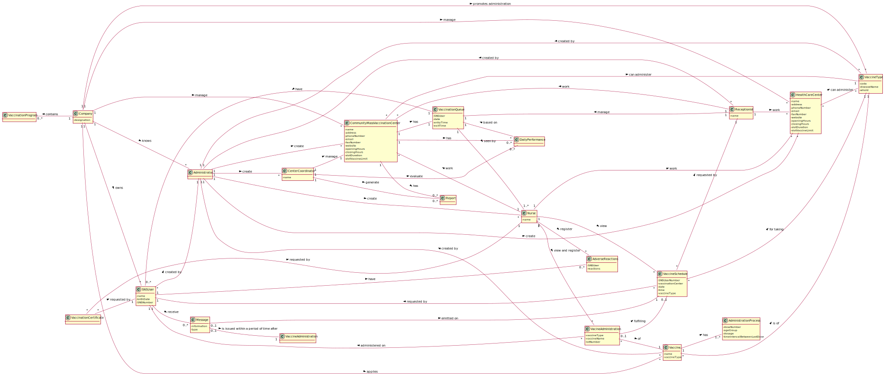

# OO Analysis #

The construction process of the domain model is based on the client specifications, especially the nouns (for _concepts_) and verbs (for _relations_) used. 

## Rationale to identify domain conceptual classes ##

### _Conceptual Class Category List_ ###

| **_Category_** | **_Conceptual Class_** |                                       
|:------------------------|:--------------------------------------------|
| **Catalogs** | Vaccination Program, Administration Process |
| **Containers of things** | Vaccination Queue |
| **Descriptions of things** | Vaccine Type, Daily Performance, Message |
| **Documents mentioned/used to perform some work** | Vaccination Certificate, Report, Message |
| **Noteworthy Events** | Vaccine Schedule, Vaccine Administration |
| **Places** | Community Mass Vaccination Center, Health Care Center |
| **Products or Services related to a Transaction or Transaction line** | Vaccine |
| **Records of finance, work, contracts, legal matters** | Report |
| **Roles of People or Organizations** | SNS User, Center Coordinator, Receptionist, Nurse, Administrator |
| **Transaction Records/Registers** | Adverse Reactions, Vaccination Queue |
| **Transaction line items** | Vaccination Program, Administration Process |
| **Transactions** | Vaccine Administration |
| **(Other) Organizations** | DGS (Company) |

### **Rationale to identify associations between conceptual classes** ###

| **_Concept (A)_** |  **_Association_** |  **_Concept (B)_** |
|----------	   		|:-------------:		|------:       |
| Administrator | create | CenterCoordinator |
| Administrator | create | CommunityMassVaccinationCenter |
| Administrator | create | HealthCareCenter |
| Administrator | create | Nurse |
| CenterCoordinator | evaluate | DailyPerformance |
| CenterCoordinator | generate | Report |
| CenterCoordinator | manage | CommunityMassVaccinationCenter |
| CommunityMassVaccinationCenter | can administer | VaccineType |
| CommunityMassVaccinationCenter | has | DailyPerformance |
| CommunityMassVaccinationCenter | has | Report |
| CommunityMassVaccinationCenter | has | VaccinationQueue |
| Company | applies	| Vaccine |
| Company | contains | VaccinationProgram |
| Company | knows | Administrator |
| Company | manage | CommunityMassVaccinationCenter |
| Company | manage | HealthCareCenter |
| Company | owns | SNSUser |
| Company | promotes administration | VaccineType |
| DailyPerformance | based on | VaccinationQueue |
| HealthCareCenter | can administer	| VaccineType |
| Message | emitted on | VaccineSchedule |
| Message | is issued within a period of time after | VaccineAdministration |
| Nurse | register | AdverseReactions |
| Nurse | view and register | VacineAdministration |
| Nurse | view | VaccineSchedule |
| Nurse | work | CommunityMassVaccinationCenter |
| Nurse | work | HealthCareCenter |
| Receptionist | created by | Administrator |
| Receptionist | manage | VaccinationQueue |
| Receptionist | work | CommunityMassVaccinationCenter |
| Receptionist | work | HealthCareCenter |
| SNSUser | created by | Administrator |
| SNSUser | have | AdverseReactions |
| SNSUser | receive | Message |
| VaccinationCertificate | requested by | Nurse |
| VaccinationCertificate | requested by | SNSUser |
| VaccinationQueue | have | SNSUser |
| VaccinationQueue | seen by | Nurse |
| Vaccine | created by | Administrator |
| Vaccine | has | AdministrationProcess |
| Vaccine | is of | VaccineType |
| VaccineSchedule | for taking | VaccineType |
| VaccineSchedule | requested by | Receptionist |
| VaccineSchedule | requested by | SNSUser |
| VaccineType | created by | Administrator |
| VacineAdministration | administered on | SNSUser |
| VacineAdministration | fulfilling | VaccineSchedule |
| VacineAdministration | of | Vaccine |

## Domain Model

**In the next image is the Domain Model:**

