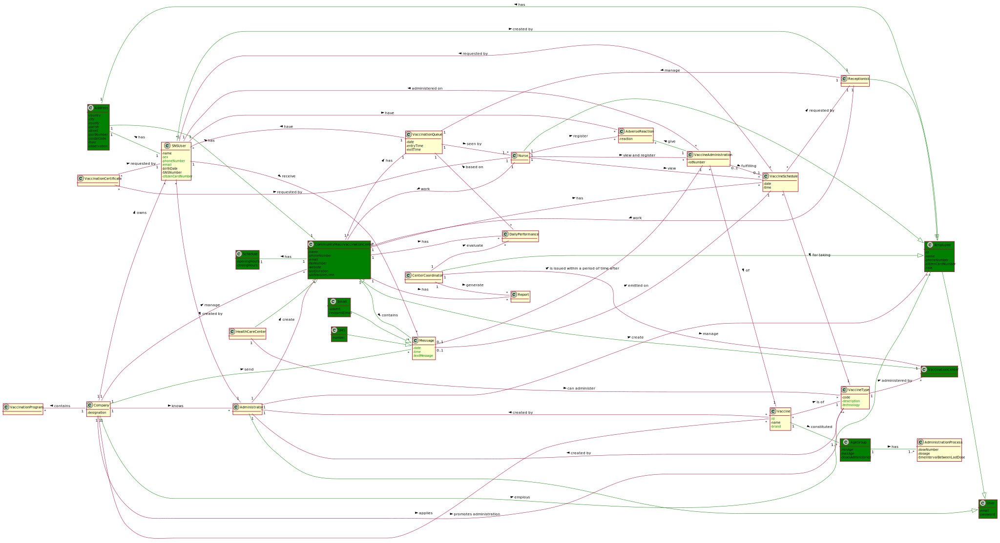

# OO Analysis #

The construction process of the domain model is based on the client specifications, especially the nouns (for _concepts_) and verbs (for _relations_) used. 

## Rationale to identify domain conceptual classes ##

### _Conceptual Class Category List_ ###

**Business Transactions**

* Vaccine Administration
---

**Transaction Line Items**

* Vaccination Program
* Administration Process
* **AgeGroup**
---

**Product/Service related to a Transaction or Transaction Line Item**

* Vaccine
---

**Transaction Records**

* Adverse Reactions
* Vaccination Queue
---  

**Roles of People or Organizations**

* SNS User
* **User**
* **Employee**
* Center Coordinator
* Receptionist
* Nurse
* Administrator
---

**Places**

* Community Mass Vaccination Center
* **Vaccination Center**
* Health Care Center
* **Address**
---

**Noteworthy Events**

* **Schedule**
* Vaccine Schedule
* Vaccine Administration
---

**Physical Objects**

*
---

**Descriptions of Things**

* Vaccine Type 
* Daily Performance
* Message
---

**Catalogs**

* Vaccination Program
* Administration Process
---

**Containers**

*
---

**Containers of things**

* Vaccination Queue
---

**Elements of Containers**

*
---

**Organizations**

* DGS (Company)
---

**Other External/Collaborating Systems**

*
---

**Records of finance, work, contracts, legal matters**

* Report
---

**Financial Instruments**

*
---

**Documents mentioned/used to perform some work/**

* Vaccination Certificate
* Report
* Message
* **Email**
* **SMS**
---

### **Rationale to identify associations between conceptual classes** ###

| **_Concept (A)_** |  **_Association_** |  **_Concept (B)_** |
|----------	   		|:-------------:		|------:       |
| Administrator | create | CommunityMassVaccinationCenter |
| Administrator | create | Employee |
| **Administrator** | **is a** | **User** |
| **AgeGroup** | **has** | **AdministrationProcess** |
| CenterCoordinator | evaluate | DailyPerformance |
| CenterCoordinator | generate | Report |
| **CenterCoordinator** | **is a** | **Employee** |
| CenterCoordinator | manage | VaccinationCenter |
| CommunityMassVaccinationCenter | has | DailyPerformance |
| CommunityMassVaccinationCenter | has | Report |
| CommunityMassVaccinationCenter | has | VaccinationQueue |
| CommunityMassVaccinationCenter | has | VaccineSchedule |
| **CommunityMassVaccinationCenter** | **contains** | **Message** |
| **CommunityMassVaccinationCenter** | **has** | **Address** |
| **CommunityMassVaccinationCenter** | **has** | **Schedule** |
| Company | applies	| Vaccine |
| Company | contains | VaccinationProgram |
| Company | knows | Administrator |
| Company | manage | CommunityMassVaccinationCenter |
| Company | owns | SNSUser |
| Company | promotes administration | VaccineType |
| **Company** | **employs** | **Employee** |
| **Company** | **send** | **Message** |
| DailyPerformance | based on | VaccinationQueue |
| **Email** | **is a** | **Message** |
| **Employee** | **is a** | **User** |
| **Employee** | **has** | **Address** |
| HealthCareCenter | can administer	| VaccineType |
| **HealthCareCenter** | **is a** | **CommunityMassVaccinationCenter** |
| Message | emitted on | VaccineSchedule |
| Message | is issued within a period of time after | VaccineAdministration |
| **Nurse** | **is a** | **Employee** |
| Nurse | register | AdverseReaction |
| Nurse | view and register | VacineAdministration |
| Nurse | view | VaccineSchedule |
| Nurse | work | CommunityMassVaccinationCenter |
| **Receptionist** | **is a** | **Employee** |
| Receptionist | manage | VaccinationQueue |
| Receptionist | work | CommunityMassVaccinationCenter |
| **SMS** | **create** | **is a** |
| SNSUser | created by | Administrator |
| SNSUser | have | AdverseReaction |
| SNSUser | receive | Message |
| **SNSUser** | **created by** | **Receptionist** |
| **SNSUser** | **has** | **Address** |
| **VaccinationCenter** | **is a** | **CommunityMassVaccinationCenter** |
| VaccinationCertificate | requested by | Nurse |
| VaccinationCertificate | requested by | SNSUser |
| VaccinationQueue | have | SNSUser |
| VaccinationQueue | seen by | Nurse |
| Vaccine | created by | Administrator |
| Vaccine | is of | VaccineType |
| **Vaccine** | **constituted** | **AgeGroup** |
| **VaccineAdministration** | **give** | **AdverseReaction** |
| VaccineSchedule | for taking | VaccineType |
| VaccineSchedule | requested by | Receptionist |
| VaccineSchedule | requested by | SNSUser |
| VaccineType | administered by | VaccinationCenter |
| VaccineType | created by | Administrator |
| VacineAdministration | administered on | SNSUser |
| VacineAdministration | fulfilling | VaccineSchedule |
| VacineAdministration | of | Vaccine |

## Domain Model

**In the next image is the Domain Model:**

