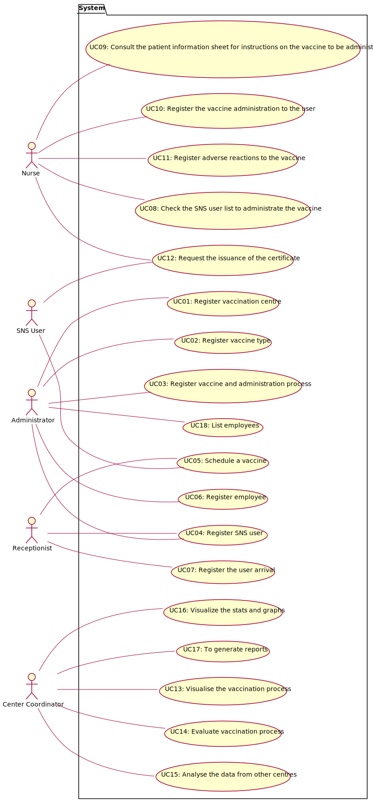

# Use Case Diagram (UCD)

<!-- **In the scope of this project, there is a direct relationship of _1 to 1_ between Use Cases (UC) and User Stories (US).** -->

**In the next image is the Use Case Diagram:**

# Use Cases / User Stories
| UC/US  | Description                                                               |                   
|:----|:------------------------------------------------------------------------|
| US 03 | [Register a SNS User](../US03/US03_RegisterSNSUser.md) |
| US 09 | [Register a vaccination center](../US09/US09_RegisterVaccinationCenter.md) |
| US 010 | [Register a new employee](../US10/US10_RegisterEmployee.md) |
| US 011 | [List employees with a given function/role](../US11/US11_ListEmployees.md) |
| US 012 | [Specify a new vaccine type](../US12/US12_NewVaccineType.md) |
| US 013 | [Specify a new vaccine and its administration process](../US13/US13_NewVaccineAdministrationProcess.md) |