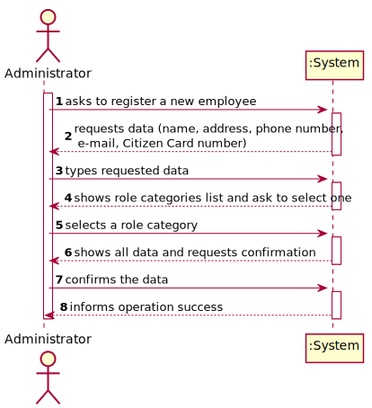
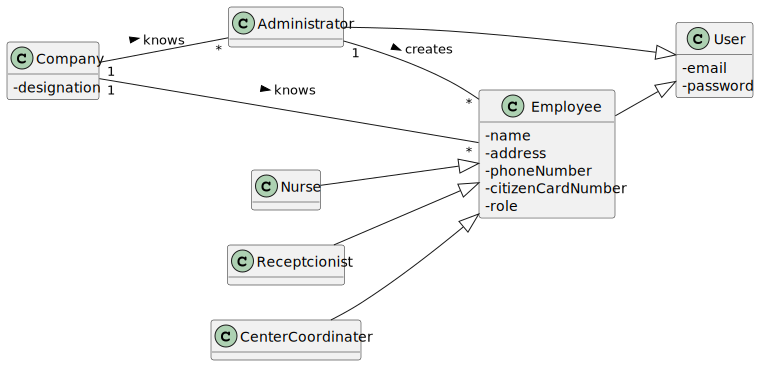
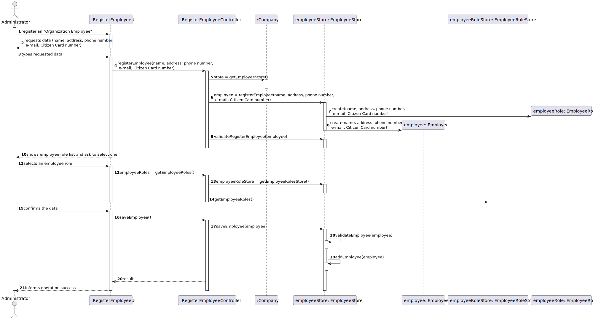
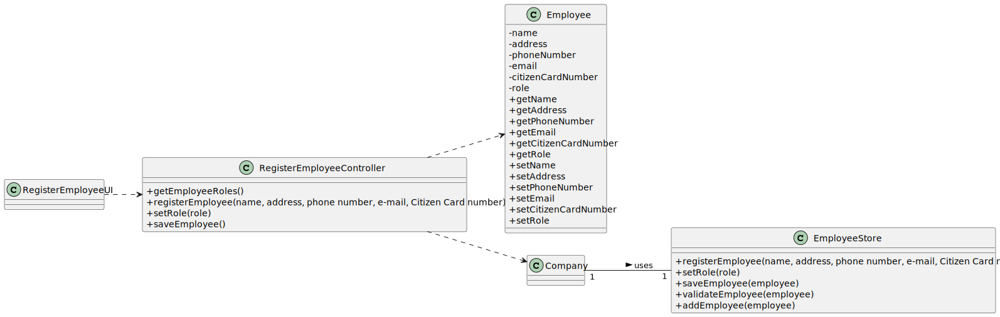

# US 10 - Register a new Employee.

## 1. Requirements Engineering

### 1.1. User Story Description

As an **administrator**, I want to register an **Employee**.

### 1.2. Customer Specifications and Clarifications

**From the specifications document:**

> "The vaccination process flow and employees enrolled in the vaccination process are almost the same in each kind of vaccination center."

> "An Administrator is responsible for properly configuring and managing the core information (e.g.:type of vaccines, vaccines, vaccination centers, employees) [...]"

> "Any Administrator uses the application to register centers, SNS users, center coordinators, receptionists, and nurses enrolled in the vaccination process."

**From the client clarifications:**

> **Question:** The relation between employee and vaccination center is required, when setting up a new employee?
>
> **Answer:** In the project description we get “… assume that receptionists and nurses can work on any vaccination center “ and “Each vaccination center has a Center Coordinator...”.

> **Question:** In the project description we have that " password for login will have 7 alphanumeric characters". Is there any restrictions for the user's name?
>
> **Answer:** Awaiting response

> **Question:** Besides a password and a username, what other (if any) information should the Admin uses to register a new employee? Are any of them optional?
>
> **Answer:** Every Employee has only one role (Coordinator, Receptionist, Nurse). Employee attributes: Id (automatic), Name, address, phone number, e-mail and Citizen Card number. All attributes are mandatory.

> **Question:** Is the password generated automatically, or is it specified by the user operating the system?
>
> **Answer:** The password should be generated automatically.

> **Question:** How does the employee should receive his password?
>
> **Answer:** Awaiting response

> **Question:** Will it be possible to edit or delete the employee's data, after being registered in the system?
>
> **Answer:** Awaiting response

> **Question:** What is the correct format for the employee's phone number and cc? Should we consider that these follow the portuguese format?
>
> **Answer:** Consider that these two attributes follow the portuguese format.

### 1.3. Acceptance Criteria

* **AC1:** Each user must have a single role defined in the system. The "auth" component available on the repository
  must be reused (without modifications).

### 1.4. Found out Dependencies

* No dependencies were found.

### 1.5 Input and Output Data

**Input Data:**

* Typed data:
    * Name
    * Address
    * Phone number
    * e-mail
    * Citizen Card number

* Selected data:
    * Classifying role category

**Output Data:**

* Data confirmation
* (In)Success of the operation

### 1.6. System Sequence Diagram (SSD)

### 1.7 Other Relevant Remarks

* There are currently no other relevant observations.

## 2. OO Analysis

### 2.1. Relevant Domain Model Excerpt

### 2.2. Other Remarks

There is none of relevance.

## 3. Design - User Story Realization

### 3.1. Rationale

| Interaction ID | Question: Which class is responsible for... | Answer  | Justification (with patterns)  |
|:-------------  |:--------------------------------------------|:--------|:-------------------------------|
| Step/Msg 1: Starts specifying a new employee. | N/A (not applicable) | | |
| Step/Msg 2: The system requests data. | N/A (not applicable) | | |
| Step/Msg 3: Types requested data | ...saving the inputted data? | Employee | IE: object created in step 2 has its own data. |
| Step/Msg 4: Shows role categories list. | ... presenting the options? | GenerateEmployeeUI | UI: interacts with the user. |
| Step/Msg 5: Selects a role category. | ... saving the selected role? | Employee | IE: object created in step 1 is classified in one Category. |
| Step/Msg 6: Shows all data and requests confirmation. | ... requesting the information? | GenerateEmployeeUI | UI: interacts with the user. |    
| Step/Msg 7: Confirms the data. | ... validating all data? | Employee | IE: knows its own data. |
| Step/Msg 8: Informs operation success. | ... informing the user? | GenerateEmployeeUI | UI: interacts with the user. |

### Systematization ##

According to the taken rationale, the conceptual classes promoted to software classes are:

* Administrator

Other software classes (i.e. Pure Fabrication) identified:

* RegisterEmployeeUI
* RegisterEmployeeController

## 3.2. Sequence Diagram (SD)

## 3.3. Class Diagram (CD)

# 4. Tests

**Test 1:** Check that it is not possible to create an instance of an employee.

	@Test(expected = IllegalArgumentException.class)
		public void ensureNullIsNotAllowed() {
          Employee employee = new Employee(null, null, null, null, null, null);
	}

# 5. Construction (Implementation)

## Class RegisterEmployeeController

    private Company company;
    private EmployeeStore employeeStore;
    private EmployeeRoleStore employeeRoleStore;
    private Employee employee;
    private EmployeeRole employeeRole;

    public List<EmployeeRole> getEmployeeRoles() {
        this.employeeRoleStore = this.company.getEmployeeRolesStore();
        return this.employeeRoleStore.getEmployeeRoles();
    }

    public static void registerEmployee(String name, String address, int phoneNumber, String email, int CitizenCardNumber) {
    }

    public static void setRole(int role){
    }

## Class Employee

		private String name;
        private String address;
        private int phoneNumber;
        private String email;
        private int citizenCardNumber;
        private EmployeeRole role;

        public Employee(String name, String address, int phoneNumber, String email, int citizenCardNumber, EmployeeRole role) {
            this.name = name;
            this.address = address;
            this.phoneNumber = phoneNumber;
            this.email = email;
            this.citizenCardNumber = citizenCardNumber;
            this.role = role;
        }

        public void setRole(EmployeeRole role) {
            this.role = role;
        }

##Class EmployeeStore

    private List<Employee> employeesList = new ArrayList<Employee>();

    public List<Employee> getEmployeesByRole(EmployeeRole role) {
        List<Employee> employeeListByRole = new ArrayList<Employee>();

        return employeeListByRole;
    }

    public void validateEmployee(Employee employee) {
    }

    public void validateRegisterEmployee(Employee employee) {
    }

##Class Company

    ...

    public EmployeeStore getEmployeeStore() {
        return this.employeeStore;
    }

    ...

    public EmployeeRoleStore getEmployeeRolesStore() {
        return this.employeeRoleStore;
    }

# 6. Integration and Demo

* A new option on the Administrator menu options was added with name "Specify a new employee".

* Some tasks are bootstrapped while system starts.

# 7. Observations

The generalization of the Employee superclass and its subclasses Nurse, CenterCoordinator and Receptionist, were
implemented using an aggregate class that contains the Employee roles. 
