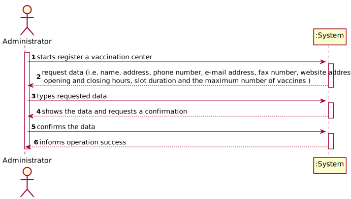
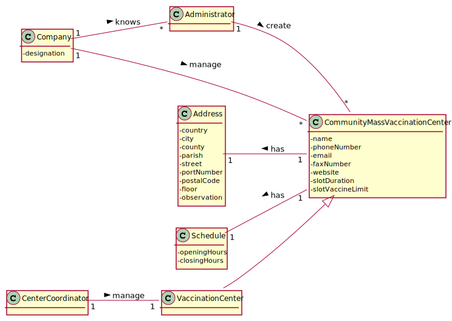
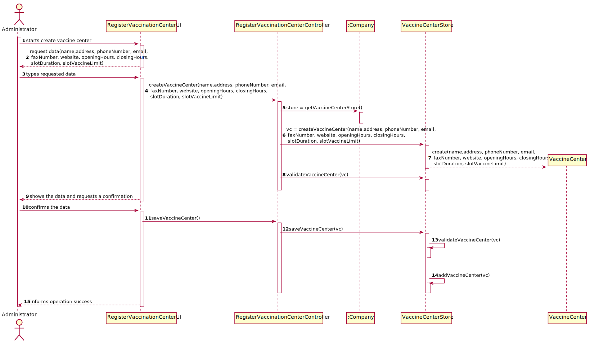
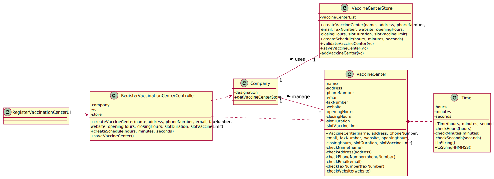

# US 09 - Register a vaccination center

## 1. Requirements Engineering

### 1.1. User Story Description

As an administrator, I want to register a vaccination center to respond to a certain pandemic.

### 1.2. Customer Specifications and Clarifications

**From the specifications document:**

>   “[…] Both kinds of vaccination centers are characterized by a name, an address, a phone number, an e-mail address, a fax number, a website address, opening and closing hours, slot duration (e.g.: 5 minutes) and the maximum number of vaccines that can be given per slot (e.g.: 10 vaccines per slot).[…]”
>
>   “[…]The vaccination process flow and employees enrolled in the vaccination process are almost the me in each kind of vaccination center[…]“
>
>   "[…]In addition, each vaccination center has one coordinator. […]"

**From the client clarifications:**

> **Question:** - For the US09 (Register a Vaccine Center) is there any specification about the phone number and fax (for example: phone number has 9 digits), website, e-mail and name (specifications about length or type).
> 
> **Answer:** - AWAITING RESPONSE

### 1.3. Acceptance Criteria

* **AC1:** No field can be empty.
* **AC2:** The phone and fax number cannot be longer than 9 digits.
* **AC3:** The value of slot duration and slot Vaccine Limit cannot be negative.
* **AC4:** The hour values can only be between 0 and 24(AC4a) and the minutes and seconds values between 0 and 60(AC4b).

### 1.4. Found out Dependencies

* No dependencies found.

### 1.5 Input and Output Data

**Input Data:**

* Typed data:
  * name
  * address
  * phone number
  * e-mail address
  * fax number
  * website address
  * opening and closing hours
  * slot duration (e.g.: 5 minutes)
  * the maximum number of vaccines that can be given per slot (e.g.: 10 vaccines per slot)

* Selected data:
  * (none)

**Output Data:**

  * (In)Success of the operation

### 1.6. System Sequence Diagram (SSD)

### 1.7 Other Relevant Remarks

* There are currently no other relevant observations.

## 2. OO Analysis

### 2.1. Relevant Domain Model Excerpt

### 2.2. Other Remarks

* There are currently no other observation.

## 3. Design - User Story Realization

### 3.1. Rationale

| Interaction ID | Question: Which class is responsible for... | Answer  | Justification (with patterns)  |
|:-------------  |:--------------------------------------------|:--------|:-------------------------------|
| Step/Msg 1: Starts register a vaccination center | ...register a vaccination center?| VaccineCenterStore | |
| Step/Msg 2: The system requests data | N/A (not applicable) | | |
| Step/Msg 3: Types requested data | ...saving the inputted data? | VaccineCenter | |
| Step/Msg 4: Shows all data and requests confirmation. | ...requesting the information? | RegisterVaccinationCenterUI | UI: interacts with the user. |    
| Step/Msg 5: Confirms the data | ...validating all data? | VaccineCenterStore | IE: knows its own data. |
| Step/Msg 6: Informs operation success | ...informing the user? | RegisterVaccinationCenterUI | UI: interacts with the user. |

### Systematization ##

According to the taken rationale, the conceptual classes promoted to software classes are:

* Company
* VaccineCenter
* Time

Other software classes (i.e. Pure Fabrication) identified:

* VaccineCenterStore (applying the "pure fabrication" pattern)
* RegisterVaccinationCenterUI (applying the "pure fabrication" pattern)
* RegisterVaccinationCenterController (applying the "controller" pattern)

## 3.2. Sequence Diagram (SD)

## 3.3. Class Diagram (CD)

# 4. Tests
### Class Vaccination Center
**Test 1:** Check that it is not possible to create an instance of the Vaccine center class with null values.

    @Test(expected = IllegalArgumentException.class)
    public void ensureNullIsNotAllowed() {
        VaccineCenter VaccineCenter = new VaccineCenter(null, null, 0, null, 0, null, null, null, 0, 0);
    }	

**Test 2:** Check that it is not possible to create an instance of the Vaccine Center class with the phone and fax number cannot be longer than 9 digits. - AC2.

    @Test(expected = IllegalArgumentException.class)
    public void ensureReferenceMeetsAC2() {
        Time openingHours  = new Time(9,0,0);
        Time closingHours  = new Time(18,0,0);
        VaccineCenter VaccineCenter = new VaccineCenter("Ramalde Lda", "R. Eng. Ferreira Dias 874, 4100-246 Porto", 1234789, "jumpjump@ramaldejump.pt", 1234689, "https://www.jumpers.pt/pt/", openingHours, closingHours, 5, 10);
    }

**Test 3:** Check that it is not possible to create an instance of the Vaccine Center class with the value of slot duration and slot Vaccine Limit cannot be negative. - AC3.

      @Test(expected = IllegalArgumentException.class)
      public void ensureReferenceMeetsAC3() {
        Time openingHours  = new Time(9,0,0);
        Time  closingHours  = new Time(18,0,0);
        VaccineCenter VaccineCenter = new VaccineCenter("Ramalde Lda", "R. Eng. Ferreira Dias 874, 4100-246 Porto", 918273645, "jumpjump@ramaldejump.pt", 123456789, "https://www.jumpers.pt/pt/", openingHours, closingHours, -14, -10);
      }

### Class Time
**Test 4a:** Check that it is not possible to create an instance of the Vaccine Center class with the hour values can only be between 0 and 24. - AC4a.

    @Test(expected = IllegalArgumentException.class)
    public void ensureReferenceMeetsAC4a() {
      Time Time  = new Time(41,12,43);

    } 

**Test 4b:** Check that it is not possible to create an instance of the Vaccine Center class with the minutes and seconds values between 0 and 60. - AC4b.

    @Test(expected = IllegalArgumentException.class)
    public void ensureReferenceMeetsAC4b() {
      Time Time  = new Time(12,421,63);

    }

# 5. Construction (Implementation)

## Class Company
        ...

        private VaccineCenterStore vaccineCenterStore = new VaccineCenterStore() ;
    
        ...    

        public VaccineCenterStore getVaccineCenterStore() {
          return vaccineCenterStore;
        }
## Class VaccineCenter

        private String name;
        private String address;
        private int phoneNumber;
        private String email;
        private int faxNumber;
        private String website;
        private Time openingHours;
        private Time closingHours;
        private int slotDuration;
        private int slotVaccineLimit;
    
        public VaccineCenter(String name, String address, int phoneNumber, String email,
                             int faxNumber, String website, Time openingHours, Time closingHours,
                             int slotDuration, int slotVaccineLimit) {
    
            checkName(name);
            checkAddress(address);
            checkPhoneNumber(phoneNumber);
            checkEmail(email);
            checkFaxNumber(faxNumber);
            checkWebsite(website);
            checkSlotDuration(slotDuration);
            checkSlotVaccineLimit(slotVaccineLimit);
    
            this.name = name;
            this.address = address;
            this.phoneNumber = phoneNumber;
            this.email = email;
            this.faxNumber = faxNumber;
            this.website = website;
            this.openingHours = openingHours;
            this.closingHours = closingHours;
            this.slotDuration = slotDuration;
            this.slotVaccineLimit = slotVaccineLimit;
        }
    
        private void checkName(String name) {
            if ((StringUtils.isBlank(name))) {
                throw new IllegalArgumentException("Name cannot be blank.");
            }
        }
    
        private void checkAddress(String address) {
            if ((StringUtils.isBlank(address))) {
                throw new IllegalArgumentException("Address cannot be blank.");
            }
        }
    
        private void checkPhoneNumber(int phoneNumber) {
            if (phoneNumber < 100000000 || phoneNumber > 999999999) {
    
                throw new IllegalArgumentException("The phone number must be 9 digits.");
            }
        }
    
        private void checkEmail(String email) {
            if ((StringUtils.isBlank(email))) {
                throw new IllegalArgumentException("Email cannot be blank.");
            }
        }
    
        private void checkFaxNumber(int faxNumber) {
            if (faxNumber < 100000000 || faxNumber > 999999999) {
    
                throw new IllegalArgumentException("The fax number must be 9 digits.");
            }
        }
    
    
        private void checkWebsite(String website) {
            if ((StringUtils.isBlank(website))) {
                throw new IllegalArgumentException("Website cannot be blank.");
            }
        }

        private void checkSlotDuration(int slotDuration) {
            if (slotDuration < 0) {
            throw new IllegalArgumentException("Value cannot be negative.");
        }

        private void checkSlotVaccineLimit(int slotVaccineLimit) {
            if (slotVaccineLimit < 0) {
            throw new IllegalArgumentException("Value cannot be negative.");
        }
    

## Class Time

        private int hours;
    
        private int minutes;
    
        private int seconds;
    
        public Time(int hours, int minutes, int seconds) {
            checkHours(hours);
            checkMinutes(minutes);
            checkSeconds(seconds);
    
            this.hours = hours;
            this.minutes = minutes;
            this.seconds = seconds;
        }
    
        @Override
        public String toString() {
            return String.format("%02d:%02d:%02d %s",
                    (hours == 12 || hours == 0) ? 12 : hours % 12,
                    minutes, seconds, hours < 12 ? "AM" : "PM");
        }
    
    
        public String toStringHHMMSS() {
            return String.format("%02d:%02d:%02d", hours, minutes, seconds);
        }
    
        private void checkHours(int hours) {
            if (hours < 0 || hours > 24) {
    
                throw new IllegalArgumentException("Value is only accepted if it is between 0 and 24.");
            }
        }
    
        private void checkMinutes(int minutes) {
            if (minutes < 0 || minutes > 60) {
    
                throw new IllegalArgumentException("Value is only accepted if it is between 0 and 60.");
            }
        }
    
        private void checkSeconds(int seconds) {
            if (seconds < 0 || seconds > 60) {
    
                throw new IllegalArgumentException("Value is only accepted if it is between 0 and 60.");
            }
        }

## Class RegisterVaccinationCenterController

        private Company company;
        private VaccineCenter vc;
        private VaccineCenterStore store ;

        public RegisterVaccinationCenterController() {
          this(App.getInstance().getCompany());  
        }

        public RegisterVaccinationCenterController(Company company) {
          this.company = company;
          this.vc = null;
          this.store = this.company.getVaccineCenterStore();
        }      

        public boolean createVaccineCenter(String name, String address, int phoneNumber, String email,
          int faxNumber, String website, Time openingHours, Time closingHours,
          int slotDuration, int slotVaccineLimit) {
          this.vc = this.store.createVaccineCenter(name,address, phoneNumber, email, faxNumber, website, openingHours, closingHours,
          slotDuration, slotVaccineLimit);
          return this.store.validateVaccineCenter(vc);
        }

        public Time createSchedule(int hours, int minutes, int seconds){
          return this.store.createSchedule(hours, minutes, seconds);
        }

        public boolean saveVaccineCenter() {
          return this.store.saveVaccineCenter(vc);  
        } 
  

# 6. Integration and Demo

* A new option on the Administrator menu options was added with name "Register a vaccination center".

* Some tasks are bootstrapped while system starts.

# 7. Observations

* There are currently no other relevant observations.

