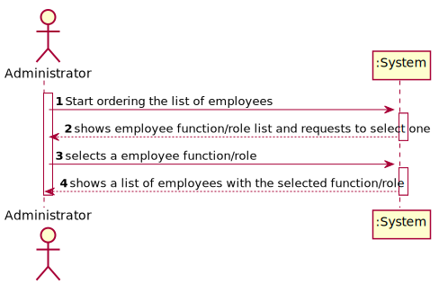
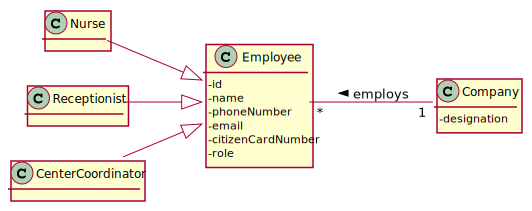
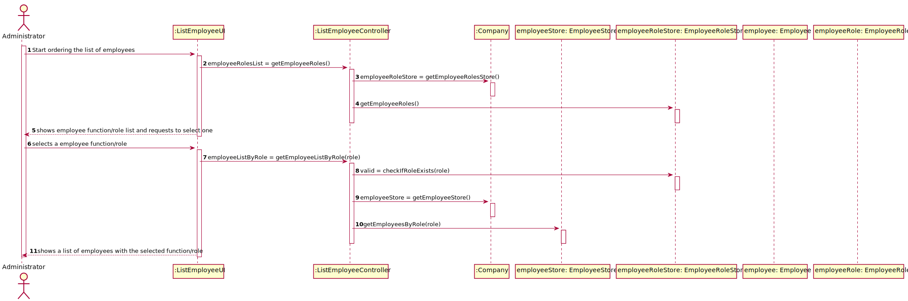
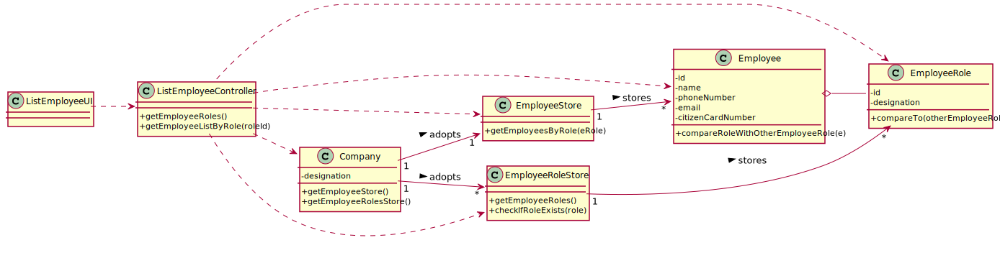

# US 11 - List Employees with a given function/role

## 1. Requirements Engineering
### 1.1. User Story Description
As an administrator, I want to get a list of Employees with a given function/role.

### 1.2. Customer Specifications and Clarifications

**From the specifications document:**

>	"[...] employees enrolled in the vaccination process are almost the same in each kind of vaccination center."

>   "As the allocation of receptionists and nurses to vaccination centers might be complex, by now, the system might assume that receptionists and nurses can work on any vaccination center. "

>   "An Administrator is responsible for properly configuring and managing the core information (e.g.: type of vaccines, vaccines, vaccination centers, employees) required for this application to be operated daily by SNS users, nurses, receptionists, etc"

>   "The DGS has Administrators who administer the application."

**From the client clarifications:**

> **Question:** "Should we give the user the possibility of listing employees from more than 1 role?"
>
> **Answer:** "The Administrator should select a given role and all employees associated with the selected role should be listed."

> **Question:** "Should the list be sorted in any specific way(for example alphabetical name order) or should we give the option to sort by other characteristics?"
>
> **Answer:** "For now I just want to get a list of employees without considering the order of presentation."

### 1.3. Acceptance Criteria

(None)

### 1.4. Found out Dependencies

* There is a dependency to "US10 Register a employee" since it's necessary to be able to register an employee to list them

### 1.5 Input and Output Data

**Input Data:**

* Typed data: (None)

* Selected data:
	* Employee function/role

**Output Data:**

* List of all employee functions/roles
* List of all employees with the selected function/role

### 1.6. System Sequence Diagram (SSD)

### 1.7 Other Relevant Remarks

* The list to be returned to the administrator will be for consultation only.

## 2. OO Analysis

### 2.1. Relevant Domain Model Excerpt

### 2.2. Other Remarks

n/a

## 3. Design - User Story Realization

### 3.1. Rationale

**SSD adopted.**

| Interaction ID | Question: Which class is responsible for... | Answer  | Justification (with patterns)  |
|:-------------  |:--------------------- |:------------|:---------------------------- |
| Step 1: |	... interacting with the administrator? | ListEmployeeUI | Pure Fabrication: there is no reason to assign this responsibility to any existing class in the Domain Model |
| 		  |	... coordinating the US? | ListEmployeeController | Controller |
| 		  |	... knowing the employees? | EmployeeStore | Pure Fabrication: Since the Company class will have so many responsibilities, we can delegate some of them on other classes |
| 		  |							 | Employee  | knows its own data (name) |
| Step 2: |	... knowing the employee type to show? | Employee | Employee has subclasses that corresponds to each existing type of employee |
| Step 3: |	... handle the selected category? | ListEmployeeController | The list to be shown will be filtered for a given type of employee, which will be handled by the controller |
| Step 4: |	... displaying the employee list? | ListEmployeeUI | UI: interacts with the user |

### Systematization ##

According to the taken rationale, the conceptual classes promoted to software classes are:

* Employee

Other software classes (i.e. Pure Fabrication) identified:

* EmployeeStore (applying the "pure fabrication" pattern)
* ListEmployeeUI (applying the "pure fabrication" pattern)
* ListEmployeeController (applying the "controller" pattern)

## 3.2. Sequence Diagram (SD)

## 3.3. Class Diagram (CD)

# 4. Tests

# Class EmployeeRoleStore

**Test 1:** Check if the inserted role exists.

	@Test
    public void checkIfRoleExistsInTheList() {
		//...
    }

# 5. Construction (Implementation)

## Class ListEmployeeController

	private Company company;
    private EmployeeStore employeeStore;
    private EmployeeRoleStore employeeRoleStore;
    private Employee employee;
    private EmployeeRole employeeRole;

    public ListEmployeeController() {
        this(App.getInstance().getCompany());
    }

    public ListEmployeeController(Company company) {
        this.company = company;
        this.employeeStore = this.company.getEmployeeStore();
        this.employeeRoleStore = this.company.getEmployeeRolesStore();
        this.employee = null;
        this.employeeRole = null;
    }

    public List<EmployeeRole> getEmployeeRoles() {
        this.employeeRoleStore = this.company.getEmployeeRolesStore();
        return this.employeeRoleStore.getEmployeeRoles();
    }

    public List<Employee> getEmployeeListByRole(String roleId) {

        boolean valid = this.employeeRoleStore.checkIfRoleExists(roleId);

        if (valid) {
            EmployeeRole eRole = this.employeeRoleStore.getEmployeeRoleById(roleId);
            this.employeeStore = this.company.getEmployeeStore();
            return this.employeeStore.getEmployeesByRole(eRole);
        }

        return null;
    }

## Class EmployeeStore

	private List<Employee> employeesList = new ArrayList<Employee>();

    public List<Employee> getEmployeesByRole(EmployeeRole role) {
        List<Employee> employeeListByRole = new ArrayList<Employee>();

        return employeeListByRole;
    }

## Class Employee

	...

	private EmployeeRole role;
	
	public Employee(String name, String address, int phoneNumber, String email, int citizenCardNumber, EmployeeRole role) {
        this.name = name;
        this.address = address;
        this.phoneNumber = phoneNumber;
        this.email = email;
        this.citizenCardNumber = citizenCardNumber;
        this.role = role;
    }

	...

	public EmployeeRole getRole() {
        return role;
    }

	public void setRole(EmployeeRole role) {
        this.role = role;
    }

## Class EmployeeRoleStore

	private List<EmployeeRole> employeeRoleStoreList = new ArrayList<EmployeeRole>();

    // temporary construtor --> ignore it | TODO delete from here
    public EmployeeRoleStore() {
        this.employeeRoleStoreList.add(new EmployeeRole("1", "Nurse"));
        this.employeeRoleStoreList.add(new EmployeeRole("2", "Receptionist"));
        this.employeeRoleStoreList.add(new EmployeeRole("3", "Center Coordinator"));
    }
    // to here

    public List<EmployeeRole> getEmployeeRoles() {
        return this.employeeRoleStoreList;
    }

    public boolean checkIfRoleExists(String roleId) {
        boolean valid = false;
        //...
        return valid;
    }

    public EmployeeRole getEmployeeRoleById(String roleId) {
        EmployeeRole eRole = null;
        //...
        return eRole;
    }

## Class EmployeeRole

    private String id;

    private String designation;

    public EmployeeRole(String id, String designation) {
        this.id = id;
        this.designation = designation;
    }

    public String getId() {
        return id;
    }

    public String getDesignation() {
        return designation;
    }

## Class Company

	...
	private EmployeeStore employeeStore = new EmployeeStore();
    private EmployeeRoleStore employeeRoleStore = new EmployeeRoleStore();

	...

	public EmployeeStore getEmployeeStore() {
        return this.employeeStore;
    }

    public EmployeeRoleStore getEmployeeRolesStore() {
        return this.employeeRoleStore;
    }

# 6. Integration and Demo

* A new option on the Administrator menu options was added.

* When using this new option from the admin menu, employee roles are created automatically for demonstration purposes only.

# 7. Observations

In order to carry out this User Story, the Company responsibilities were delegated to other classes. In this way, the code is more structured and makes it easier to maintain.

