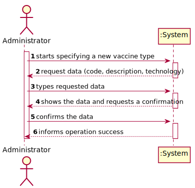
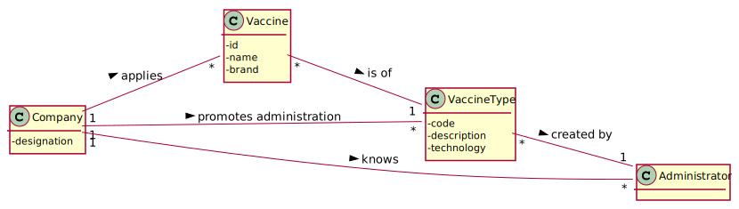
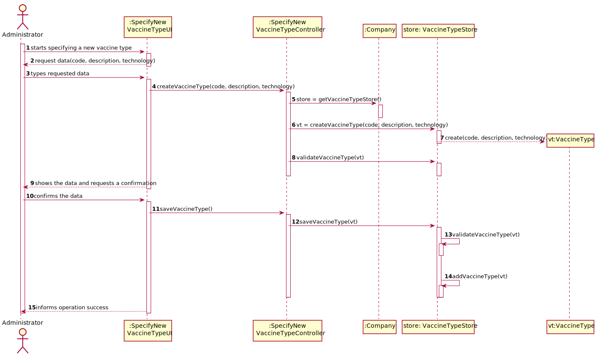
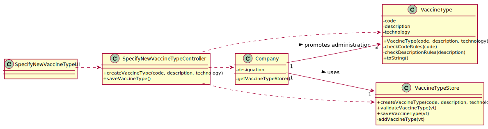

# US 12 - Specify a New Vaccine Type

## 1. Requirements Engineering
### 1.1. User Story Description

As an **administrator**, I intend to specify a new **vaccine type**.

### 1.2. Customer Specifications and Clarifications

**From the specifications document:**

>	“[…] the community mass vaccination centers are facilities specifically created to administer vaccines of a single type […]”

>	“[…] healthcare center […] can administer any type of vaccines (e.g.: Covid-19, Dengue, Tetanus, smallpox).”

>   “[…] for each type of vaccine, it might exist several vaccines […]”

**From the client clarifications:**

> **Question:** “What kind of information would you like to include in a new type of vaccine?“
>  
> **Answer:** : “The vaccine type should have the following attributes: Code (five alphanumeric characters), Short description and Vaccine technology.“

### 1.3. Acceptance Criteria

* **AC1:** All required fields must be filled in.
* **AC2:** Code must be unique having five alphanumeric characters.
* **AC3:** Designation cannot be empty and has, at maximum, 40 chars.

### 1.4. Found out Dependencies

No dependencies were found.

### 1.5 Input and Output Data

**Input Data:**

* Typed data:
    * code
    * description
    * technology
	
* Selected data:
	* (none) 
	
**Output Data:**

* (In)Success of the operation

### 1.6. System Sequence Diagram (SSD)

### 1.7 Other Relevant Remarks

* There are currently no other relevant observations.

## 2. OO Analysis

### 2.1. Relevant Domain Model Excerpt 

### 2.2. Other Remarks

* There are currently no other observations.

## 3. Design - User Story Realization 

### 3.1. Rationale

| Interaction ID | Question: Which class is responsible for... | Answer  | Justification (with patterns)  |
|:-------------  |:--------------------- |:------------|:---------------------------- |
| Step/Msg 1: starts specifying a new vaccine type | ...interacting with the actor? | SpecifyNewVaccineTypeUI | Pure Fabrication: there is no reason to assign this responsibility to any existing class in the Domain Model. |
| | ...coordinating the US? | SpecifyNewVaccineTypeController | Controller. |
| | ...instantiating a new vaccine type? | VaccineTypeStore | |
| Step/Msg 2: request data (code, description, technology) | ...request the data? | SpecifyNewVaccineTypeUI | IE: responsible for user interaction. |
| Step/Msg 3: types requested data	|	...saving the input data? | VaccineType  | IE: The object created in step 1 has its own data. |
| Step/Msg 4: shows the data and requests a confirmation |	...validating the data locally (e.g.: mandatory vs. non-mandatory data)? | VaccineType  | IE: knows its own data. |
|					| ...validating the data globally (e.g.: duplicated)? | VaccineTypeStore | IE: knows all the VaccineType objects. |
| Step/Msg 5: confirms the data  |	...saving the created vaccine type? | VaccineTypeStore  | IE: adopts/records all the VaccineType objects. |
| Step/Msg 6: informs operation success |	...informing the user? | SpecifyNewVaccineTypeUI  | IE: responsible for user interaction. |

### Systematization ##

According to the taken rationale, the conceptual classes promoted to software classes are: 

 * Company
 * VaccineType

Other software classes (i.e. Pure Fabrication) identified: 

 * VaccineTypeStore (applying the "pure fabrication" pattern)
 * SpecifyNewVaccineTypeController (applying the "controller" pattern)
 * SpecifyNewVaccineTypeUI (applying the "pure fabrication" pattern)

## 3.2. Sequence Diagram (SD)

## 3.3. Class Diagram (CD)

# 4. Tests 

**Test 1:** Check that it is not possible to create an instance of the VaccineType class with null values - AC1. 

    @Test(expected = IllegalArgumentException.class)
    public void ensureNullIsNotAllowed() {
        VaccineType vaccineType = new VaccineType(null, null, null);
    }
	

**Test 2:** Check that it is not possible to create an instance of the VaccineType class without a code containing five alphanumeric characters - AC2. 

    @Test(expected = IllegalArgumentException.class)
    public void ensureReferenceMeetsAC2() {
        VaccineType vaccineType = new VaccineType("1A", "Covid-19", "Live-attenuated vaccines");
    }

**Test 3:** Check that it is not possible to create an instance of the VaccineType class with a  esignation containing more than forty chars - AC3.

    @Test(expected = IllegalArgumentException.class)
    public void ensureReferenceMeetsAC3() {
        VaccineType vaccineType = new VaccineType("1ABCD", "Covid-19-Covid-19-Covid-19-Covid-19-Covid-19", "Live-attenuated vaccines");
    }
 

# 5. Construction (Implementation)

## Class VaccineType

    public class VaccineType {
        private String code;
        private String description;
        private String technology;
    
        public VaccineType(String code, String description, String technology) {
            checkCodeRules(code);
            checkDescriptionRules(description);
            this.code = code;
            this.description = description;
            this.technology = technology;
        }
    
        private void checkCodeRules(String code) {
            if (StringUtils.isBlank(code))
                throw new IllegalArgumentException("Code cannot be blank.");
            if (code.length() != 5)
                throw new IllegalArgumentException("Code must have 5 alphanumeric characters.");
        }
    
        private void checkDescriptionRules(String description) {
            if (StringUtils.isBlank(description))
                throw new IllegalArgumentException("Description cannot be blank.");
            if (description.length() > 40)
                throw new IllegalArgumentException("Description maximum 40 chars.");
        }
    
        @Override
        public String toString() {
            return "Code: " + code + "\n   Description: " + description + "\n   Technology: " + technology;
        }
    }

## Class Company

    public class Company {
    
        ...
    
        private VaccineTypeStore vaccineTypeStore = new VaccineTypeStore();
    
        ...
    
        public VaccineTypeStore getVaccineTypeStore() {
            return vaccineTypeStore;
        }
    }

## Class VaccineTypeStore

    public class VaccineTypeStore {
        private List<VaccineType> vaccineTypeList = new ArrayList<>();
    
        public VaccineType createVaccineType(String code, String description, String technology) {
            return new VaccineType(code, description, technology);
        }
    
        public boolean validateVaccineType(VaccineType vt) {
            if (vt == null) {
                return false;
            } else {
                return !this.vaccineTypeList.contains(vt);
            }
        }
    
        public boolean saveVaccineType(VaccineType vt) {
            if (!validateVaccineType(vt)) {
                return false;
            } else {
                return addVaccineType(vt);
            }
        }
    
        private boolean addVaccineType(VaccineType vt) {
            return this.vaccineTypeList.add(vt);
        }
    }

## Class SpecifyNewVaccineTypeController

    public class SpecifyNewVaccineTypeController {
        private Company company;
        private VaccineType vt;
        private VaccineTypeStore store;
    
        public SpecifyNewVaccineTypeController() {
            this(App.getInstance().getCompany());
        }
    
        public SpecifyNewVaccineTypeController(Company company) {
            this.company = company;
            this.vt = null;
            this.store = this.company.getVaccineTypeStore();
        }
    
        public boolean createVaccineType(String code, String description, String technology) {
            this.vt = this.store.createVaccineType(code, description, technology);
            return this.store.validateVaccineType(vt);
        }
    
        public boolean saveVaccineType() {
            return this.store.saveVaccineType(vt);
        }
    }

# 6. Integration and Demo 

* A new option on the Administrator menu options was added with name "Specify a new vaccine type".

* Some tasks are bootstrapped while system starts

# 7. Observations

* In order to carry out this User Story, the Company responsibilities were delegated to other classes. In this way, the code is more structured and makes it easier to maintain.