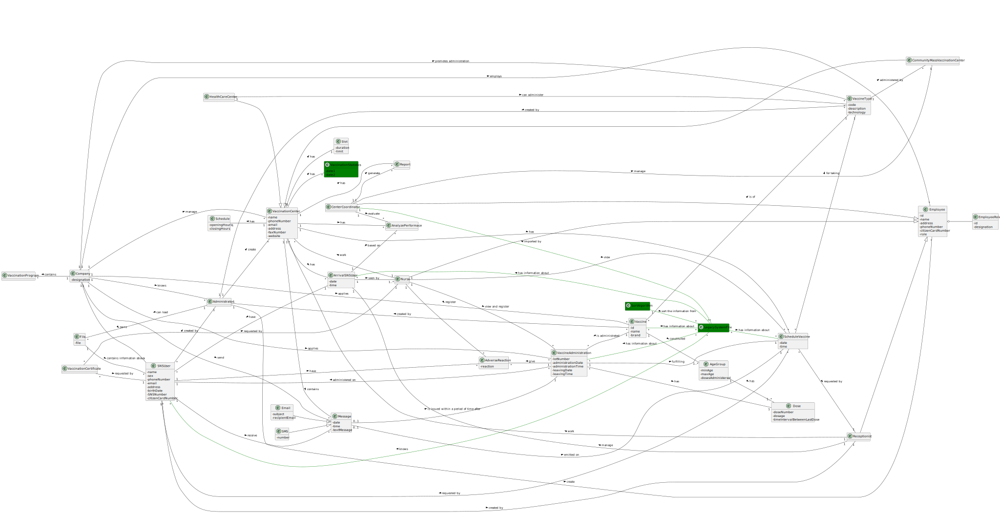

# OO Analysis #

The construction process of the domain model is based on the client specifications, especially the nouns (for _concepts_) and verbs (for _relations_) used. 

## Rationale to identify domain conceptual classes ##

### _Conceptual Class Category List_ ###

**Business Transactions**

* Vaccine Administration
---

**Transaction Line Items**

* Vaccination Program
* Administration Process
* AgeGroup
---

**Product/Service related to a Transaction or Transaction Line Item**

* Vaccine
---

**Transaction Records**

* Adverse Reactions
* Arrival SNS User
---  

**Roles of People or Organizations**

* SNS User
* User
* Employee
* Center Coordinator
* Receptionist
* Nurse
* Administrator
---

**Places**

* Community Mass Vaccination Center
* Vaccination Center
* Health Care Center
* Address
---

**Noteworthy Events**

* Schedule
* Vaccine Schedule
* Vaccine Administration
---

**Physical Objects**

*
---

**Descriptions of Things**

* Vaccine Type 
* Daily Performance
* Message
---

**Catalogs**

* Vaccination Program
* Administration Process
---

**Containers**

*
---

**Containers of things**

* Vaccination Queue
---

**Elements of Containers**

*
---

**Organizations**

* DGS (Company)
---

**Other External/Collaborating Systems**

*
---

**Records of finance, work, contracts, legal matters**

* Report
---

**Financial Instruments**

*
---

**Documents mentioned/used to perform some work/**

* Vaccination Certificate
* Report
* Message
* Email
* SMS
---

### **Rationale to identify associations between conceptual classes** ###

| **_Concept (A)_** |  **_Association_** |  **_Concept (B)_** |
|----------	   		|:-------------:		|------:       |
| Administrator | can load | File |
| Administrator | create | Employee |
| Administrator | create | VaccinationCenter |
| Administrator | is a | User |
| AgeGroup | has | Dose |
| ArrivalSNSUser | have | SNSUser |
| ArrivalSNSUser | seen by | Nurse |
| CenterCoordinator | evaluate | DailyPerformance |
| CenterCoordinator | generate | Report |
| CenterCoordinator | is a | Employee |
| CenterCoordinator | manage | CommunityMassVaccinationCenter |
| CommunityMassVaccinationCenter | is a | VaccinationCenter |
| Company | applies	| Vaccine |
| Company | contains | VaccinationProgram |
| Company | employs | Employee |
| Company | knows | Administrator |
| Company | manage | VaccinationCenter |
| Company | owns | SNSUser |
| Company | promotes administration | VaccineType |
| Company | send | Message |
| DailyPerformance | based on | ArrivalSNSUser |
| Email | is a | Message |
| Employee | has | Address |
| Employee | is a | User |
| File | contains information about | SNSUser |
| HealthCareCenter | can administer	| VaccineType |
| HealthCareCenter | is a | VaccinationCenter |
| Message | emitted on | VaccineSchedule |
| Message | is issued within a period of time after | VaccineAdministration |
| Nurse | is a | Employee |
| Nurse | register | AdverseReaction |
| Nurse | view and register | VacineAdministration |
| Nurse | view | VaccineSchedule |
| Nurse | work | VaccinationCenter |
| Receptionist | is a | Employee |
| Receptionist | manage | ArrivalSNSUser |
| Receptionist | work | VaccinationCenter |
| SMS | create | is a |
| SNSUser | created by | Administrator |
| SNSUser | created by | Receptionist |
| SNSUser | has | Address |
| SNSUser | have | AdverseReaction |
| SNSUser | receive | Message |
| VaccinationCenter | contains | Message |
| VaccinationCenter | has | Address |
| VaccinationCenter | has | ArrivalSNSUser |
| VaccinationCenter | has | DailyPerformance |
| VaccinationCenter | has | Report |
| VaccinationCenter | has | Schedule |
| VaccinationCenter | has | Slot |
| VaccinationCenter | has | VaccineSchedule |
| VaccinationCertificate | requested by | Nurse |
| VaccinationCertificate | requested by | SNSUser |
| Vaccine | constituted | AgeGroup |
| Vaccine | created by | Administrator |
| Vaccine | is administrated | VaccineAdministration |
| Vaccine | is of | VaccineType |
| VaccineAdministration | administered on | SNSUser |
| VaccineAdministration | fulfilling | VaccineSchedule |
| VaccineAdministration | give | AdverseReaction |
| VaccineAdministration | has | Dose |
| VaccineSchedule | for taking | VaccineType |
| VaccineSchedule | requested by | Receptionist |
| VaccineSchedule | requested by | SNSUser |
| VaccineType | administered by | CommunityMassVaccinationCenter |
| VaccineType | created by | Administrator |

## Domain Model

**In the next image is the Domain Model:**

