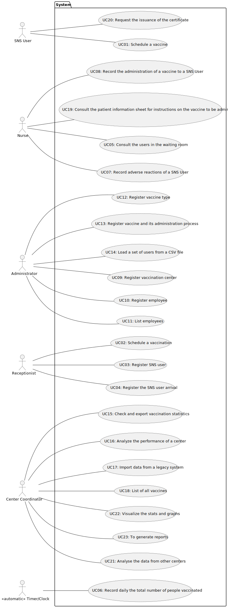

# Use Case Diagram (UCD)

<!-- **In the scope of this project, there is a direct relationship of _1 to 1_ between Use Cases (UC) and User Stories (US).** -->

**In the next image is the Use Case Diagram:**

# Use Cases / User Stories
| UC/US  | Description                                                               |                   
|:----|:------------------------------------------------------------------------|
| US 01 | [Schedule a Vaccine](../US01/US01_ScheduleAVaccine.md.md) |
| US 02 | [Schedule a vaccination](../US02/US02_ScheduleAVaccination.md) |
| US 03 | [Register a SNS User](../US03/US03_RegisterSNSUser.md) |
| US 04 | [Register the arrival of a SNS user to take the vaccine](../US04/US04_RegisterArrivalSNSUser.md) |
| US 05 | [List the arrival of a SNS user to take the vaccine](../US05/US05_ListArrivalSNSUser.md) |
| US 06 | [Record daily the total number of people vaccinated](../US06/US06_RecordDailyPeopleVaccinated.md) |
| US 08 | [Record the administration of a vaccine to a SNS user](../US08/US08_RecordAdministrationVaccine.md) |
| US 09 | [Register a vaccination center](../US09/US09_RegisterVaccinationCenter.md) |
| US 10 | [Register a new employee](../US10/US10_RegisterEmployee.md) |
| US 11 | [List employees with a given function/role](../US11/US11_ListEmployees.md) |
| US 12 | [Specify a new vaccine type](../US12/US12_NewVaccineType.md) |
| US 13 | [Specify a new vaccine and its administration process](../US13/US13_NewVaccineAdministrationProcess.md) |
| US 14 | [Load a set of users from a CSV file](../US14/US14_LoadUsersFromCSVFile.md) |
| US 15 | [Check and export to CSV file vaccination statistics](../US15/US15_CheckAndExportToCSVFileVaccinationStatistics.md) |
| US 16 | [Analyze the performance of a center](../US16/US16_AnalyzePerformanceCenter.md) |
| US 17 | [Import data from a legacy system that was used in the past to manage centers](../US17/US17_ImportDataFromLegacySystem.md) |