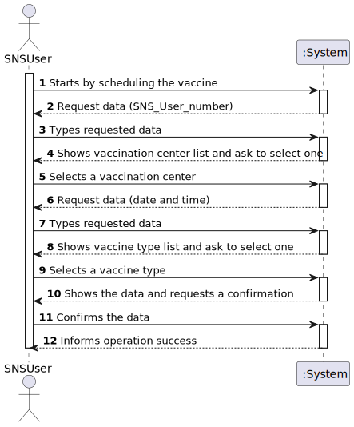
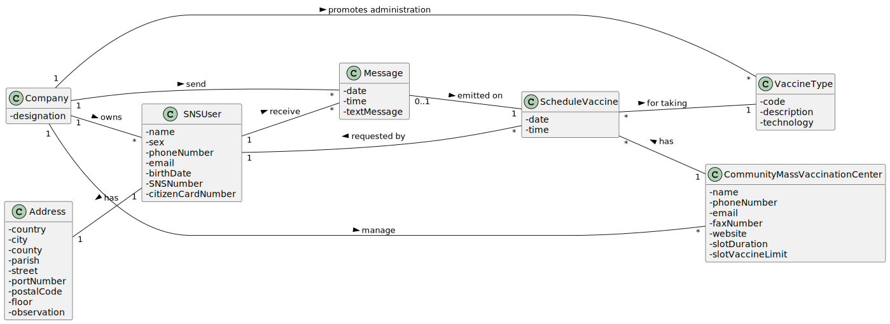
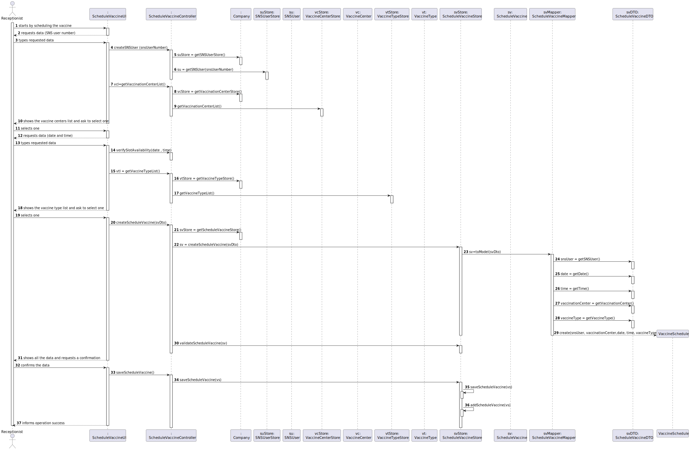
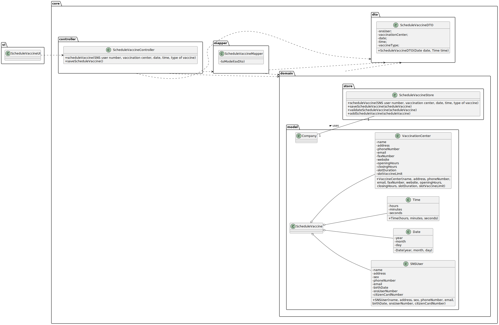

# US 01 - Schedule a Vaccine

## 1. Requirements Engineering

### 1.1. User Story Description

- As a SNS user, I intend to use the application to schedule a vaccine.

### 1.2. Customer Specifications and Clarifications 

**From the specifications document:** 

> "To take a vaccine, the SNS user should use the application to schedule his/her vaccination."

> "The user should introduce his/her SNS user number, select vaccination center, the date and the time (s)he wants to be vaccinated as well as the type of vaccine to be administered (by default, the system suggests the one related to the ongoing outnreak)."	

**From the client clarifications:**

> **Question:** "For the US01, the acceptance criteria is: A SNS User cannot schedule the same vaccine more than once.
> 				 For the US02 the acceptance criteria is: The algorithm should check if the SNS user is within the age and time since the last vaccine.
> 				 Are this acceptance criteria exclusive of each US or are implemented in both?
> 				 To make the development of each US more clear, could you clarify the differences between the two US?".
>  
> **Answer:** "The acceptance criteria for US01 and US02 should be merged. The acceptance criteria for US01 and US02 is:A SNS User cannot schedule the same vaccine more than once. The algorithm should check if the SNS user is within the age and time since the last vaccine."
> 			  "In US01 the actor is the SNS User, in US02 the actor is the receptionist. In US01 user is already logged in the system and information that is required and that exists in the system should be automatically obtained. In US02 the receptionist should ask the SNS User for the information needed to schedule a vaccination. Information describing the SNS user should be automatically obtained by introducing the SNS User number.".

> **Question:** "We are unsure if it's in this user stories that's asked to implement the "send a SMS message with information about the schedule appointment" found on the Project Description available in moodle".
>
> **Answer:** "In a previous clarification that I made on this forum, I said: "[The user should receive a] SNS message to warn of a schuduling [and the message] should include: Date, Time and Vaccination Center". Teams must record the answers! A file named SMS.txt should be used to receive/record the SMS messages. We will not use a real world service to send SMSs".

> **Question:** "Regarding the US01 - should the app ask for the location where the SNS User would like to take his vaccine or should it rather suggest a vaccination center fot the SNS User to go, based on the timetable chosen by the SNS User?".
>
> **Answer:** "The application should ask for a location where the SNS User wants to take the vaccine.".

> **Question:** "The project description says "To take a vaccine, the SNS user should use the application to schedule his/her vaccination. The user should introduce his/her SNS user number, select the vaccination center, the date, and the time(s)he wants to be vaccinated as well as the type of vaccine to be administered [...]". Does the user have to enter the date and time they want or does the system have to show the available dates and times for the user to select?".
>
> **Answer:** " In this sprint the actor should introduce (using the keyboard) the date and time (s)he wants to be vaccinated.".

> **Question:** "Regarding vaccination centers, in the project description is said: “Both kinds of vaccination centers are characterized by a name, an address, a phone number, an e-mail address, a fax number, a website address, opening and closing hours, slot duration (e.g.: 5 minutes) and the maximum number of vaccines that can be given per slot (e.g.: 10 vaccines per slot). First, it’s important to clarify that our team understands slot as a “Vaccination room where a person is vaccinated by a nurse”. Our doubts are: 1)     Shouldn’t the vaccination center be also characterized by the number of available slots that it has? (So, for example, some vaccination center has 10 available slots and following the given example in the project description, each slot can give maximum 10 vaccines, that means this vaccination center would be able to administer 100 vaccines a day.) Or should we consider that at each center exists only one slot?; 2)     Each center has a capacity, this is, there’s a maximum number of people (besides the center’s staff) that can be at the center at the same time. Should we consider that this capacity includes the waiting room and recovery room?" 
>
> **Answer:** " 1- There is only one vaccination room per center; 2- I already answered this question.".

### 1.3. Acceptance Criteria

* **AC1:** A SNS user cannot schedule the same vaccine more than once. 
* **AC2:** The time chosen must be within the opening hours of the center.
* **AC3:** For scheduling the vaccine, must take into account the slot time limit.

### 1.4. Found out Dependencies

* This user story depends on the user record.

### 1.5 Input and Output Data

**Input Data:**

* Typed data:
	* SNS User number,
	* date, 
	* time
	
	

* Selected data:
	* Vaccine Center,
	* type of vaccine

**Output Data:**

* (In)Successfully registered user

### 1.6. System Sequence Diagram (SSD)

### 1.7 Other Relevant Remarks

* (none).

## 2. OO Analysis

### 2.1. Relevant Domain Model Excerpt 

### 2.2. Other Remarks

* (none).

## 3. Design - User Story Realization 

### 3.1. Rationale

**SSD adopted**

| Interaction ID | Question: Which class is responsible for... | Answer  | Justification (with patterns)  |
|:-------------  |:--------------------- |:------------|:---------------------------- |
| Step 1 - starts scheduling the vaccine 	 |	...instantiating a new vaccine schedule? | VaccineScheduleStore   |  **IE:** The object knows its own data    |
| Step 2 - request data for vaccineSchedule (SNSUser number, date and time)	 |	...requests data for vaccineSchedule?	 |  VaccineScheduleUI  | **IE:** is responsible for user interactions    |
| Step 3 - types requested data 		 |	...saving the input data? | VaccineScheduleUI  |   **IE:** is responsible for user interactions  |
| Step 4 - shows the vaccine centers list and ask to select one	 |	...knowing the vaccine center to show? | VaccineScheduleUI  | **IE:** is responsible for user interactions |
| Step 5 - selects one  |	...is saving input? | VaccineCenter  | **IE:** The object knows its own data  |
| Step 6 - shows the vaccine type list and ask to select one  |	...knowing the vaccine type to show? | VaccineScheduleUI | **IE:** is responsible for user interactions  |
| Step 7 - selects one  |	...is saving input? | VaccineType  | **IE:** The object knows its own data  |
| Step 8 - shows all the data and requests confirmation |	...validating the data locally? | VaccineSchedule  | **IE:** The object knows its own data  |
| Step 9 - confirms the data  |	...saving the data? | VaccineScheduleStore | **IE:** adopts/records all the Vaccine Schedules objects  |
| Step 10 - informs operation success  |	...informing operation success? | VaccineScheduleUI | **IE:** responsible for user interactions  |

### Systematization ##

According to the taken rationale, the conceptual classes promoted to software classes are: 

 * Company
 * VaccineSchedule
 * VaccineCenter
 * VaccineType

Other software classes (i.e. Pure Fabrication) identified: 

 * ScheduleVaccineUI
 * ScheduleVaccineController
 * RegisterVaccinationCenterController
 * SpecifyNewVaccineTypeController
 * VaccinationCenterStore  
 * ScheduleVaccineStore
 * VaccineTypeStore
 * ScheduleVaccineMapper
 * ScheduleVaccineDto

## 3.2. Sequence Diagram (SD)

## 3.3. Class Diagram (CD)

# 4. Tests 

**Test 1:** Check that it is not possible to create an instance of the Vaccine Schedule class with null values. 

	@Test(expected = IllegalArgumentException.class)
		public void ensureNullIsNotAllowed() {
		new ScheduleVaccine (0, null, null, null, null);
	}
	

**Test 2:** Check that it is not possible to create an instance of the Vaccine Schedule class an empty vaccine center. 

	@Test(expected = IllegalArgumentException.class)
		public void ensureReferenceMeetsAC2() {
		
		new ScheduleVaccine(123456789, date, time, null, vaccinetype);
	}

**Test 3:** Check if it is not possible to create an instance of the Vaccine Schedule class with an empty vaccine center and vaccine type.

	@Test(expected = IllegalArgumentException.class)
		public void ensureReferenceMeetsAC2() {

		new ScheduleVaccine (0, date, time, null, vaccineType);
	}

# 5. Construction (Implementation)

## Class ScheduleVaccineUI

		@Override
    public void run() {
        ScheduleVaccineController controller = new ScheduleVaccineController();

        String snsUserNumber = Utils.readLineFromConsole("Insert SNS user number:");
        SNSUser su = controller.createSNSUser (snsUserNumber);

        if (su != null) {

            List< VaccinationCenter > vcl = controller.getVaccinationCenterList();
            VaccinationCenter vc = (VaccinationCenter) Utils.showAndSelectOne(vcl, "Select Vaccination center");

            try {

                String stringDate = Utils.readLineFromConsole("Insert intended date:");

                while (!Date.validateDate(stringDate) || stringDate == null) {
                    System.out.println("Insert date is invalid!!");
                    stringDate = Utils.readLineFromConsole("Insert intended date:");
                }

                Date date = Date.convertStringToDate(stringDate);

                System.out.println("Insert intended time:");
                int hours = Utils.readIntegerFromConsole("Insert hours: ");
                int minutes = Utils.readIntegerFromConsole("Insert minutes: ");
                Time time = new Time(hours, minutes);

                if (controller.verifySlotAvailability(date, time)) {
                    List< VaccineType > vtl = controller.getVaccineTypeList();
                    VaccineType vt = (VaccineType) Utils.showAndSelectOne(vtl, "Select Vaccination type");
                    controller.createScheduleVaccine(new ScheduleVaccineDTO(su, vc, date, time, vt));
                    printData(date, time);
                    askForConfirmation(controller);
                }else {
                    System.out.println("Cannot schedule for this date and time.");
                }

                printData(date, time);

            } catch (IllegalArgumentException exception) {
                System.out.println(exception.getMessage());
            }
        }
        else {
            System.out.println("The SNS user number indicated does not correspond to any registered user.");
        }

    }

    public void printData(  Date date, Time time) {
        System.out.println("");
        System.out.println("Confirm the data:");
        System.out.println("Date: " + date.toDayMonthYearString());
        System.out.println("Time: " + time.toString());

    }

    public void askForConfirmation(ScheduleVaccineController controller) {
        if (Utils.confirm("Is the data correct? (Y/N)")) {
            controller.saveScheduleVacine();
            System.out.println("Operation complete");
        } else {
            System.out.println("Operation incomplete, please try again");
        }
    }

## Class ScheduleVaccineController
	
		public class ScheduleVaccineController {
    private Company company;
    private ScheduleVaccine sv;
    private ScheduleVaccineStore svStore;
    private SNSUser su;
    private SNSUserStore suStore;
    private VaccinationCenterStore vcStore;
    private VaccineTypeStore vtStore;

    public ScheduleVaccineController() {
        this(App.getInstance().getCompany());
    }

    public ScheduleVaccineController(Company company) {
        this.company = company;
       // this.scheduleVaccine = null;
    }

    public boolean createScheduleVaccine(ScheduleVaccineDTO svDto){
        svStore = company.getScheduleVaccineStore();
        sv = ScheduleVaccineMapper.toModel(svDto);
        return svStore.validateScheduleVaccine(sv);
    }

    public SNSUser createSNSUser(String snsUserNumber) {
        suStore = company.getSNSUserStore();
        this.su = suStore.getSNSUser(snsUserNumber);
        return  this.su;
    }

    public List<VaccinationCenter> getVaccinationCenterList(){
        vcStore = company.getVaccinationCenterStore();
        return vcStore.getVaccinationCenterList();
    }

    public boolean verifySlotAvailability(Date date , Time time){
        return true;
    }

    public List<VaccineType> getVaccineTypeList(){
        vtStore = company.getVaccineTypeStore();
        return vtStore.getVaccineTypeList();
    }

    public boolean saveScheduleVacine() {
        svStore = company.getScheduleVaccineStore();

        return this.svStore.saveScheduleVaccine(sv);
    }

## Class ScheduleVaccineMapper

		public static List<ScheduleVaccineDTO> toListDTO(List<ScheduleVaccine> listSV) {
        List<ScheduleVaccineDTO> listSVDto = new ArrayList<>();

        for (int i = 0; i < listSV.size(); i++) {
            ScheduleVaccine sv = listSV.get(i);

            Date date = sv.getDate();
            Time time = sv.getTime();

            ScheduleVaccineDTO svDto = new ScheduleVaccineDTO(date, time);

            listSVDto.add(svDto);
        }

        return listSVDto;
    }

    public static ScheduleVaccine toModel(ScheduleVaccineDTO svDto) {
        SNSUser snsUser = svDto.getSNSUser();
        Date date = svDto.getDate();
        Time time = svDto.getTime();
        VaccinationCenter vaccinationCenter = svDto.getVaccinationCenter();
        VaccineType vaccineType = svDto.getVaccineType();

        return new ScheduleVaccine(snsUser, vaccinationCenter, date, time, vaccineType);

    }

## Class ScheduleVaccineController

	public ScheduleVaccineDTO(SNSUser snsUser, VaccinationCenter vaccinationCenter, Date date, Time time, VaccineType vaccineType) {
        this.snsUser = snsUser;
        this.vaccinationCenter = vaccinationCenter;
        this.date = date;
        this.time = time;
        this.vaccineType = vaccineType;
    }

	
			...

	public SNSUser getSNSUser() {
        return snsUser;
    }

    public VaccinationCenter getVaccinationCenter() {
        return vaccinationCenter;
    }

    public Date getDate() {
        return date;
    }

    public Time getTime() {
        return time;
    }

    public VaccineType getVaccineType() {
        return vaccineType;
    }

# 6. Integration and Demo 

A new option on the Main menu options was added with name "Schedule Vaccine".

Some tasks are bootstrapped while system starts.

# 7. Observations

In order to carry out this User Story, the Company responsibilities were delegated to other classes. In this way, the code is more structured and makes it easier to maintain.