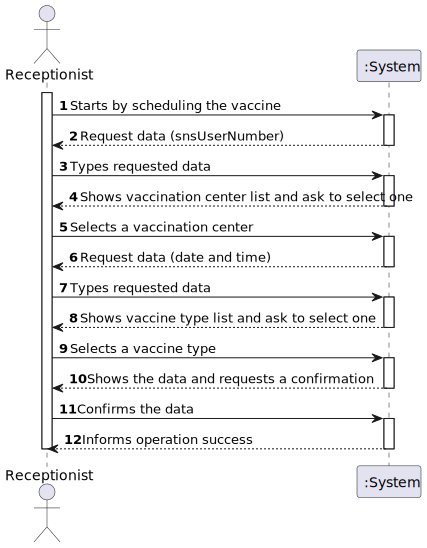
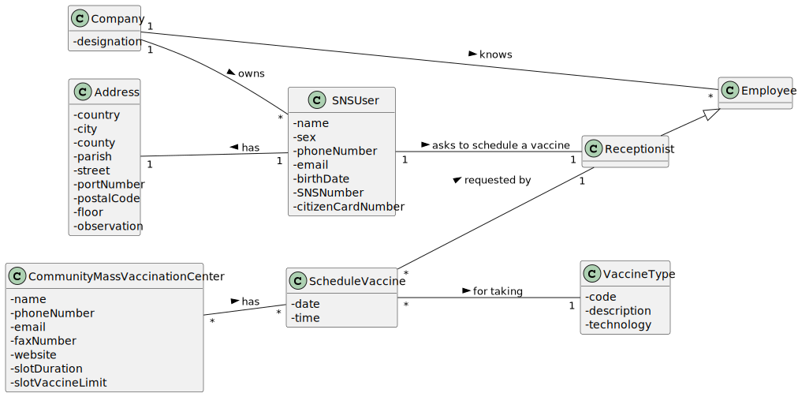
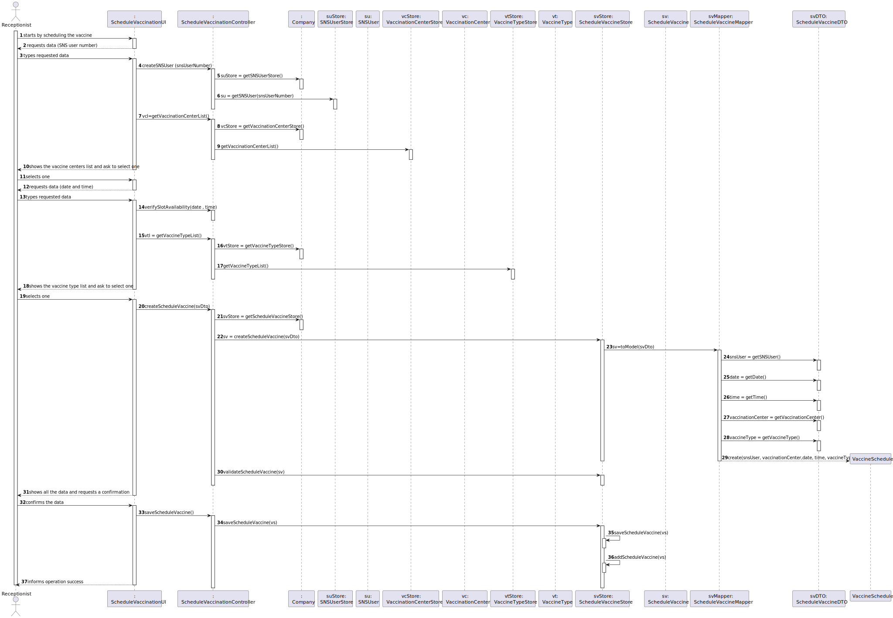
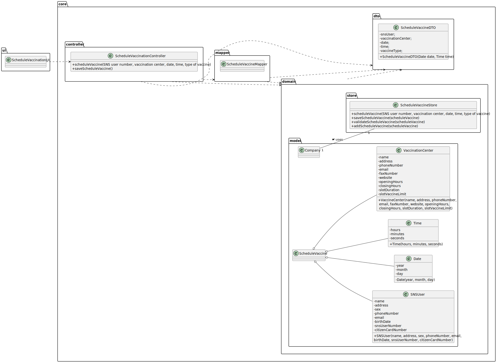

# US 02 - Schedule a vaccination

## 1. Requirements Engineering

### 1.1. User Story Description

As a receptionist at one vaccination center, I want to schedule a vaccination

### 1.2. Customer Specifications and Clarifications

**From the specifications document:**

> Some users (e.g.: older ones) may want to go to a healthcare center to schedule the vaccine appointment with the help
> of a receptionists at one vaccination center.

**From the client clarifications:**

> **Question:** A receptionist has the ability to schedule an appointment in different vaccination centres or only on
> their own?
>
> **Answer:** The receptionist has the ability to schedule the vaccine in any vaccination center. The receptionist
> should ask the SNS user to indicate/select the preferred vaccination center.

> **Question:** Does the user have to enter the date and time they want or does the system have to show the available
> dates and times for the user to select?
>
> **Answer:**  In this sprint the actor should introduce (using the keyboard) the date and time (s)he wants to be
> vaccinated.

> **Question:** We are unsure if it's in this user stories that's asked to implement the "send a SMS message with
> information about the scheduled appointment" found on the Project Description available in moodle. Could you clarify?
>
> **Answer:** The user should receive an SMS Message to warn of a scheduling and the message should include: Date, Time
> and vaccination center. Teams must record the answers! A file named SMS.txt should be used to receive/record the SMS
> messages. We will not use a real word service to send SMSs.

### 1.3. Acceptance Criteria

* **AC1:** A SNS user cannot schedule the same vaccine more than once.
* **AC2:** The time chosen must be within the opening hours of the center.
* **AC3:** For scheduling the vaccine, must take into account the slot time limit.

### 1.4. Found out Dependencies

* This user story depends on the creation of a recepcionist (US10).

### 1.5 Input and Output Data

**Input Data:**

* Typed data:
    * SNS user number
    * Date
    * Time

* Selected data:
    * Vacination center

**Output Data:**

* (In)Success of the operation

### 1.6. System Sequence Diagram (SSD)

### 1.7 Other Relevant Remarks

* None

## 2. OO Analysis

### 2.1. Relevant Domain Model Excerpt

### 2.2. Other Remarks

* None

## 3. Design - User Story Realization

### 3.1. Rationale

| Interaction ID | Question: Which class is responsible for... | Answer  | Justification (with patterns)  |
|:-------------  |:--------------------- |:------------|:---------------------------- |
| Step 1 - starts scheduling the vaccine     |    ...instantiating a new vaccine schedule? | VaccineScheduleStore   |  **
IE:** The object knows its own data    |
| Step 2 - request data for vaccineSchedule (SNSUser number, date and time)     |    ...requests data for vaccineSchedule?     |  VaccineScheduleUI  | **
IE:** is responsible for user interactions    |
| Step 3 - types requested data         |    ...saving the input data? | VaccineScheduleUI  |   **
IE:** is responsible for user interactions  |
| Step 4 - shows the vaccine centers list and ask to select one     |    ...knowing the vaccine center to show? | VaccineScheduleUI  | **
IE:** is responsible for user interactions |
| Step 5 - selects one  |    ...is saving input? | VaccineCenter  | **IE:** The object knows its own data  |
| Step 6 - shows the vaccine type list and ask to select one  |    ...knowing the vaccine type to show? | VaccineScheduleUI | **
IE:** is responsible for user interactions  |
| Step 7 - selects one  |    ...is saving input? | VaccineType  | **IE:** The object knows its own data  |
| Step 8 - shows all the data and requests confirmation |    ...validating the data locally? | VaccineSchedule  | **
IE:** The object knows its own data  |
| Step 9 - confirms the data  |    ...saving the data? | VaccineScheduleStore | **
IE:** adopts/records all the Vaccine Schedules objects  |
| Step 10 - informs operation success  |    ...informing operation success? | VaccineScheduleUI | **
IE:** responsible for user interactions  |

### Systematization ##

According to the taken rationale, the conceptual classes promoted to software classes are:

* Organization
* Platform
* Task

Other software classes (i.e. Pure Fabrication) identified:

* CreateTaskUI
* CreateTaskController

## 3.2. Sequence Diagram (SD)

## 3.3. Class Diagram (CD)

# 4. Tests

    @Test(expected = IllegalArgumentException.class)
    public void testNull() {
    ScheduleVaccine sv = new ScheduleVaccine(null, null,null,null,null);

    }

*It is also recommended to organize this content by subsections.*

# 5. Construction (Implementation)

# 6. Integration and Demo

*A new option on the Main menu options was added with name "Schedule Vaccine".

*Some tasks are bootstrapped while system starts.

# 7. Observations

In order to carry out this User Story, the Company responsibilities were delegated to other classes. In this way, the
code is more structured and makes it easier to maintain.

