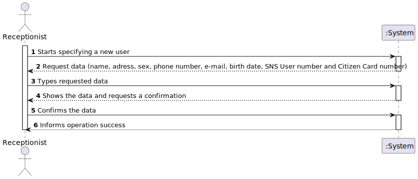
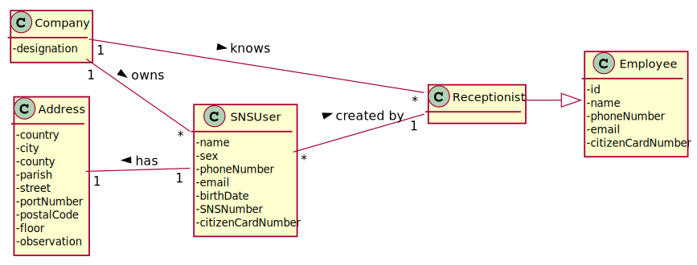
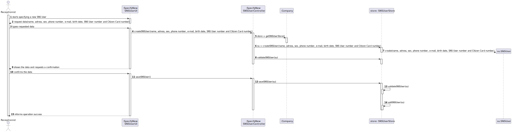
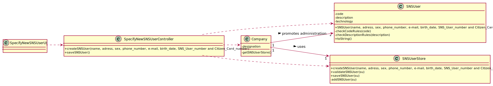

# US 03 - Register a SNS User

## 1. Requirements Engineering

### 1.1. User Story Description

- As a receptionist, I want to register a SNS user. 

### 1.2. Customer Specifications and Clarifications 

**From the specifications document:**

>	Each task is characterized by having a unique reference per organization, a designation, an informal and a technical description, an estimated duration and cost as well as the its classifying task category. 

>	As long as it is not published, access to the task is exclusive to the employees of the respective organization. 

**From the client clarifications:**

> **Question:** "There we can read "US03 - As a receptionist, I want to register a SNS User." Accordingly to our project description, the person allowed to register a SNS User it's the DGS Administrator".
>  
> **Answer:** "There is no error. We will have two User Stories for registering SNS users. One of these USs is US03 and the other US will be introduced later, in Sprint C".

> **Question:** "As a receptionist, I want to register an SNS User." " What re the necessary components in order to register an SNS User?"
>
> **Answer:** "The attributes that should be used to describe a SNS user are: name, address, sex, phone number, e-mail, Birth date, SNS User number and Citizen Card number."
> 			  "The sex attribute is optional. All other fields are required."
> 			  "The e-mail, phone number, Citizen Card number and SNS user number should be unique for each SNS User."

### 1.3. Acceptance Criteria

* **AC1:** The SNS user must become a system user. The "auth" component available on the repository must be reused (without modifications).
* **AC2:** Birth day must have the format: DD/MM/YYYY.
* **AC3:** Sex options: Male/Female.
* **AC4:** The email address must use a regular expression.
* **AC5:** All input fields are required except sex.
* **AC6:** The following fields must be unique for each user: citizen card number, SNS number, telephone number and e-mail address. When this condition is not met, the system should reject the operation and the user should be given a chance to modify the invalid data entered.
* **AC7:** The user receives an email informing them that the registration was successful and that they can start using the system. The email includes the user's password.

### 1.4. Found out Dependencies

* No dependencies were found.

### 1.5 Input and Output Data

**Input Data:**

* Typed data:
	* name, 
	* address,
	* phone number,
	* sex,  
	* e-mail, 
	* birth date, 
	* SNS User number, 
	* Citizen Card number
	

* Selected data:
	* (none)

**Output Data:**

* (In)Successfully registered user

### 1.6. System Sequence Diagram (SSD)

### 1.7 Other Relevant Remarks

* There are no relevant observations.

## 2. OO Analysis

### 2.1. Relevant Domain Model Excerpt 

### 2.2. Other Remarks

n/a

## 3. Design - User Story Realization 

### 3.1. Rationale

**SSD adopted**

| Interaction ID | Question: Which class is responsible for... | Answer  | Justification (with patterns)  |
|:-------------  |:--------------------- |:------------|:---------------------------- |
| Step 1 - starts specifying a new SNSUser  		 |	...instantiating a new SNSUser? | SNSUserStore   |      creator: R1, R2          |
| Step 2 - request data (name, address, sex, phone number, e-mail, birth date, SNSUser number and Citizen Card number) 		 |		n/a					 |             |                              |
| Step 3 - types requested data 		 |	...saving the input data? | SNSuser  |     IE: The object created in step 1 has its own data  |
| 				 |...informing operation success? | UI |    IE: responsible for user interaction |
| Step 4 - types requested data		 |	...validating the data locally? | SNSUser  | IE: knows its own data |
|                                    |	...validating the data globally? | SNSUserStore  | IE: knows all the SNS user objects  |
| Step 5 - confirms the data  		 |	...saving the created vaccine type? | SNSUserStore  | IE: adopts/records all the SNS user objects  |

### Systematization ##

According to the taken rationale, the conceptual classes promoted to software classes are: 

 * Company
 * SNSUser

Other software classes (i.e. Pure Fabrication) identified: 

 * SNSUserUI  
 * SNSUserController
 * SNSUserStore

## 3.2. Sequence Diagram (SD)

## 3.3. Class Diagram (CD)

# 4. Tests 

**Test 1:** Check that it is not possible to create an instance of the SNS class with null values. 

	@Test(expected = IllegalArgumentException.class)
		public void ensureNullIsNotAllowed() {
		SNSUser = new SNSUser (null, null, null, null, null, null, null);
	}
	

**Test 2:** Check that it is possible to create an instance of the SNS class. 

	@Test(expected = IllegalArgumentException.class)
		public void ensureReferenceMeetsAC2() {
		
		SNSUser sns user = new SNSUser("Alfredo", "Rua da rua", "123456789", "male","email@email.com", "01/01/2002", 3780, 1111);
			Assert.assertNotNull (sns user);
	}

**Test 3:** Check if it is possible to create an instance with the phone number with more than 9 digits.

	@Test(expected = IllegalArgumentException.class)
		public void ensureReferenceMeetsAC2() {

		SNSUser sns user = new SNSUser("Alfredo", "Rua da rua", "1234567890", "male","email@email.com", "01/01/2002", 3780, 1111);
			Assert.assertNotNull (sns user);
	}

**Test 4:** Check if it is possible to create an instance with all negative numbers.

	@Test(expected = IllegalArgumentException.class)
		public void ensureReferenceMeetsAC2() {

		SNSUser sns user = new SNSUser("Alfredo", "Rua da rua", "-123456789", "male","email@email.com", "-01/-01/-2002", -3780, -1111);
			Assert.assertNotNull (sns user);
	}

**Teste 5:** Check if it is possible to create an instance with the wrong gender.

	@Test(expected = IllegalArgumentException.class)
		public void ensureReferenceMeetsAC2() {

		SNSUser sns user = new SNSUser("Alfredo", "Rua da rua", "123456789", "mal","email@email.com", "01/01/2002", 3780, 1111);
			Assert.assertNotNull (sns user);
	}

# 5. Construction (Implementation)

## Class SpecifyNewSNSUserController

		...

## Class Company
	
		...

## Class SNSUser

		...

## Class SNSUserStore

		...

# 6. Integration and Demo 

A new option on the Receptionist menu options was added with name "Register a SNS user".

Some tasks are bootstrapped while system starts.

# 7. Observations

In order to carry out this User Story, the Company responsibilities were delegated to other classes. In this way, the code is more structured and makes it easier to maintain.

