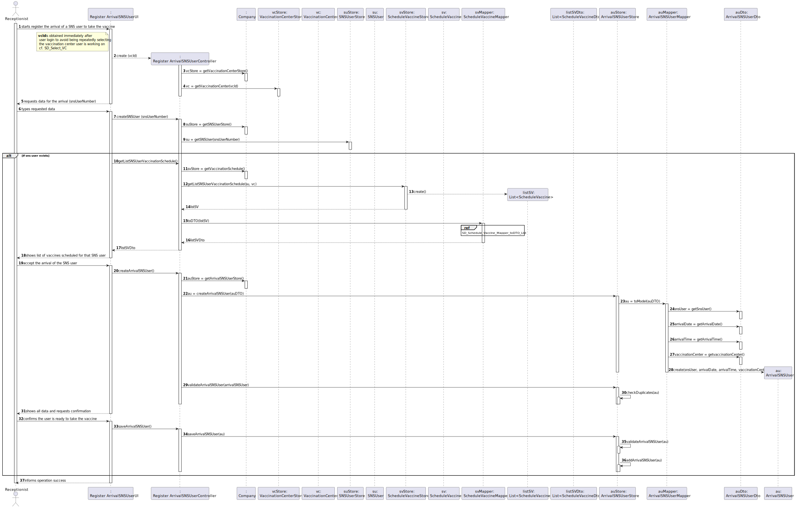
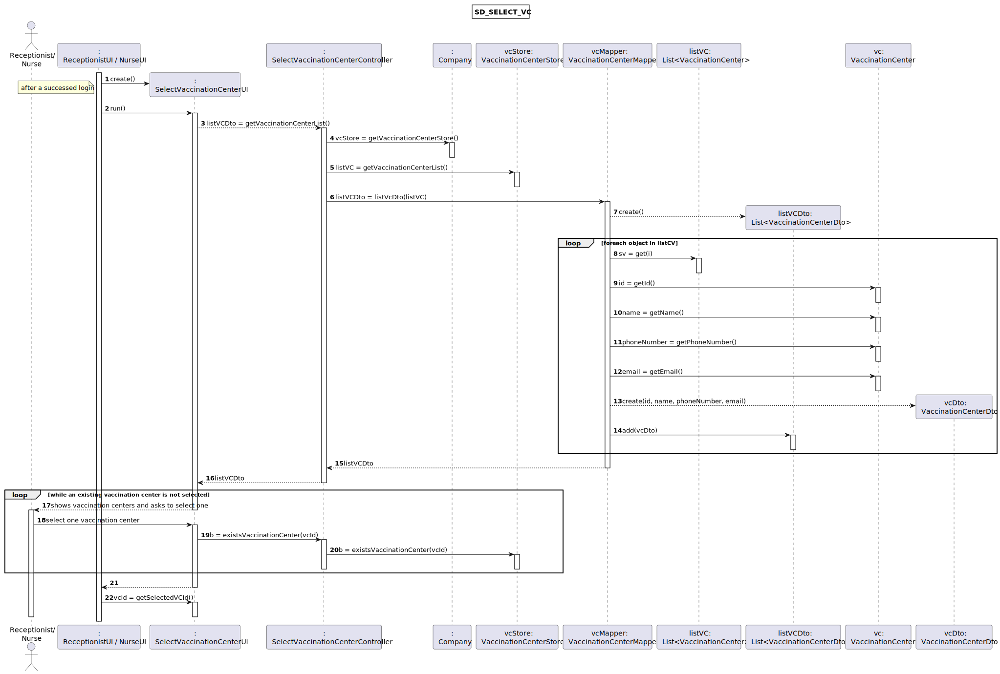

# US 04 - Register the arrival of a SNS user to take the vaccine

## 1. Requirements Engineering

### 1.1. User Story Description

As a **receptionist** at a vaccination center, I want to register the **arrival** of a **SNS user** to take the vaccine.

### 1.2. Customer Specifications and Clarifications 

**From the specifications document:**

>	"When the SNS user arrives at the vaccination center, a receptionist registers the arrival of the user to take the respective vaccine."

>   "The receptionist asks the SNS user for his/her SNS user number and confirms that he/she has the vaccine scheduled for the that day and time."

>	"If the information is correct, the receptionist acknowledges the system that the user is ready to take the vaccine."
 

**From the client clarifications:**

> **Question:** "Regarding US04, i would like to know what's the capacity of the waiting room."
>
> **Answer:** "The waiting room will not be registered or defined in the system. The waiting room of each vaccination center has the capacity to receive all users who take the vaccine on given slot."

> **Question:** "Regarding US04, a receptionist register the arrival of a SNS user immediately when he arrives at the vaccination center or only after the receptionist confirms that the respective user has a vaccine schedule for that day and time."
>
> **Answer:** "The receptionist registers the arrival of a SNS user only after confirming that the user has a vaccine scheduled for that day and time."

> **Question:** "When the SNS user number is introduce by the receptionist and the system has no appointment for that SNS user number, how should the system proceed?"
>
> **Answer:** "The application should present a message saying that the SNS user did not scheduled a vaccination."

> **Question:** "Regarding US04, what are the attributes needed in order to register the arrival of a SNS user to a vaccination center?"
>
> **Answer:** "The time of arrival should be registered."
 
> **Question:** "When the receptionist registers a SNSUser arrival, should we validate that the vaccination center where the SNS user arrives is the same as where the receptionist is currently working? If so, should we allocate receptionists to vaccination centers, i.e., ask the receptionist which vaccination center is she currently working at?"
>
> **Answer:** "To start using the application, the receptionist should first select the vaccination center where she is working. The receptionists register the arrival of a SNS user at the vaccination center where she is working." 

> **Question:** "Regarding US04, the attribute "arrival time" should be considered to let the user enter the waiting room. For example, a user that arrives 40 minutes after his appointment wont be allowed to enter the center, and another who only arrives 10 minutes late may proceed. If so, how much compensation time should we provide to the user."
>
> **Answer:** "In this sprint we are not going to address the problem of delays. All arriving users are attended and registered by the receptionist."

### 1.3. Acceptance Criteria

* **AC1:** No duplicate entries should be possible for the same SNS user on the same day or vaccine period.
* **AC2:** The vaccine scheduled must correspond for that day and time. 

### 1.4. Found out Dependencies

* There is a dependency for "US1 - As a SNS user, I intend to use the application to schedule a vaccine" or "US2 - As a receptionist at one vaccination center, I want to schedule a vaccination", as it is necessary to be able to schedule a vaccine to list it them.
* There is a dependency for "US3 - As a receptionist, I want to register a SNS user" since an SNS user must be registered to be able to register your arrival.
* There is a dependency for "US9 - As an administrator, I want to register a vaccination center to respond to a certain pandemic" since a vaccination center must be registered in order to register arrivals there.

### 1.5 Input and Output Data

**Input Data:**

* Typed data:
    * SNS user number
	
* Selected data:
    * (none)

**Output Data:**
* List of vaccines scheduled for the current day for this SNS user
* (In)Success of the operation

### 1.6. System Sequence Diagram (SSD)

### 1.7 Other Relevant Remarks

(none)

## 2. OO Analysis

### 2.1. Relevant Domain Model Excerpt 

### 2.2. Other Remarks

(none)

## 3. Design - User Story Realization 

### 3.1. Rationale

| Interaction ID | Question: Which class is responsible for... | Answer  | Justification (with patterns)  |
|:-------------  |:--------------------- |:------------|:---------------------------- |
| Step 1 | ...interacting with the actor? | RegisterArrivalSNSUserUI | **Pure Fabrication:** there is no reason to assign this responsibility to any existing class in the Domain Model |
| | ...coordinating the US? | RegisterArrivalSNSUserController | **Controller** |
| | ...do you know the vaccination center where the actor is logged in? | RegisterArrivalSNSUserUI | **Pure Fabrication:** there is no reason to assign this responsibility to any existing class in the Domain Model |
| | ...knows the list of vaccinations centers? | VaccinationCenterStore | **IE:** knows all the vaccination centers |
| | ...knows VaccinationCenterStore? | Company |  **IE:** Company knows the VaccinationCenterStore to which it is delegating some tasks |
| Step 2 | | |
| Step 3 | ...verify SNS number exists? | SNSUserStore | knows all the SNS users |
| | ...knows SNSUserStore? | Company |  **IE:** Company knows the SNSUserStore to which it is delegating some tasks |
| | ...knows the list of vaccine schedules of the SNS user? | ScheduleVaccineStore | **IE:** knows all the vaccine schedules |
| | ...transfer the list data from the store to the controller? | ScheduleVaccineDTO | **DTO:** When there is so much data to transfer, it is better to opt by using a DTO in order to reduce coupling between UI and domain |
| |	...instantiating a new list ScheduleVaccine? | ScheduleVaccineMapper  | **DTO** using **Mapper**, **Creator (R1)** and **HC+LC**: By the application of the Creator (R1) it would be the "Company". But, by applying HC + LC to the "Company", and since we are using the DTO pattern to transfer the data between the store layer and the controller layer, this delegates that responsibility to the "ScheduleVaccineMapper" |
| | ...knows ScheduleVaccineStore? | Company |  **IE:** Company knows the ScheduleVaccineStore to which it is delegating some tasks |
| Step 4 | | | |
| Step 5 | ...transfer the data typed in the UI to the domain? | ArrivalSNSUserDTO | **DTO:** When there is so much data to transfer, it is better to opt by using a DTO in order to reduce coupling between UI and domain |
| |	...instantiating a new ArrivalSNSUser? | ArrivalSNSUserMapper  | **DTO** using **Mapper**, **Creator (R1)** and **HC+LC**: By the application of the Creator (R1) it would be the "Company". But, by applying HC + LC to the "Company", and since we are using the DTO pattern to transfer the data between the UI layer and the domain layer, this delegates that responsibility to the "ArrivalSNSUserMapper" |
| | ...knows ArrivalSNSUserStore? | Company |  **IE:** Company knows the ArrivalSNSUserStore to which it is delegating some tasks |
| | ...saving the sns user arrival data? | ArrivalSNSUser | **IE:** a client knows its own data |
| |	...validating all data (local validation)? | ArrivalSNSUser | **IE:** an object knows its data |
| |	...validating all data (global validation)? | ArrivalSNSUserStore | **IE:** knows all the arrival users | 
| Step 6 | | | |
| Step 7 |	...saving the user SNS arrival? | ArrivalSNSUserStore | **IE:** knows all the arrival users | 
| Step 8 |	...informing operation success?| RegisterArrivalSNSUserUI  | **IE:** is responsible for user interactions  | 

### Systematization ##

According to the taken rationale, the conceptual classes promoted to software classes are:

  * Company
  * ArrivalSNSUser
  * ScheduleVaccine

Other software classes (i.e. Pure Fabrication) identified:

  * ArrivalSNSUserStore
  * ArrivalSNSUserMapper
  * ArrivalSNSUserDTO
  * VaccinationCenterStore
  * SNSUserStore
  * ScheduleVaccineStore
  * ScheduleVaccineMapper
  * ScheduleVaccineDTO
  * RegisterArrivalSNSUserController
  * RegisterArrivalSNSUserUI

## 3.2. Sequence Diagram (SD)

**Main SD**

**Select Vaccination Center SD**

**Schedule Vaccine Mapper toDTO List SD**

## 3.3. Class Diagram (CD)

# 4. Tests 

### Class ArrivalSNSUser

**Test 1:** Check that it is not possible to create an instance of the ArrivalSNSUser class with null values.

    @Test(expected = IllegalArgumentException.class)
    public void ensureNullIsNotAllowed() {
        new ArrivalSNSUser(null, null, null, null);
    }

**Test 2:** Check if it is possible to search for a registered SNS user using a non-existent SNS user number.

    @Test
    public void testCreateSNSUser() {
        SNSUser SNS_USER1 = new SNSUser("André Silva", "Rua da Fruta Nº30", "Male", "967654321", new Email("Silva@Gmail.com"), new Date(2008, 12, 12), "187178348", "165044578");
        company.getSNSUserStore().saveSNSUser(SNS_USER1);

        boolean test1 = controller.createSNSUser("123456789");
        boolean test2 = controller.createSNSUser("987654321");
        boolean test3 = controller.createSNSUser("187178348");

        Assert.assertFalse(test1);
        Assert.assertFalse(test2);
        Assert.assertTrue(test3);
    }

**Test 3:** Check if it is possible No duplicate entries should be possible for the same SNS user on the same day or vaccine period.

    @Test
    public void testCheckDuplicates() {
        boolean test1 = arrivalSNSUserStore.checkDuplicates(new ArrivalSNSUser(SNS_USER1, new Date(2022, 12, 12),
                new Time(10, 25, 10), VACCINATION_CENTER));
        boolean test2 = arrivalSNSUserStore.checkDuplicates(new ArrivalSNSUser(SNS_USER2, new Date(2022, 12, 12),
                new Time(12, 30, 15), VACCINATION_CENTER));
        boolean test3 = arrivalSNSUserStore.checkDuplicates(new ArrivalSNSUser(SNS_USER3, new Date(2022, 12, 12),
                new Time(14, 45, 20), VACCINATION_CENTER));

        Assert.assertFalse(test1);
        Assert.assertFalse(test2);
        Assert.assertTrue(test3);
    }

# 5. Construction (Implementation)

## Class Company
    
    ...
    
    private VaccinationCenterStore vaccinationCenterStore = new VaccinationCenterStore();
    private SNSUserStore snsUserStore = new SNSUserStore();
    private ScheduleVaccineStore scheduleVaccineStore = new ScheduleVaccineStore();
    private ArrivalSNSUserStore arrivalSNSUserStore = new ArrivalSNSUserStore();
    
    ...
    
    public VaccinationCenterStore getVaccinationCenterStore() {
        return vaccinationCenterStore;
    }

    public SNSUserStore getSNSUserStore() {
        return snsUserStore;
    }

    public ScheduleVaccineStore getScheduleVaccineStore() {
        return scheduleVaccineStore;
    }

    public ArrivalSNSUserStore getArrivalSNSUserStore() {
        return arrivalSNSUserStore;
    }
    

## Class ArrivalUser

    private SNSUser snsUser;
    private Date arrivalDate;  
    private Time arrivalTime;
    private VaccinationCenter vaccinationCenter;
    private boolean waitingRoom;

    public ArrivalSNSUser(SNSUser snsUser, Date arrivalDate, Time arrivalTime, VaccinationCenter vaccinationCenter) {
        this.snsUser = snsUser;
        this.arrivalDate = arrivalDate;
        this.arrivalTime = arrivalTime;
        this.vaccinationCenter = vaccinationCenter;
        this.waitingRoom = true;
    }

## Class SNSUser

    private String name;
    private String address;
    private String sex;
    private String phoneNumber;
    private Email email;
    private Date birthdate;
    private String snsUserNumber;
    private String citizenCardNumber;

    public SNSUser(String name, String address, String sex, String phoneNumber, Email email,
                   Date birthdate, String snsUserNumber, String citizenCardNumber) {
        this.name = name;
        this.address = address;
        this.sex = sex;
        this.phoneNumber = phoneNumber;
        this.email = email;
        this.birthdate = birthdate;
        this.snsUserNumber = snsUserNumber;
        this.citizenCardNumber = citizenCardNumber;
    }

## Class VaccinationCenter

    private int id;
    private String name;
    private String address;
    private int phoneNumber;
    private Email email;
    private int faxNumber;
    private String website;
    private Time openingHours;
    private Time closingHours;
    private int slotDuration;
    private int slotVaccineLimit;

    private static int numberVaccinationCenters;

    public VaccinationCenter(String name, String address, int phoneNumber, Email email,
                             int faxNumber, String website, Time openingHours, Time closingHours,
                             int slotDuration, int slotVaccineLimit) {

        this.id = ++numberVaccinationCenters;
        this.name = name;
        this.address = address;
        this.phoneNumber = phoneNumber;
        this.email = email;
        this.faxNumber = faxNumber;
        this.website = website;
        this.openingHours = openingHours;
        this.closingHours = closingHours;
        this.slotDuration = slotDuration;
        this.slotVaccineLimit = slotVaccineLimit;
    }
    
## Class Date

    private int year;
    private Months month;
    private int day;

    public Date(int year, int month, int day) {
        this.year = year;
        this.month = Months.getMonths(month);
        this.day = day;
    }

    public static Date currentDate() {
        Calendar today = Calendar.getInstance();
        int year = today.get(Calendar.YEAR);
        int month = today.get(Calendar.MONTH) + 1;
        int day = today.get(Calendar.DAY_OF_MONTH);
        return new Date(year, month, day);
    }
    
    
    
## Class Time

    private int hours;
    private int minutes;
    private int seconds;

    public Time(int hours, int minutes, int seconds) {
        checkHours(hours);
        checkMinutes(minutes);
        checkSeconds(seconds);

        this.hours = hours;
        this.minutes = minutes;
        this.seconds = seconds;
    }

    public static Time currentTime() {
        Calendar now = Calendar.getInstance();
        int hour = now.get(Calendar.HOUR_OF_DAY);
        int minute = now.get(Calendar.MINUTE);
        int second = now.get(Calendar.SECOND);

        return new Time(hour, minute, second);
    }

## Class ScheduleVaccine

    private SNSUser snsUser;
    private VaccinationCenter vaccinationCenter;
    private Date date;
    private Time time;
    private VaccineType vaccineType;

    public ScheduleVaccine(SNSUser snsUser, VaccinationCenter vaccinationCenter, Date date, Time time, VaccineType vaccineType) {
        this.snsUser = snsUser;
        this.vaccinationCenter = vaccinationCenter;
        this.date = date;
        this.time = time;
        this.vaccineType = vaccineType;
    }

## Class ArrivalSNSUserStore

    private List<ArrivalSNSUser> listAU = new ArrayList<>();

    public ArrivalSNSUser createArrivalSNSUser(ArrivalSNSUserDTO auDto) {
        ArrivalSNSUser au = ArrivalSNSUserMapper.toModel(auDto);
        return au;
    }

    public boolean validateArrivalSNSUser(ArrivalSNSUser au) {
        if (au == null) {
            return false;
        } else {
            return !checkDuplicates(au);
        }
    }

    public boolean checkDuplicates(ArrivalSNSUser au) {
        return this.listAU.contains(au);
    }

    public boolean saveArrivalSNSUser(ArrivalSNSUser au) {
        if (!validateArrivalSNSUser(au)) {
            return false;
        } else {
            return addArrivalSNSUser(au);
        }
    }

    private boolean addArrivalSNSUser(ArrivalSNSUser arrivalSNSUser) {
        return this.listAU.add(arrivalSNSUser);
    }

## Class VaccinationCenterStore 

    private List<VaccinationCenter> vcList = new ArrayList<>();
    
    ...

    public VaccinationCenter getVaccinationCenter(int vcId) {
        VaccinationCenter vc = null;

        for (VaccinationCenter list : listVC) {
            if (list.getId() == vcId) {
                vc = list;
            }
        }

        return vc;
    }

## Class SNSUserStore

    private List<SNSUser> listSU = new ArrayList<>();

    ...

    public SNSUser getSNSUser(String snsUserNumber) {
        SNSUser su = null;

        for (SNSUser item : listSU) {
            if (item.getSnsUserNumber().equals(snsUserNumber)) {
                su = item;
            }
        }

        return su;
    }

## Class ScheduleVaccineStore

    private List<ScheduleVaccine> listSV = new ArrayList<>();

    ...

    public List<ScheduleVaccine> getVaccinationScheduleListSNSUser(SNSUser su, VaccinationCenter vc) {
        List<ScheduleVaccine> listSV = new ArrayList<>();
    
        for (ScheduleVaccine list : this.listSV) {
            if (list.getSnsUser().equals(su)
                    && list.getVaccinationCenter().equals(vc)
                    && list.getDate().equals(Date.currentDate())) {
    
                listSV.add(list);
            }
        }
    
        return listSV;
    }

## Class ArrivalSNSUserController

    private Company company;
    private ArrivalSNSUserStore auStore;
    private VaccinationCenterStore vcStore;
    private SNSUserStore suStore;
    private ScheduleVaccineStore svStore;
    private ArrivalSNSUser au;
    private SNSUser su;
    private VaccinationCenter vc;

    public RegisterArrivalSNSUserController(int vcId) {
        this(App.getInstance().getCompany());
        vc = vcStore.getVaccinationCenter(vcId);
    }

    public RegisterArrivalSNSUserController(Company company) {
        this.company = company;
        this.au = null;
        this.su = null;
        this.vcStore = this.company.getVaccinationCenterStore();
    }

    public boolean createArrivalSNSUser() {
        this.auStore = this.company.getArrivalSNSUserStore();
        ArrivalSNSUserDTO auDTO = new ArrivalSNSUserDTO(su, Date.currentDate(), Time.currentTime(), vc);
        this.au = this.auStore.createArrivalSNSUser(auDTO);
        return this.auStore.checkDuplicates(au);
    }

    public boolean saveArrivalSNSUser() {
        return this.auStore.saveArrivalSNSUser(au);
    }

    public ArrivalSNSUser getArrivalSNSUser() {
        return au;
    }

    public boolean createSNSUser(String snsUserNumber) {
        this.suStore = this.company.getSNSUserStore();
        this.su = suStore.getSNSUser(snsUserNumber);
        return su != null;
    }

    public List<ScheduleVaccineDTO> getListSNSUserVaccinationSchedule() {
        this.svStore = this.company.getScheduleVaccineStore();
        List<ScheduleVaccine> listSV = svStore.getVaccinationScheduleListSNSUser(su, vc);
        return ScheduleVaccineMapper.toListDTO(listSV);
    }

## Class ArrivalSNSUserMapper

    public static ArrivalSNSUser toModel(ArrivalSNSUserDTO auDTO) {
        SNSUser snsUser = auDTO.getSnsUser();
        Date arrivalDate = auDTO.getArrivalDate();
        Time arrivalTime = auDTO.getArrivalTime();
        VaccinationCenter vaccinationCenter = auDTO.getVaccinationCenter();

        return new ArrivalSNSUser(snsUser, arrivalDate, arrivalTime, vaccinationCenter);
    }

## Class ScheduleVaccineMapper

    public static List<ScheduleVaccineDTO> toListDTO(List<ScheduleVaccine> listSV) {
        List<ScheduleVaccineDTO> listSVDto = new ArrayList<>();

        for (int i = 0; i < listSV.size(); i++) {
            ScheduleVaccine sv = listSV.get(i);

            Date date = sv.getDate();
            Time time = sv.getTime();

            ScheduleVaccineDTO svDto = new ScheduleVaccineDTO(date, time);

            listSVDto.add(svDto);
        }

        return listSVDto;
    }

## Class ArrivalSNSUserDTO

    private SNSUser snsUser;
    private Date arrivalDate;
    private Time arrivalTime;
    private VaccinationCenter vaccinationCenter;
    private boolean waitingRoom;

    public ArrivalSNSUserDTO(SNSUser snsUser, Date arrivalDate, Time arrivalTime, VaccinationCenter vaccinationCenter) {
        this.snsUser = snsUser;
        this.arrivalDate = arrivalDate;
        this.arrivalTime = arrivalTime;
        this.vaccinationCenter = vaccinationCenter;
        this.waitingRoom = true;
    }

    public SNSUser getSnsUser() {
        return snsUser;
    }

    public Date getArrivalDate() {
        return arrivalDate;
    }

    public Time getArrivalTime() {
        return arrivalTime;
    }

    public VaccinationCenter getVaccinationCenter() {
        return vaccinationCenter;
    }

## Class ScheduleVaccineDTO

    private SNSUser snsUser;
    private VaccinationCenter vaccinationCenter;
    private Date date;
    private Time time;
    private VaccineType vaccineType;

    public ScheduleVaccineDTO(Date date, Time time) {
        this.date = date;
        this.time = time;
    }

# 6. Integration and Demo 

* A new option on the Receptionist menu options was added with name "Register the arrival of a SNS user".

* Some tasks are bootstrapped while system starts.

# 7. Observations

* In order to carry out this User Story, the Company responsibilities were delegated to other classes. In this way, the code is more structured and makes it easier to maintain.
