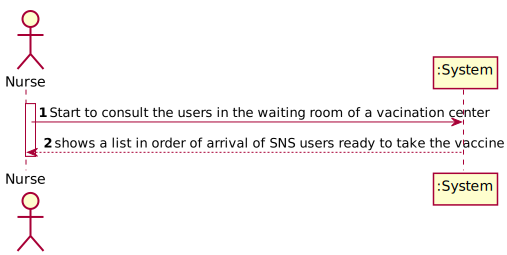
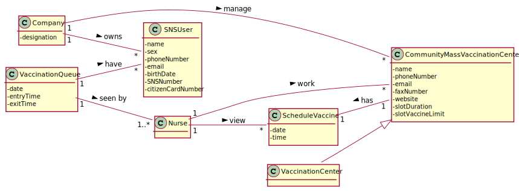
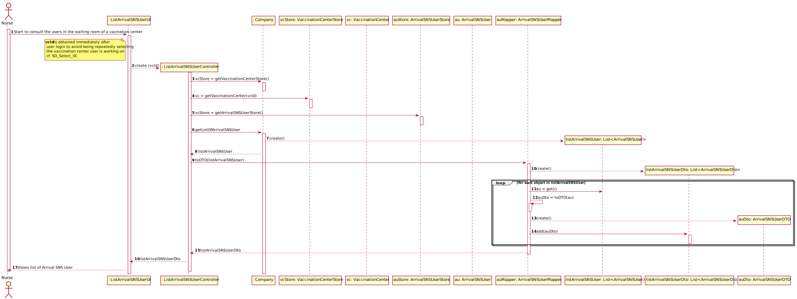
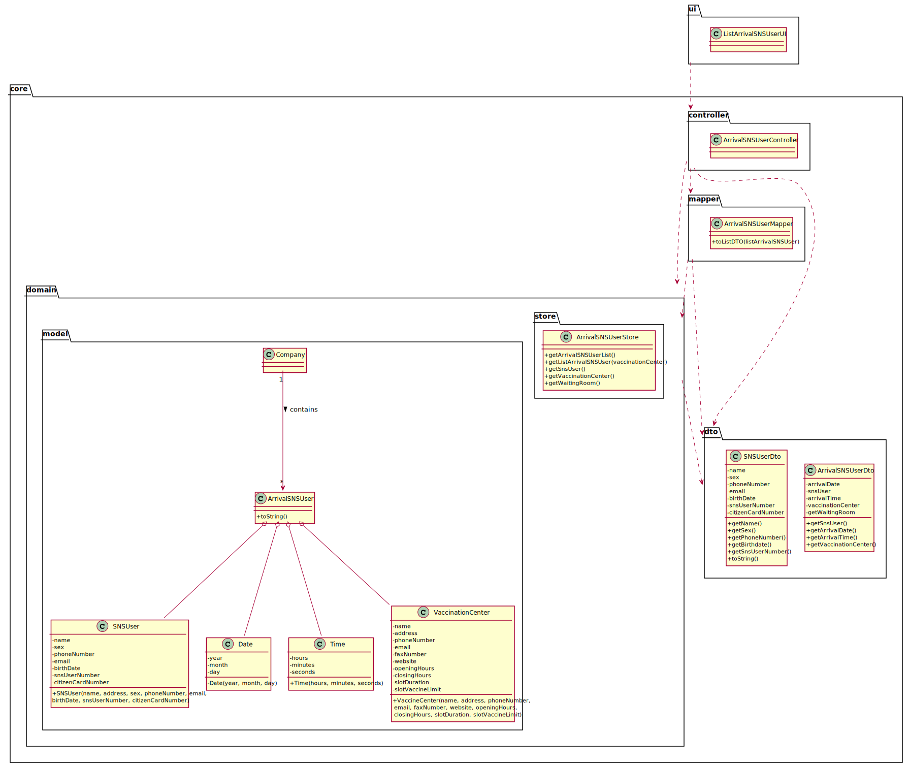

# US 05 - List the arrival of a SNS User to take the vaccine

## 1. Requirements Engineering

### 1.1. User Story Description

- As a nurse, I intend to consult the users in the waiting room of a vacination center.

### 1.2. Customer Specifications and Clarifications

**From the specifications document:**

> At any time, a nurse responsible for administering the vaccine will use the application to check the list of SNS users that are present in the vaccination center to take the vaccine and will call one SNS user to administer him/her the vaccine. Usually, the user that has arrived firstly will be the first one to be vaccinated (like a FIFO queue).

**From the client clarifications:**

> **Question:** Regarding US05, the listing is supposed to be for the day itself or for a specific day.
>
>
> **Answer:** The list should show the users in the waiting room of a vaccination center.

> **Question:** What information about the Users (name, SNS number, etc) should the system display when listing them?
>
>
> **Answer:** Name, Sex, Birth Date, SNS User Number and Phone Number.

### 1.3. Acceptance Criteria

* **AC1:** SNS Users’ list should be presented by order of arrival.

### 1.4. Found out Dependencies

* There is a dependency for "US04 - As a receptionist at a vaccination post, I want to register the arrival of an SNS
  user to take the vaccine", to be able to list it is necessary that the users are registered.

### 1.5 Input and Output Data

**Input Data:**

* Typed data: (None)

* Selected data:
    * (None)

**Output Data:**

* List in order of arrival of SNS users ready to take the vaccine

### 1.6. System Sequence Diagram (SSD)

### 1.7 Other Relevant Remarks

(none)

## 2. OO Analysis

### 2.1. Relevant Domain Model Excerpt

### 2.2. Other Remarks

(none)

## 3. Design - User Story Realization

### 3.1. Rationale

**SSD adopted.**

| Interaction ID | Question: Which class is responsible for... | Answer  | Justification (with patterns)  |
|:-------------  |:--------------------- |:------------|:---------------------------- |
| Step 1 | ...interacting with the actor? | ListArrivalSNSUserUI | **Pure Fabrication:** there is no reason to assign this responsibility to any existing class in the Domain Model |
| | ...coordinating the US? | ListArrivalSNSUserController | **Controller** |
| | ...do you know the vaccination center where the actor is logged in? | ListArrivalSNSUserUI | **Pure Fabrication:** there is no reason to assign this responsibility to any existing class in the Domain Model |
| | ...knows the list of vaccinations centers? | VaccinationCenterStore | **IE:** knows all the vaccination centers |
| | ...knows VaccinationCenterStore? | Company |  **IE:** Company knows the VaccinationCenterStore to which it is delegating some tasks |
| Step 2 | ...knows the list arrival SNS user? | ArrivalSNSUserStore | **IE:** knows all the SNS User |
| | ...transfer the list data from the store to the controller? | ArrivalSNSUserDTO | **DTO:** When there is so much data to transfer, it is better to opt by using a DTO in order to reduce coupling between UI and domain |
| |	...instantiating a new list ArrivalSNSUser? | ArrivalSNSUserMapper  | **DTO** using **Mapper**, **Creator (R1)** and **HC+LC**: By the application of the Creator (R1) it would be the "Company". But, by applying HC + LC to the "Company", and since we are using the DTO pattern to transfer the data between the store layer and the controller layer, this delegates that responsibility to the "ArrivalSNSUserMapper" |
| | ...who knows the attributes? | ArrivalSNSUser | **IE:** an object knows its data |
| | ...knows ArrivalSNSUserStore? | Company |  **IE:** Company knows the ArrivalSNSUserStore to which it is delegating some tasks |
| |	...show list of arrival SNS User?| ListArrivalSNSUserUI  | **IE:** is responsible list arrival SNS User |

### Systematization ##

According to the taken rationale, the conceptual classes promoted to software classes are:

* Company
* ArrivalSNSUser

Other software classes (i.e. Pure Fabrication) identified:

* ListArrivalSNSUserUI
* ListArrivalSNSUserController
* VaccinationCenterStore
* ArrivalSNSUserStore
* ArrivalSNSUserDTO
* ArrivalSNSUserMapper

## 3.2. Sequence Diagram (SD)

## 3.3. Class Diagram (CD)

# 4. Tests

**Test 1:** Check if it lists arrival SNS user.

	public void getListArrivalSNSUserTest() {
		
		...
		List<ArrivalSNSUserDTO> expectedArivalSNSUserList = controller.getListArrivalSNSUser();

        ArrivalSNSUserDTO arrivalSNSUserDTO = new ArrivalSNSUserDTO(snsUser);
        ArrivalSNSUserDTO arrivalSNSUserDTO1 = new ArrivalSNSUserDTO(snsUser1);

        List<ArrivalSNSUserDTO> resultArrivalSNSUserList = new ArrayList<>();

        resultArrivalSNSUserList.add(arrivalSNSUserDTO);
        resultArrivalSNSUserList.add(arrivalSNSUserDTO1);
        int n = 0;
        while (n < resultArrivalSNSUserList.size()) {
            boolean result = resultArrivalSNSUserList.get(n).equals(resultArrivalSNSUserList.get(n));
            Assert.assertTrue(result);
            n++;
        }
    }

# 5. Construction (Implementation)

## Class ArrivalSNSUserMapper

    public static ArrivalSNSUser toModel(ArrivalSNSUserDTO auDTO) {
        SNSUser snsUser = auDTO.getSnsUser();
        Date arrivalDate = auDTO.getArrivalDate();
        Time arrivalTime = auDTO.getArrivalTime();
        VaccinationCenter vaccinationCenter = auDTO.getVaccinationCenter();

        return new ArrivalSNSUser(snsUser, arrivalDate, arrivalTime, vaccinationCenter);
    }

    public static List<SNSUserDTO> toListDTO(List<ArrivalSNSUser> listArrivalSNSUser) {
        List<SNSUserDTO> listSNSUserDto = new ArrayList<>();

        for (int i = 0; i < listArrivalSNSUser.size(); i++) {
            ArrivalSNSUser au = listArrivalSNSUser.get(i);

            String name = au.getSnsUser().getName();
            String sex = au.getSnsUser().getSex();
            String birthdate = au.getSnsUser().getBirthdate();
            String phoneNumber = au.getSnsUser().getPhoneNumber();
            String snsUserNumber = au.getSnsUser().getSnsUserNumber();

            SNSUserDTO userDTO= new SNSUserDTO(name,sex,birthdate,phoneNumber,snsUserNumber);
            listSNSUserDto.add(userDTO);
        }

        return listSNSUserDto;

    }

## Class ListArrivalSNSUserController

    private Company company;

    private ArrivalSNSUser arrivalSNSUser;

    private ArrivalSNSUserStore store;

    private VaccinationCenter vaccinationCenter;

    public ListArrivalSNSUserController(/*VaccinationCenter vaccinationCenter*/) {
        //this.vaccinationCenter = vaccinationCenter;
        this(App.getInstance().getCompany());
    }

    public ListArrivalSNSUserController(Company company) {
        this.company = company;
        this.arrivalSNSUser = null;
        this.store = this.company.getArrivalSNSUserStore();
    }

    public List<SNSUserDTO> getListArrivalSNSUser( ){
        List<ArrivalSNSUser> arrivalSNSUserList = store.getListArrivalSNSUser(vaccinationCenter);
        return ArrivalSNSUserMapper.toListDTO(arrivalSNSUserList);

    }

## Class ArrivalSNSUserDTO

    private SNSUser snsUser;

    private Date arrivalDate;

    private Time arrivalTime;

    private VaccinationCenter vaccinationCenter;

    private boolean waitingRoom;

    public ArrivalSNSUserDTO(SNSUser snsUser, Date arrivalDate, Time arrivalTime, VaccinationCenter vaccinationCenter) {
        this.snsUser = snsUser;
        this.arrivalDate = arrivalDate;
        this.arrivalTime = arrivalTime;
        this.vaccinationCenter = vaccinationCenter;
        this.waitingRoom = true;
    }

    public SNSUser getSnsUser() {
        return snsUser;
    }

    public Date getArrivalDate() {
        return arrivalDate;
    }

    public Time getArrivalTime() {
        return arrivalTime;
    }

    public VaccinationCenter getVaccinationCenter() {
        return vaccinationCenter;
    }

    public boolean getWaitingRoom() {
        return waitingRoom;
    }

## Class ArrivalSNSUser

	private SNSUser snsUser;

    private Date arrivalDate;

    private Time arrivalTime;

    private VaccinationCenter vaccinationCenter;

    private boolean waitingRoom;

    public ArrivalSNSUser(SNSUser snsUser, Date arrivalDate, Time arrivalTime, VaccinationCenter vaccinationCenter) {
        this.snsUser = snsUser;
        this.arrivalDate = arrivalDate;
        this.arrivalTime = arrivalTime;
        this.vaccinationCenter = vaccinationCenter;
        this.waitingRoom = true;
    }

    @Override
    public String toString() {
        return String.format("SNS User Number: %s \nArrival Date: %s \nArrival Time: %s",
                this.snsUser.getSnsUserNumber(), this.arrivalDate, this.arrivalTime);
    }

    @Override
    public boolean equals(Object otherObject) {
        if (this == otherObject) {
            return true;
        }

        if (otherObject == null || this.getClass() != otherObject.getClass()) {
            return false;
        }

        ArrivalSNSUser otherArrivalSNSUser = (ArrivalSNSUser) otherObject;
        return (this.snsUser.equals(otherArrivalSNSUser.snsUser)
                && (this.arrivalDate.equals(otherArrivalSNSUser.arrivalDate))
                && (this.vaccinationCenter.equals(otherArrivalSNSUser.vaccinationCenter)));
    }

    @Override
    public int compareTo(ArrivalSNSUser otherArrivalSNSUser) {
        if (!this.arrivalDate.equals(otherArrivalSNSUser.arrivalDate)) {
            return this.arrivalDate.compareTo(otherArrivalSNSUser.arrivalDate);
        } else {
            return this.arrivalTime.compareTo(otherArrivalSNSUser.arrivalTime);
        }
    }

    public SNSUser getSnsUser() {
        return snsUser;
    }

    public VaccinationCenter getVaccinationCenter() {
        return vaccinationCenter;
    }

    public boolean getWaitingRoom() {
        return waitingRoom;
    }

## Class ArrivalSNSUserStore

    private List<ArrivalSNSUser> listAU = new ArrayList<>();

    public ArrivalSNSUser createArrivalSNSUser(ArrivalSNSUserDTO auDto) {
        ArrivalSNSUser au = ArrivalSNSUserMapper.toModel(auDto);
        return au;
    }

    public boolean validateArrivalSNSUser(ArrivalSNSUser au) {
        if (au == null) {
            return false;
        } else {
            return !this.listAU.contains(au);
        }
    }

    public boolean saveArrivalSNSUser(ArrivalSNSUser au) {
        if (!validateArrivalSNSUser(au)) {
            return false;
        } else {
            return addArrivalSNSUser(au);
        }
    }

    private boolean addArrivalSNSUser(ArrivalSNSUser arrivalSNSUser) {
        return this.listAU.add(arrivalSNSUser);
    }

    public List<ArrivalSNSUser> getArrivalSNSUserList() {
        return listAU;
    }

    public List<ArrivalSNSUser> getListArrivalSNSUser(VaccinationCenter vaccinationCenter) {
        List<ArrivalSNSUser> arrivalSNSUserList = new ArrayList<>();

        for (ArrivalSNSUser list : this.listAU) {
            if (list.getVaccinationCenter().equals(vaccinationCenter) && list.getWaitingRoom()) {

                arrivalSNSUserList.add(list);
            }
        }

        return arrivalSNSUserList;
    }

## Class RegisterArrivalSNSUserUI

	RegisterArrivalSNSUserController registerArrivalSNSUserController = new RegisterArrivalSNSUserController();

    @Override
    public void run() {
        //O vaccination center vai ser definido depois do login, ainda por configurar
        //VaccinationCenter vc = App.getInstance().getVaccinationCenter();

        if (registerArrivalSNSUserController.createSNSUser(readSNSUserNumber())) {

            List<ScheduleVaccineDTO> listSVDto = registerArrivalSNSUserController.getListSNSUserVaccinationSchedule();

            if (!listSVDto.isEmpty()) {
                Utils.showList(listSVDto, "Vaccination schedule list: ");

                if (Utils.confirm("Accept the arrival of the SNS user? (y/n)")) {
                    if (registerArrivalSNSUserController.createArrivalSNSUser()) {
                        showData();
                        confirmData();
                    } else {
                        System.out.println("No duplicate entry is possible for the same SNS user on the same day or vaccination period.");
                    }
                }

            } else {
                System.out.println("There is no schedule of vaccines for the indicated SNS user.");
            }

        } else {
            System.out.println("The SNS user number indicated does not correspond to any registered user.");
        }
    }

    private String readSNSUserNumber() {
        return Utils.readLineFromConsole("Insert SNS User Number: ");
    }

    private void confirmData() {
        if (Utils.confirm("Do you want to confirm the arrival of the sns user? (y/n)")) {
            registerArrivalSNSUserController.saveArrivalSNSUser();
            System.out.println("Successfully registered the arrival of the SNS user.");
        } else {
            System.out.println("The arrival of the SNS user was not successfully registered!");
        }
    }

    private void showData() {
        System.out.println("\n*** SNS User Arrival Data ***");
        System.out.println(registerArrivalSNSUserController.getArrivalSNSUser());
    }

# 6. Integration and Demo

A new option in the Nurse menu options has been added.

When using this new option in the nurse menu, it lists the SNS users who are in the waiting queue.

# 7. Observations

In order to carry out this User Story, the Company responsibilities were delegated to other classes. In this way, the
code is more structured and makes it easier to maintain.

