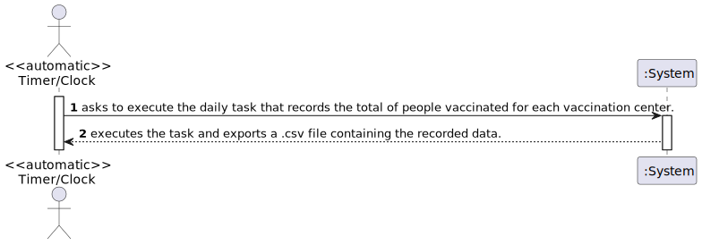
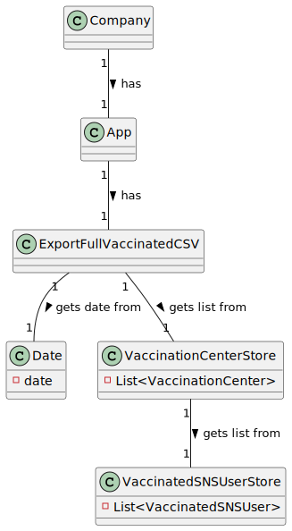
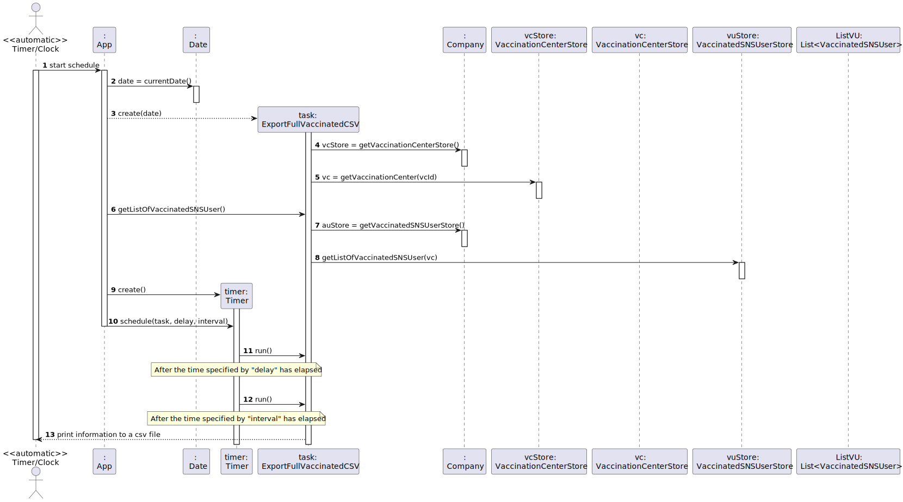
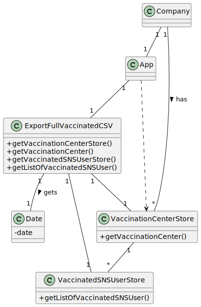

# US 06 - Record daily the total number of people vaccinated.

## 1. Requirements Engineering

### 1.1. User Story Description

- DGS wants to record daily the total number of people vaccinated in each vaccination center.

### 1.2. Customer Specifications and Clarifications

**From the specifications document:**

> No relevant information regarding the specifications document.

**From the client clarifications:**

> **Question:** "In the acceptance criteria, "the algorithm should run automatically at a time defined in a configuration file and should register a date, the name of the vaccination center and the total number of vaccinated users." How it is supposed to register this information? Should it be recorded in a file (ex: txt,..) or recorded in the system (ex: in a store) ?"
>
>
> **Answer:** "The data should be written to a CSV file (field delimiter should be a semicolon)."

> **Question:** "We would like to know which kind of user (Administrator, Nurse...) is supposed to have access to the file generated by the system. Also, is it supposed to have the possibility to change the information on the configuration file? If so, who can do it?"
>
>
> **Answer:** "Someone from DGS."

> **Question:** "As per the acceptance criteria, can the job be deployed manually by a specific actor like Receptionist, Administrator,...? Who does the initial configuration for the automatic job?"
>
>
> **Answer:** "The algorithm should run automatically at a time defined in a configuration file and should register the date, the name of the vaccination center and the total number of vaccinated users."

> **Question:** "Should the Company choose first the vaccination center that wants to analyze or should the program show the information of all the vaccination centers?"
>
>
> **Answer:** "The application should show the information for all vaccination centers."

> **Question:** "After asking you to be more clear with your answer to my previous questions, you said that we can either access directly the "vaccinations report" file or create the option for center coordinators and administrators to view it's content, is this correct?"
>
>
> **Answer:** "You misunderstood, I didn't say that. The file should be available in the file system and anyone having access to the file system can read the file contents."

> **Question:** "Does the report contain the count of vaccinations of the current day (which depending on the time of day can be incomplete) or the day before??"
>
>
> **Answer:** "Should record vaccinations of the current day."

### 1.3. Acceptance Criteria

* **AC1:** The algorithm should run automatically at a time defined in a configuration file and should register the date, the name of the vaccination center and the total number of vaccinated users.
* **AC2:** The data should be a written to a CSV file
* **AC3:** The application should show the information for all vaccination centers
* **AC4:** Should record vaccinations of the current day

### 1.4. Found out Dependencies

* There is a dependency found in US008 "As a nurse, I want to record the administration of a vaccine to a SNS user. At the end of the recovery period, the user should receive a SMS message informing the SNS user that he can leave the vaccination center.", because in order to get the daily number of vaccinated people, it's necessary that people get vaccinated

### 1.5 Input and Output Data

**Input Data:**

* Typed data: (None)

* Selected data:
    * (None)

**Output Data:**

* the date
* the name of the vaccination center
* the total number of vaccinated users

### 1.6. System Sequence Diagram (SSD)

### 1.7 Other Relevant Remarks

* (none)

## 2. OO Analysis

### 2.1. Relevant Domain Model Excerpt

### 2.2. Other Remarks

* (none)

## 3. Design - User Story Realization

### 3.1. Rationale

**SSD adopted.**

| Interaction ID | Question: Which class is responsible for...   | Answer                  | Justification (with patterns)                                                                    |
|:---------------|:----------------------------------------------|:------------------------|:------------------------------------------------------------------------------------------------|
| Step 1         | ...starting to execute the task?              | ???                     | Pure Fabrication: There is no need to assign this responsibility to any other existing classes. |
| Step 2         | ...executing the task?                        | App                     |  ???                                                                                            |
|                | ...creating the csv file with the data?        |ExportFullVaccinatedCSV  | IE: Has the necessary information to create the requested file.                                  |
|                | ...supplying the list of vaccination centers? | VaccinationCentersStore | Pure Fabrication : Has the vaccination centers.                                                 |
|                | ...supplying the list of vaccinated users?    | VaccinatedSNSUserStore  | IE: Knows it's own vaccinated users.                                                            |
### Systematization ##

According to the taken rationale, the conceptual classes promoted to software classes are:

* ExportFullVaccinatedCSV 

Other software classes (i.e. Pure Fabrication) identified:

* App
* VaccinationCentersStore
* VaccinatedSNSUserStore

## 3.2. Sequence Diagram (SD)

## 3.3. Class Diagram (CD)

# 4. Tests

# 5. Construction (Implementation)

	

# 6. Integration and Demo

        
          public void writeToFileCSV(List<FullVaccinated> fullVaccinatedList) throws FileNotFoundException {
        try {
            FileWriter myWriter = new FileWriter("src/daily people vaccinated/DailyPeopleVaccinated.csv", true);
            for (FullVaccinated list : fullVaccinatedList) {
                myWriter.write(list.getCurrentDate().toDayMonthYearString() + ";" + list.getNameCenterVaccination()
                        + ";" + list.getNumberOfVaccinated() + "\n");
            }
            myWriter.close();
        } catch (IOException e) {
        }
    }

# 7. Observations

In order to carry out this User Story, the Company responsibilities were delegated to other classes. In this way, the
code is more structured and makes it easier to maintain.

