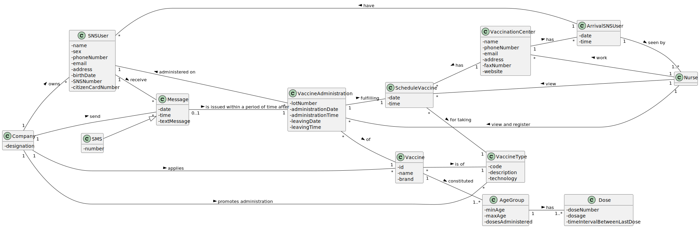
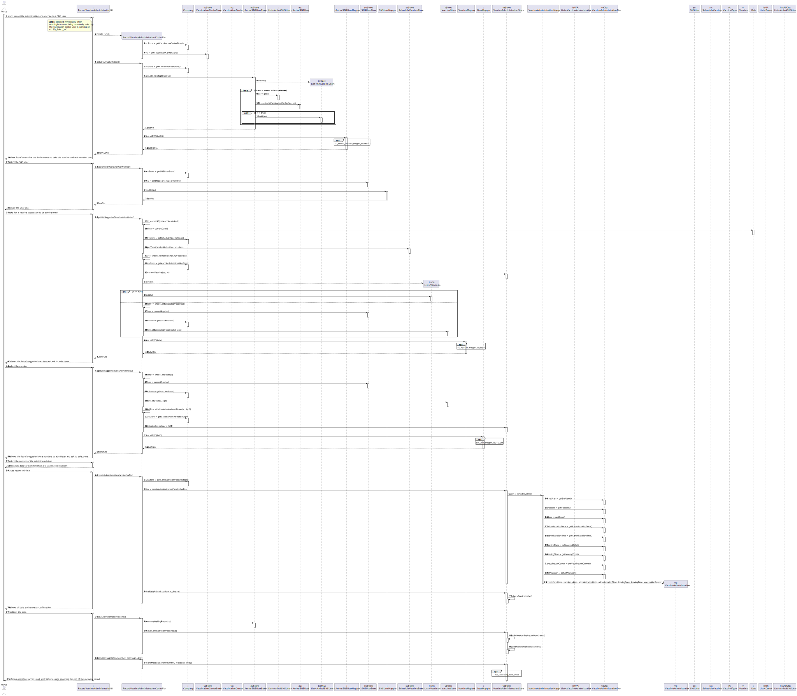

# US 08 - Record the administration of a vaccine to a SNS user

## 1. Requirements Engineering

### 1.1. User Story Description

As a **nurse**, I want to record the **administration** of a **vaccine** to a **SNS user**. At the end of the recovery period, the user should receive a SMS message informing the SNS user that he can leave the vaccination center.

### 1.2. Customer Specifications and Clarifications

**From the specifications document:**

>   "The nurse checks the user info and health conditions in the system and in accordance with the scheduled vaccine type, and the SNS user vaccination history, (s)he gets system instructions regarding the vaccine to be administered (e.g.: vaccine and respective dosage considering the SNS user age group)."

>	"After giving the vaccine to the user, each nurse registers the event in the system, more precisely, registers the vaccine type [..], vaccine name/brand [..], and the lot number used."

>	"[..] the nurse sends the user to a recovery room, to stay there for a given recovery period (e.g.: 30 minutes)."

>   "If there are no problems, after the given recovery period, the user should leave the vaccination center. The system should be able to notify [..] the user that his/her recovery period has ended."

**From the client clarifications:**

> **Question:** "After giving the vaccine to the user, each nurse registers the event in the system, more precisely, registers the vaccine type (e.g.: Covid-19), vaccine name/brand (e.g.: Astra Zeneca, Moderna, Pfizer), and the lot number used. Does the lot number follow a certain structure or length? (for example a 10 digit number)."
>
> **Answer:** "The lot number has five alphanumeric characters an Hyphen and two numerical characters (example: 21C16-05)."

> **Question:** "To access the user info - scheduled vaccine type and vaccination history -, should the nurse enter user's SNS number?"
>
> **Answer:** "The nurse should select a SNS user from a list of users that are in the center to take the vaccine." 

> **Question:** "Supposing that the SNS user has already received a dose of a given vaccine type (for example, COVID-19), the user can only receive the same vaccine or a different one with the same vaccine type?"
>
> **Answer:** "The SNS user can only receive the same vaccine. Related information: A SNS user is fully vaccinated when he receives all doses of a given vaccine. A SNS user that has received a single-dose vaccine is considered fully vaccinated and will not take more doses. A SNS user that is fully vaccinated will not be able to schedule a new vaccine of the type for which he is already fully vaccinated."

> **Question:** "The system displays the list of possible vaccines to be administered (considering the age group of the user); then the nurse selects the dose she is going to administer and gets information about the dosage. But wouldn't it be more correct, since the system knows the vaccination history, in other words, if the user has already take x dose(s) of that vaccine, to simply show the dose and the respective dosage and not ask for the nurse to arbitrarily select it?"
>
> **Answer:** "If it is the first dose, the application should show the list of possible vaccines to be administered. If is is not a single dose vaccine, when the SNS user arrives to take the vaccine, the system should simply show the dose and the respective dosage."

> **Question:** "After giving the vaccine to the user, how should the nurse register the vaccine type? by the code?"
>
> **Answer:** "A vaccine is associated with a given vaccine type. Therefore, there is no need to register the vaccine type. Moreover, the nurse should also register the vaccine lot number (the lot number has five alphanumeric characters an hyphen and two numerical characters (example: 21C16-05))."

> **Question:** "As we can read in Project Description, the vaccination flow follows these steps: 1. Nurse calls one user that is waiting in the waiting room to be vaccinated; 2. Nurse checks the user's health data as well as which vaccine to administer; 3. Nurse administers the vaccine and registers its information in the system. The doubt is: do you want US08 to cover steps 2 and 3, or just step 3?"
>
> **Answer:** "1.The nurse selects a SNS user from a list. 2. Checks user's Name, Age and Adverse Reactions registered in the system. 3. Registers information about the administered vaccine."

> **Question:** "Regarding the recovery period, how should we define it? Is it the same for all vaccines or should the nurse specify in each case what the recovery time is?"
>
> **Answer:** "The recovery period/time is the same for all vaccines. The recovery period/time should be defined in a configuration file."

> **Question:** "Is the nurse responsible for registering in the system the recovery period?"
>
> **Answer:** "No. The recovery period starts automatically after registering the administration of a given vaccine."

> **Question:** "If there are no adverse reactions detected/registered, after the given recovery period, the system notifies the user that his/her recovery period has ended, right? If there are adverse reactions detected/registered, the system should not do anything additional?"
>
> **Answer:** "US7 and US8 are independent user stories."

> **Question:** "Our group has five members and the US07: Register an adverse reaction is not obligatory to be implemented. So, with this in mind we would like to know if we, in step 2, should only show the Name and the Age or other information."
>
> **Answer:** "If your team does not implement US7, then you should show a message saying "No Adverse Reactions registered in the system"."

> **Question:** "In US 08 says: "At the end of the recovery period, the user should receive a SMS message informing the SNS user that he can leave the vaccination center." How should the SNS user receive and have access to the SMS message?"
>
> **Answer:** "A file named SMS.txt should be used to receive/record the SMS messages. We will not use a real word service to send SMSs."

### 1.3. Acceptance Criteria

* **AC1:** The nurse should select a vaccine and the administered dose number.
* **AC2:** The nurse should select a SNS user from a list of users that are in the center to take the vaccine.
* **AC3:** The nurse checks user's name, age and adverse Reactions registered in the system.
* **AC4:** The message should be shown saying "No Adverse Reactions registered in the system", due to the non-implementation of US7.
* **AC5:** The SNS user can only receive the same vaccine.
* **AC6:** The system should show the list of possible vaccines to be administered, if it is the first dose. If is not a single dose vaccine, the system should simply show the dose and the respective dosage.
* **AC7:** The lot number has five alphanumeric characters an Hyphen and two numerical characters.
* **AC8:** The recovery period/time is the same for all vaccines.
* **AC9:** The recovery period/time should be defined in a configuration file.
* **AC10:** The recovery period starts automatically after registering the administration of a given vaccine.
* **AC11:** At the end of the recovery period, the user should receive a SMS message informing the SNS user that he can leave the vaccination center.
* **AC12:** A file named SMS.txt should be used to receive/record the SMS messages.

### 1.4. Found out Dependencies

* There is a dependency for "US1 - As a SNS user, I intend to use the application to schedule a vaccine" or "US2 - As a receptionist at one vaccination center, I want to schedule a vaccination", as it is necessary for a vaccine to be scheduled to be able to administer it to an SNS user, in addition necessary to checking the type of vaccine scheduled.
* There is a dependency for "US3 - As a receptionist, I want to register an SNS user" since an SNS user must be registered in order to receive the vaccine.
* There is a dependency for "US4 - As a receptionist at a vaccination center, I want to register the arrival of a SNS user to take the vaccine" since a sns user must have their arrival registered to receive the vaccine.
* There is a dependency for "US9 - As an administrator, I want to register a vaccination center to respond to a certain pandemic" since a vaccination center must be registered for SNS users to receive the administration of the vaccine. 
* There is a dependency for "US10 - As an administrator, I want to register an Employee" since a nurse must be registered to record the administration of the vaccine.
* There is a dependency for "US13 - As an administrator, I intend to specify a new vaccine and its administration process" as it is necessary to get instructions regarding the vaccine to be administered.

### 1.5 Input and Output Data

**Input Data:**

* Typed data:
  * Lot number

* Selected data:
  * SNS user
  * Vaccine
  * Administered dose number

**Output Data:**
  * List of users that are in the center to take the vaccine
  * The user info
  * List of suggested vaccines
  * List of suggested dose numbers to administer
  * (In)Success of the operation

### 1.6. System Sequence Diagram (SSD)

### 1.7 Other Relevant Remarks

(none)

## 2. OO Analysis

### 2.1. Relevant Domain Model Excerpt

### 2.2. Other Remarks

(none)

## 3. Design - User Story Realization

### 3.1. Rationale

| Interaction ID | Question: Which class is responsible for... | Answer  | Justification (with patterns)  |
|:-------------  |:--------------------- |:------------|:---------------------------- |
| Step 1 | ...interacting with the actor? | RecordVaccineAdministrationUI | **Pure Fabrication:** there is no reason to assign this responsibility to any existing class in the Domain Model |
| | ...coordinating the US? | RecordVaccineAdministrationController | **Controller** |
| | ...do you know the vaccination center where the actor is logged in? | RecordVaccineAdministrationUI | **Pure Fabrication:** there is no reason to assign this responsibility to any existing class in the Domain Model |
| | ...knows the list of vaccinations centers? | VaccinationCenterStore | **IE:** knows all the vaccination centers |
| | ...knows VaccinationCenterStore? | Company |  **IE:** Company knows the VaccinationCenterStore to which it is delegating some tasks |
| | ...knows the list arrival SNS user? | ArrivalSNSUserStore | **IE:** knows all the arrival SNS User |
| | ...transfer the list data from the store to the controller? | ArrivalSNSUserDTO | **DTO:** When there is so much data to transfer, it is better to opt by using a DTO in order to reduce coupling between UI and domain |
| |	...instantiating a new list ArrivalSNSUser? | ArrivalSNSUserMapper  | **DTO** using **Mapper**, **Creator (R1)** and **HC+LC**: By the application of the Creator (R1) it would be the "Company". But, by applying HC + LC to the "Company", and since we are using the DTO pattern to transfer the data between the store layer and the controller layer, this delegates that responsibility to the "ArrivalSNSUserMapper" |
| | ...who knows the attributes? | ArrivalSNSUser | **IE:** an object knows its data |
| | ...knows ArrivalSNSUserStore? | Company |  **IE:** Company knows the ArrivalSNSUserStore to which it is delegating some tasks |
| Step 2 | | |
| Step 3 | ...verify the SNS user info? | SNSUserStore | knows all the SNS users |
| | ...knows SNSUserStore? | Company |  **IE:** Company knows the SNSUserStore to which it is delegating some tasks |
| Step 4 | | | |
| Step 5 | ...knows the list of suggested vaccines? | VaccineStore | **IE:** knows all the vaccine |
| | ...transfer the list data from the store to the controller? | VaccineDTO | **DTO:** When there is so much data to transfer, it is better to opt by using a DTO in order to reduce coupling between UI and domain |
| |	...instantiating a new list Vaccine? | VaccineMapper  | **DTO** using **Mapper**, **Creator (R1)** and **HC+LC**: By the application of the Creator (R1) it would be the "Company". But, by applying HC + LC to the "Company", and since we are using the DTO pattern to transfer the data between the store layer and the controller layer, this delegates that responsibility to the "VaccineMapper" |
| | ...who knows the attributes? | Vaccine | **IE:** an object knows its data |
| | ...knows VaccineStore? | Company |  **IE:** Company knows the VaccineStore to which it is delegating some tasks |
| Step 6 | | | |
| Step 7 | ...knows the list of suggested dose numbers to administer? | VaccineStore | **IE:** knows all the doses of vaccines |
| | ...transfer the list data from the store to the controller? | DoseDTO | **DTO:** When there is so much data to transfer, it is better to opt by using a DTO in order to reduce coupling between UI and domain |
| |	...instantiating a new list Dose? | DoseMapper  | **DTO** using **Mapper**, **Creator (R1)** and **HC+LC**: By the application of the Creator (R1) it would be the "Company". But, by applying HC + LC to the "Company", and since we are using the DTO pattern to transfer the data between the store layer and the controller layer, this delegates that responsibility to the "DoseMapper" |
| | ...who knows the attributes? | Dose | **IE:** an object knows its data |
| | ...knows VaccineStore? | Company |  **IE:** Company knows the VaccineStore to which it is delegating some tasks |
| Step 8 | | | |
| Step 9 | | | |
| Step 10 | | | |
| Step 11 | ...transfer the data typed in the UI to the domain? | VaccineAdministrationDTO | **DTO:** When there is so much data to transfer, it is better to opt by using a DTO in order to reduce coupling between UI and domain |
| |	...instantiating a new VaccineAdministration? | VaccineAdministrationMapper  | **DTO** using **Mapper**, **Creator (R1)** and **HC+LC**: By the application of the Creator (R1) it would be the "Company". But, by applying HC + LC to the "Company", and since we are using the DTO pattern to transfer the data between the UI layer and the domain layer, this delegates that responsibility to the "VaccineAdministrationMapper" |
| | ...knows VaccineAdministrationStore? | Company |  **IE:** Company knows the VaccineAdministrationStore to which it is delegating some tasks |
| | ...saving the vaccine administration? | VaccineAdministration | **IE:** a vaccine administration knows its own data |
| |	...validating all data (local validation)? | VaccineAdministration | **IE:** an object knows its data |
| |	...validating all data (global validation)? | VaccineAdministrationStore | **IE:** knows all the vaccine administrations | 
| Step 12 | | | |
| Step 13 |	...saving the vaccine administration? | VaccineAdministrationStore | **IE:** knows all the vaccine administrations | 
| Step 14 |	...informing operation success?| RecordVaccineAdministrationUI  | **IE:** is responsible for user interactions  | 
| | ...write sending the message with the end of the recovery period? | FileSMSMessage  | **Pure Fabrication:** there is no reason to assign this responsibility to any existing class in the Domain Model. This promotes the reuse of this functionality.  |
| |	...write the data present in a file? | FileSMSMessageHandler  | **Protected Variations:** Assign responsibilities in order to create a stable interface around such points.
| | ...schedule the execution of the message sending at the end of the recovery period?	| SMSMessageTask | **IE:** the object knows where is the file to get the information |

### Systematization ##

According to the taken rationale, the conceptual classes promoted to software classes are:

* Company
* ArrivalSNSUser
* ScheduleVaccine
* Vaccine
* Dose
* VaccineAdministration

Other software classes (i.e. Pure Fabrication) identified:

* VaccinationCenterStore
* ArrivalSNSUserStore
* SNSUserStore
* ScheduleVaccineStore
* VaccineStore
* VaccineAdministrationStore
* ArrivalSNSUserMapper
* SNSUserMapper
* VaccineAdministrationMapper
* VaccineMapper
* DoseMapper
* ArrivalSNSUserDTO
* VaccineAdministrationDTO
* VaccineDTO
* DoseDTO
* SMSMessageTask
* FileSMSMessageHandler
* FileSMSMessage
* RecordVaccineAdministrationController
* RecordVaccineAdministrationUI

## 3.2. Sequence Diagram (SD)

**Main SD**

**Select Vaccination Center SD**

**Arrival SNSUser Mapper toListDTO SD**

**Vaccine Mapper toListDTO SD**

**Dose Mapper toListDTO SD**

**Executing Task Once SD**

## 3.3. Class Diagram (CD)

# 4. Tests

### Class ArrivalSNSUser

**Test 1:** Check that it is not possible to create an instance of the VaccineAdministration class with null values.

    @Test(expected = IllegalArgumentException.class)
    public void ensureNullIsNotAllowed() {
        new VaccineAdministration(null, null, null, null, null, null, null, null, null);
    }

**Test 2:** Check that it is not possible to create an instance of the VaccineAdministration class with invalid lot number.

    @Test(expected = IllegalArgumentException.class)
    public void testCheckLotNumber() {
        new VaccineAdministration(SNS_USER1, VACCINE1, DOSE1, ADMINISTRATION_DATE1, ADMINISTRATION_TIME2,
            LEAVING_DATE1, LEAVING_TIME2, VACCINATION_CENTER, "123-AA");
    }

**Test 3:** Check that it is not possible to create an instance of the VaccineAdministration class with administration time greater than exit time

    Time ADMINISTRATION_TIME1 = new Time(15, 10, 20);    
    Time LEAVING_TIME1 = new Time(15, 0, 20);
    
    ...

    @Test(expected = IllegalArgumentException.class)
    public void testCheckTime() {
        new VaccineAdministration(SNS_USER1, VACCINE1, DOSE1, ADMINISTRATION_DATE1, ADMINISTRATION_TIME1,
                LEAVING_DATE1, LEAVING_TIME1, VACCINATION_CENTER, "AA123-55");
    }

# 5. Construction (Implementation)

    ...

# 6. Integration and Demo

* A new option on the Nurse menu options was added with name "Record Vaccine Administration".

* Some tasks are bootstrapped while system starts.

# 7. Observations

* In order to carry out this User Story, the Company responsibilities were delegated to other classes. In this way, the code is more structured and makes it easier to maintain.
