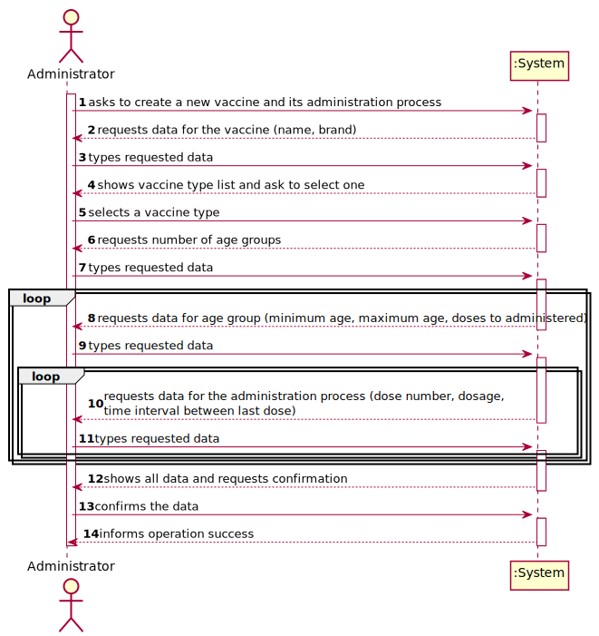
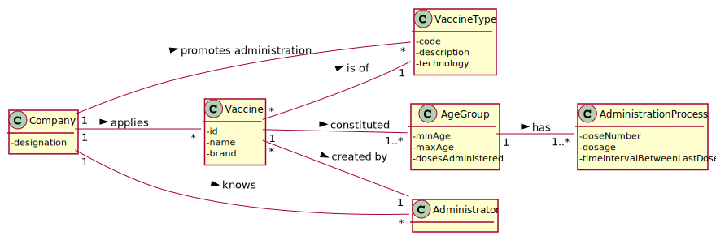
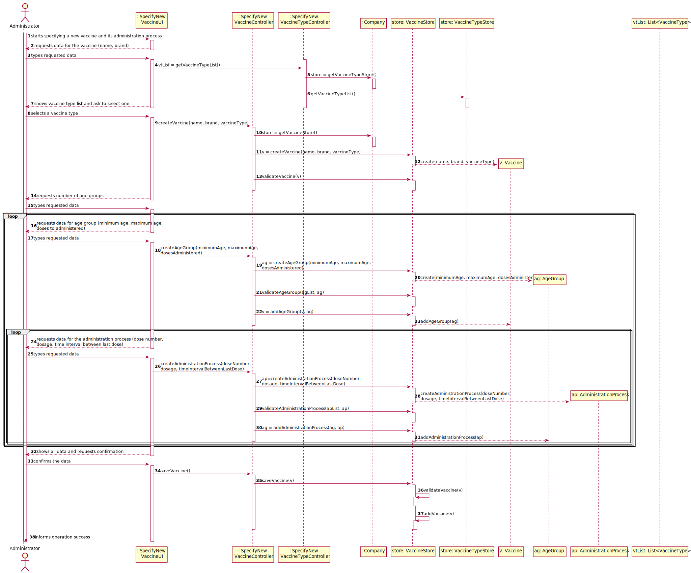
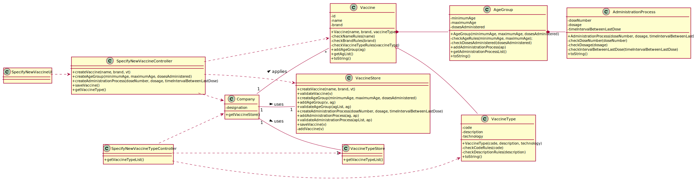

# US 13 - Specify a new vaccine and its administration process

## 1. Requirements Engineering

### 1.1. User Story Description

As an **administrator**, I intend to specify a new **vaccine** and its **administration process**.

### 1.2. Customer Specifications and Clarifications 

**From the specifications document:**

>	"[…] several vaccines might exist, each one demanding a distinct administration process." 

>	"[…] for the Covid-19 type, there is (i) the Pfizer vaccine, (ii) the Moderna vaccine, (iii) the Astra Zeneca vaccine [..]."

>   "The vaccine administration process comprises (i) one or more age groups [..], and (ii) per age group, the doses to be administered [..], the vaccine dosage [..], and the time interval regarding the previously administered dose."

>	"[..] between doses [..] the dosage to be administered might vary as well as the time interval elapsing between two consecutive doses [..]"
 

**From the client clarifications:**

> **Question:** "Which attributes does the Vaccine have (besides the ones refering to the Vaccine Type)?"
>
> **Answer:** "Each vaccine has the following attributes: Id, Name, Brand, Vaccine Type, Age Group, Dose Number, Vaccine Dosage and Time Since Last Dose."

> **Question:** "As to the interval between doses, what time format are we to use? (e.g. days, weeks, months)"
>
> **Answer:** "Number of days."

> **Question:** "We would like to know if when specifying a new Vaccine and its Administration Process, should a list of the existing types of vaccines be displayed in order for him to choose one, or should he just input it?"
>
> **Answer:** "If the information is available in the system, it is a good practice to present the information to the user and ask the user to select."

### 1.3. Acceptance Criteria

* **AC1:** All required fields must be filled in.
* **AC2:** A vaccine cannot have the empty vaccine type.
* **AC3:** In an age group, the minimum age cannot be greater than the maximum age, nor be a negative number.
* **AC4:** In an age group, the administered doses cannot be negative, nor be zero.
* **AC5:** In an administration process, the dose number and dosage cannot be negative, nor be zero.

### 1.4. Found out Dependencies

* There is a dependency to "US12 - Specify a New Vaccine Type" since at least a vaccine type must exist to classify the vaccine being created.

### 1.5 Input and Output Data

**Input Data:**

* Typed data:
    * name
    * brand
    * number of age groups
    * minimum age
    * maximum age
    * doses to administered
    * dose number
    * dosage
    * time interval between last dose
	
* Selected data:
    * Classifying vaccine type 

**Output Data:**
* List of existing vaccine type
* (In)Success of the operation

### 1.6. System Sequence Diagram (SSD)

### 1.7 Other Relevant Remarks

* A vaccine is made up of one or more age groups and each age group is made up of one or more administration processes.
* In relation to attributes:
  * The format used in the time interval between last dose is the number of days.
  * The format used in the dosage is the milliliter (ml).

## 2. OO Analysis

### 2.1. Relevant Domain Model Excerpt 

### 2.2. Other Remarks

* There are currently no other observations.

## 3. Design - User Story Realization 

### 3.1. Rationale

| Interaction ID | Question: Which class is responsible for... | Answer  | Justification (with patterns)  |
|:-------------  |:--------------------- |:------------|:---------------------------- |
| Step/Msg 1: starts specifying a new vaccine and its administration process | ...interacting with the actor? | SpecifyNewVaccineUI | Pure Fabrication: there is no reason to assign this responsibility to any existing class in the Domain Model. |
| | ...coordinating the US? | SpecifyNewVaccineController | Controller. |
| | ...instantiating a new vaccine and its administration process? | VaccineStore | |
| Step/Msg 2: requests data for the vaccine (name, brand) | ...request the data for vaccine? | SpecifyNewVaccineUI | IE: is responsible for user interactions. |
| Step/Msg 3: types requested data | ...saving the input data? | SpecifyNewVaccineUI | IE: The data is stored in the class that has this data in the next steps. |
| Step/Msg 4: shows vaccine type list and ask to select one | ...knowing the vaccine type to show? | VaccineTypeStore | IE: Vaccine type are defined by the VaccineTypeStore. |
| Step/Msg 5: selects a vaccine type | ...saving the input data? | Vaccine | IE: The type of vaccine is added to the data requested in step 2. |
| Step/Msg 6: requests number of age groups | ...request the number of age groups? | SpecifyNewVaccineUI | IE: is responsible for user interactions. |
| Step/Msg 7: types requested data | ...saving the input data? | SpecifyNewVaccineUI | IE: This data will be responsible for the next interactions with the user. |
| Step/Msg 8: requests data for age group (minimum age, maximum age, doses to administered) | ...request the data for age group? | SpecifyNewVaccineUI | IE: is responsible for user interactions. |
| Step/Msg 9: types requested data | ...saving the input data? | AgeGroup | IE: owns its data. |
| Step/Msg 10: requests data for the administration process (dose number, dosage, time interval between last dose) | ...request the data for administration process? | SpecifyNewVaccineUI | IE: is responsible for user interactions. |
| Step/Msg 11: types requested data | ...saving the input data? | AdministrationProcess | IE: owns its data. |
| Step/Msg 12: shows the data and requests a confirmation |	...validating the data locally (e.g.: mandatory vs.non-mandatory data)? | Vaccine | IE: owns its data. |
| |	...validating the data globally (e.g.: duplicated)? | VaccineStore | IE: knows all the Vaccine objects. |
| Step/Msg 13: confirms the data | ...saving the created vaccine and its administration process? | VaccineStore | IE: adopts/records all the Vaccine objects. |
| Step/Msg 14: informs operation success | ...informing operation success? | SpecifyNewVaccineUI | IE: is responsible for user interactions. |

### Systematization ##

According to the taken rationale, the conceptual classes promoted to software classes are: 

 * Company
 * Vaccine
 * AgeGroup
 * AdministrationProcess

Other software classes (i.e. Pure Fabrication) identified: 

 * VaccineStore (applying the "pure fabrication" pattern)
 * VaccineTypeStore (applying the "pure fabrication" pattern)
 * SpecifyNewVaccineController (applying the "controller" pattern)
 * SpecifyNewVaccineTypeController (applying the "controller" pattern)
 * SpecifyNewVaccineUI (applying the "pure fabrication" pattern)

## 3.2. Sequence Diagram (SD)

## 3.3. Class Diagram (CD)

# 4. Tests 

### Class Vaccine

**Test 1:** Check that it is not possible to create an instance of the Vaccine class with null values - AC1. 

    @Test(expected = IllegalArgumentException.class)
    public void ensureNullIsNotAllowed() {
        Vaccine vaccine = new Vaccine(null, null, null);
    }

**Test 2:** Check that it is not possible to create an instance of the Vaccine class with an empty vaccine type - AC2.

    @Test(expected = IllegalArgumentException.class)
    public void ensureReferenceMeetsAC2() {
        Vaccine vaccine = new Vaccine("Pfizer", "Pfizer, Inc", null);
    }

### Class AgeGroup

**Test 1:** Check that it is not possible to create an instance of the AgeGroup class with the minimum age be greater than the maximum age - AC3.

    @Test(expected = IllegalArgumentException.class)
    public void ensureReferenceMeetsAC3() {
        AgeGroup ageGroup = new AgeGroup(30, 20, 3);
    }

**Test 2:** Check that it is not possible to create an instance of the AgeGroup class with negative administered doses - AC4.

    @Test(expected = IllegalArgumentException.class)
    public void ensureReferenceMeetsAC4() {
        AgeGroup ageGroup =  new AgeGroup(10, 20, -10);
    }

### Class AdministrationProcess

**Test 1:** Check that it is not possible to create an instance of the AdministrationProcess class with a dose number or dose less than or equal to zero - AC5.

    @Test(expected = IllegalArgumentException.class)
    public void ensureReferenceMeetsAC5() {
        AdministrationProcess administrationProcess = new AdministrationProcess(0, 0, 25);
    }

# 5. Construction (Implementation)

## Class Vaccine

      private int id;
      private String name;
      private String brand;
      private VaccineType vt;
      private List<AgeGroup> agList;
    
      private static int numberVaccines;
    
      public Vaccine(String name, String brand, VaccineType vt) {
          checkNameRules(name);
          checkBrandRules(name);
          checkVaccineTypeRules(vaccineType);
          this.id = ++numberVaccines;
          this.name = name;
          this.brand = brand;
          this.vt = vt;
          this.agList = new ArrayList<>();
      }
    
      private void checkNameRules(String name) {
          if (StringUtils.isBlank(name))
              throw new IllegalArgumentException("Name cannot be blank.");
      }
    
      private void checkBrandRules(String brand) {
          if (StringUtils.isBlank(brand))
              throw new IllegalArgumentException("Brand cannot be blank.");
      }
    
      private void checkVaccineTypeRules(VaccineType vt) {
          if (vt == null) {
              throw new IllegalArgumentException("Vaccine Type cannot be blank.");
          }
      }
    
      public void addAgeGroup(AgeGroup ag) {
          this.agList.add(ag);
      }
    
      public List<AgeGroup> getAgList() {
          return agList;
      }
    
      @Override
      public String toString() {
          return "Vaccine: " + "Id: " + id + ", Name: " + name + ", Brand: " + brand +
                  "\nVaccine Type: " + vt + "\nAge Group: " + agList;
      }

## Class AgeGroup 

      private int minimumAge;
      private int maximumAge;
      private int dosesAdministered;
      private List<AdministrationProcess> apList;

      public AgeGroup(int minimumAge, int maximumAge, int dosesAdministered) {
          checkAgeRules(minimumAge, maximumAge);
          checkDosesAdministered(dosesAdministered);
          this.minimumAge = minimumAge;
          this.maximumAge = maximumAge;
          this.dosesAdministered = dosesAdministered;
          this.apList = new ArrayList<>();
      }
  
      private void checkAgeRules(int minimumAge, int maximumAge) {
          if (minimumAge < 0 || maximumAge < 0) {
              throw new IllegalArgumentException("Age cannot be negative.");
          }
          if (minimumAge > maximumAge) {
              throw new IllegalArgumentException("The minimum age and the maximum age are invalid.");
          }
      }
  
      private void checkDosesAdministered(int dosesAdministered) {
          if (dosesAdministered <= 0)
              throw new IllegalArgumentException("Administered doses cannot be negative, nor be zero.");
      }
  
      public void addAdministrationProcess(AdministrationProcess ap) {
          this.apList.add(ap);
      }
  
      public List<AdministrationProcess> getAdministrationProcessList() {
          return apList;
      }
  
      @Override
      public String toString() {
          return "Minimum Age: " + minimumAge + ", Maximum Age: " + maximumAge + ", Doses to Administered: " + dosesAdministered
                  + "\nAdministrationProcessList: " + apList;
      }  

## Class AdministrationProcess

        private int doseNumber;
        private int dosage;
        private int timeIntervalBetweenLastDose;
    
        public AdministrationProcess(int doseNumber, int dosage, int timeIntervalBetweenLastDose) {
            checkDoseNumber(doseNumber);
            checkDosage(dosage);
            checkIntervalBetweenLastDose(timeIntervalBetweenLastDose);
            this.doseNumber = doseNumber;
            this.dosage = dosage;
            this.timeIntervalBetweenLastDose = timeIntervalBetweenLastDose;
        }
    
        private void checkDoseNumber(int doseNumber) {
            if (doseNumber <= 0)
                throw new IllegalArgumentException("Dose number cannot be negative, nor be zero");
        }
    
        private void checkDosage(int dosage) {
            if (dosage <= 0)
                throw new IllegalArgumentException("Dosage cannot be negative, nor be zero");
        }
    
        private void checkIntervalBetweenLastDose(int timeIntervalBetweenLastDose) {
            if (timeIntervalBetweenLastDose < 0)
                throw new IllegalArgumentException("Interval between last dose cannot be negative.");
        }
    
        @Override
        public String toString() {
            return "Dose Number: " + doseNumber + ", Dosage: " + dosage + ", Time Interval Between Last Dose: "
                    + timeIntervalBetweenLastDose;
        }

## Class Company
    
      ...
  
      private VaccineStore vaccineStore = new VaccineStore();
  
      ...
  
      public VaccineStore getVaccineStore() {
          return vaccineStore;
      }

## Class VaccineStore

      private List<Vaccine> vaccineList = new ArrayList<>();
  
      public Vaccine createVaccine(String name, String brand, VaccineType vt) {
          return new Vaccine(name, brand, vt);
      }
  
      public boolean validateVaccine(Vaccine v) {
          if (v == null) {
              return false;
          } else {
              return !this.vaccineList.contains(v);
          }
      }
  
      public AgeGroup createAgeGroup(int minimumAge, int maximumAge, int dosesAdministered) {
          return new AgeGroup(minimumAge, maximumAge, dosesAdministered);
      }
  
      public Vaccine addAgeGroup(Vaccine v, AgeGroup ag) {
          v.addAgeGroup(ag);
          return v;
      }
  
      public boolean validateAgeGroup(List<AgeGroup> agList, AgeGroup ag) {
          if (ag == null) {
              return false;
          } else {
              return !agList.contains(ag);
          }
      }
  
      public AdministrationProcess createAdministrationProcess(int doseNumber, int dosage, int timeIntervalBetweenLastDose) {
          return new AdministrationProcess(doseNumber, dosage, timeIntervalBetweenLastDose);
      }
  
      public AgeGroup addAdministrationProcess(AgeGroup ag, AdministrationProcess ap) {
          ag.addAdministrationProcess(ap);
          return ag;
      }
  
      public boolean validateAdministrationProcess(List<AdministrationProcess> apList, AdministrationProcess ap) {
          if (ap == null) {
              return false;
          } else {
              return !apList.contains(ap);
          }
      }
  
      public boolean saveVaccine(Vaccine v) {
          if (!validateVaccine(v)) {
              return false;
          } else {
              return addVaccine(v);
          }
      }
  
      private boolean addVaccine(Vaccine v) {
          return this.vaccineList.add(v);
      }

## Class VaccineTypeStore

      ...

      public List<VaccineType> getVaccineTypeList() {
          return vtList;
      }

## Class SpecifyNewVaccineController

      private Company company;
      private Vaccine v;
      private AgeGroup ag;
      private AdministrationProcess ap;
  
      private VaccineStore store;
  
      public SpecifyNewVaccineController() {
          this(App.getInstance().getCompany());
      }
  
      public SpecifyNewVaccineController(Company company) {
          this.company = company;
          this.v = null;
          this.store = this.company.getVaccineStore();
      }
  
      public boolean createVaccine(String name, String brand, VaccineType vt) {
          this.v = this.store.createVaccine(name, brand, vt);
          return this.store.validateVaccine(v);
      }
  
      public boolean createAgeGroup(int minimumAge, int maximumAge, int dosesAdministered) {
          this.ag = this.store.createAgeGroup(minimumAge, maximumAge, dosesAdministered);
  
          boolean validateAgeGroup = this.store.validateAgeGroup(v.getAgList(), ag);
          if (validateAgeGroup) {
              this.v = this.store.addAgeGroup(v, ag);
              return true;
          } else {
              return false;
          }
      }
  
      public boolean createAdministrationProcess(int doseNumber, int dosage, int timeIntervalBetweenLastDose) {
          this.ap = this.store.createAdministrationProcess(doseNumber, dosage, timeIntervalBetweenLastDose);
  
          boolean validateAdministrationProcess = this.store.validateAdministrationProcess(ag.getAdministrationProcessList(), ap);;
          if (validateAdministrationProcess) {
              this.ag = this.store.addAdministrationProcess(ag, ap);
              return true;
          } else {
              return false;
          }
      }
  
      public boolean saveVaccine() {
          return this.store.saveVaccine(v);
      }
  
      public Vaccine getVaccine() {
          return v;
      }

## Class SpecifyNewVaccineTypeController

      ...

      public List<VaccineType> getVaccineTypeList() {
          return this.store.getVaccineTypeList();
      }

# 6. Integration and Demo 

* A new option on the Administrator menu options was added with name "Specify a new vaccine and its administration process".

* Some tasks are bootstrapped while system starts

# 7. Observations

* In order to carry out this User Story, the Company responsibilities were delegated to other classes. In this way, the code is more structured and makes it easier to maintain.
