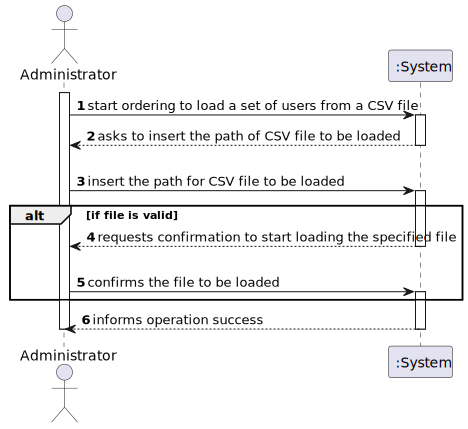
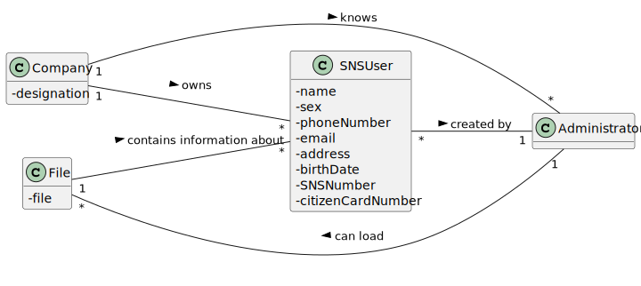
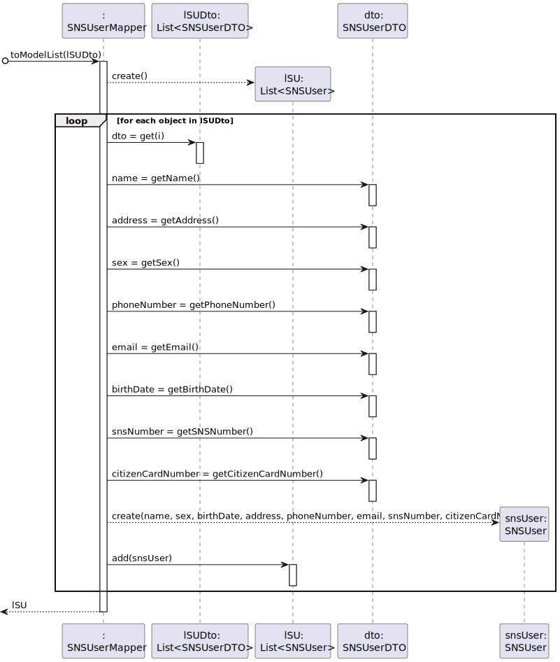
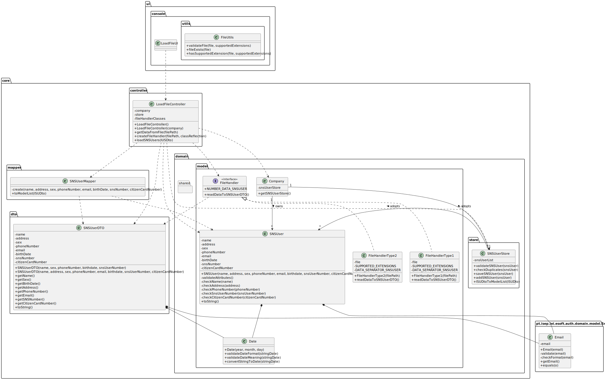

# US 14 - Load a set of users from a CSV file

## 1. Requirements Engineering
### 1.1. User Story Description
As an administrator, I want to load a set of users from a CSV file

### 1.2. Customer Specifications and Clarifications

**From the specifications document:**

>   "An Administrator is responsible for properly configuring and managing the core information (e.g.: type of vaccines, vaccines, vaccination centers, employees) required for this application to be operated daily by SNS users, nurses, receptionists, etc."
>	"Any Administrator uses the application to register centers, SNS users, ... enrolled in the vaccination process."

**From the client clarifications:**

> **Question:** "Regarding US014, I would like to clarify if the CSV file only contains information about SNS users of if the CSV file may also contain some information about employees from that vaccination center."
>
> **Answer:** "The CSV file only contains information about SNS users."

> **Question:** "What would be the sequence of parameters to be read on the CSV? For example: "Name | User Number".
>
> **Answer:** "Name, Sex, Birth Date, Address, Phone Number, E-mail, SNS User Number and Citizen Card Number."

> **Question:** "Is it possible that the file can contain lines with incomplete information in some fields (e.g. N/A). If so, should we read those lines as well and leave those fields empty or shall we discard that complete line?"
>
> **Answer:** "CSV files that have errors should not be loaded. Opcional attributes may have a NA value."

> **Question:** "Should we check if the users from the CSV file are already registered in the system? If so, which data should we use, the one already in the system or the one on the file?"
>
> **Answer:** "This feature of the system will be used to register a batch users. If the user is already registered in the system, then the information available in the CSV file should not be used to register that user."

> **Question:** "Should our application detect if the CSV file to be loaded contains the header, or should we ask the user if is submitting a file with a header or not?"
>
> **Answer:** "The application should automatically detect the CSV file type."

### 1.3. Acceptance Criteria

* **AC1:** The application must support importing a CSV file where it is necessary to have a header, and the column separation is done using “;” character.
* **AC2:** The application must support importing a CSV file where it doesn't have a header, and the column separation is done using “,” character.
* **AC3:** The csv file should have the 8 following information about a SNS User: Name, Sex, Birth Date, Address, Phone Number, E-mail, SNS User Number and Citizen Card Number.
* **AC4:** Optional attributes may have a NA value.
* **AC5:** CSV files that have errors should not be loaded.
* **AC6:** Duplicated SNS User information cannot be saved into system.
* **AC7:** The application should automatically detect the CSV file type.

### 1.4. Found out Dependencies

* US3 - As a receptionist, I want to register a SNS user

### 1.5 Input and Output Data

**Input Data:**

* Typed data:
    * Name of the file with the data to be loaded

* Selected data: 
	* (None)

**Output Data:**

* (In)Success of the operation

### 1.6. System Sequence Diagram (SSD)

### 1.7 Other Relevant Remarks

* There are some similarities to US 3 regarding the need of register a SNS User in the system.

## 2. OO Analysis

### 2.1. Relevant Domain Model Excerpt

### 2.2. Other Remarks

* (None)

## 3. Design - User Story Realization

### 3.1. Rationale

**SSD adopted.**

| Interaction ID | Question: Which class is responsible for... | Answer  | Justification (with patterns)  |
|:-------------  |:--------------------- |:------------|:---------------------------- |
| Step 1: |	... interacting with the actor? | LoadFileUI | **Pure Fabrication:** there is no reason to assign this responsibility to any existing class in the Domain Model |
| 		  |	... coordinating the US? | LoadFileController | **Controller** |
| Step 2: |	 |  |  |
| Step 3: |	... instantiating a file handler object? | LoadFileController | **Creator (R1):** It's easier to work with the object itself |
|         | ... validating if the file exists and have the required extension? | FileUtils | **Pure Fabrication:** Since the application can have more functionalities to import a file in the future, it's better to assign this responsibility to a artificial class where it can be called from other contexts with similar purposes |
|         | ... reading the data present in the file? | FileHandler | **IE:** the object knows where is the file to get the information |
| Step 4: |	 |  |  |
| Step 5: | ... knows SNSUserStore? | Company |  **IE:** Company knows the SNSUserStore to which it is delegating some tasks |
|         |	... transfer the data read in the file to the domain? | SNSUserDTO | **DTO:** When there is so much data to transfer, it is better to opt by using a DTO in order to reduce coupling between the controller and domain |
| 		  |	... instantiating a new SNS User? | SNSUserMapper | **DTO** using **Mapper**, **Creator (R1)** and **HC+LC:** By the application of the Creator (R1) it would be the "Company". But, by applying HC + LC to the "Company", and since we are using the DTO pattern to transfer the data between the UI layer and the domain layer, this delegates that responsibility to the "SNSUserMapper" |
|         |	... saving the SNS User data? | SNSUser  | **IE:** a SNS User knows its own data |
|         |	... validating all data (local validation)? | SNSUser | **IE:** an object knows its own data |
| 		  |	... validating all data (global validation)? | SNSUserStore | **IE:** knows all the SNS Users|
| 		  |	... saving the SNSUser? | SNSUserStore | **IE:** Knows all SNS Users |
| Step 6: |	... informing operation success? | LoadFileUI | **IE:** is responsible for user interactions |

### Systematization ##

According to the taken rationale, the conceptual classes promoted to software classes are:

* Company
* SNSUser

Other software classes (i.e. Pure Fabrication) identified:

* LoadFileUI
* LoadFileController
* FileHandler
* FileUtils
* SNSUserStore
* SNSUserMapper
* SNSUserDto

## 3.2. Sequence Diagram (SD)

**Main Sequence Diagram for this US**

**Sequence Diagram representing the SNSUserMapper transforming a list of objects of the type SNSUserDto in a list of SNSUser**

## 3.3. Class Diagram (CD)

# 4. Tests

# Class SNSUserStoreTests

**Test 1:** Test the method lSUDtoToModelList. The operation will be done successfully

    @Test
    public void lSUDtoToModelListTest1() {
        lSUDto.add(snsUserDTO1);
        lSUDto.add(snsUserDTO2);
        lSUDto.add(snsUserDTO3);
        store.lSUDtoToModelList(lSUDto);
    }

**Test 2:** Test the method lSUDtoToModelList. The operation will throw a InvalidSNSUserInListException exception

    @Test (expected = InvalidSNSUserInListException.class)
    public void lSUDtoToModelListTest2() {
        lSUDto.add(invalidSnsUserDTO1);
        lSUDto.add(invalidSnsUserDTO2);
        store.lSUDtoToModelList(lSUDto);
    }

# Class SNSUserMapperTests

**Test 1:** Convert successfully a list of SNSUserDTO into a SNSUser list

    @Test
    public void toModelListTest1() {
        lSUDto.add(snsUserDTO1);
        lSUDto.add(snsUserDTO2);
        lSUDto.add(snsUserDTO3);
        SNSUserMapper.toModelList(lSUDto);
    }

**Test 2:** Try to convert a list of SNSUserDTO into a SNSUser list

    @Test (expected = InvalidSNSUserInListException.class)
    public void toModelListTest2() {
        lSUDto.add(invalidSnsUserDTO1);
        lSUDto.add(invalidSnsUserDTO2);
        SNSUserMapper.toModelList(lSUDto);
    }

# Class LoadFileControllerTests

**Test 1:** Tests the information loaded from file

    @Test
    public void getDataFromFileTest() throws Exception {
        List<SNSUserDTO> lSUDto = new ArrayList<SNSUserDTO>();
        SNSUserDTO snsUserDTOExpected = new SNSUserDTO("Teste teste", "Santa Maria da Feira", "M", "919999999", new Email("teste@hotmail.com"), new Date(2001, 5, 20), "123456789", "123456789");
        lSUDto = controller.getDataFromFile(filePath);
        SNSUserDTO snsUserDTO = lSUDto.get(0);

        Assert.assertEquals(snsUserDTOExpected.getName(), snsUserDTO.getName());
        Assert.assertEquals(snsUserDTOExpected.getAddress(), snsUserDTO.getAddress());
        Assert.assertEquals(snsUserDTOExpected.getSex(), snsUserDTO.getSex());
        Assert.assertEquals(snsUserDTOExpected.getPhoneNumber(), snsUserDTO.getPhoneNumber());
        Assert.assertEquals(snsUserDTOExpected.getEmail().getEmail(), snsUserDTO.getEmail().getEmail());
        Assert.assertEquals(snsUserDTOExpected.getBirthdate().toString(), snsUserDTO.getBirthdate().toString());
        Assert.assertEquals(snsUserDTOExpected.getSnsUserNumber(), snsUserDTO.getSnsUserNumber());
        Assert.assertEquals(snsUserDTOExpected.getCitizenCardNumber(), snsUserDTO.getCitizenCardNumber());

    }

**Test 2:** Tests if FileHandler instance is created with success

    @Test
    public void createFileHandlerTest1() throws Exception {
        FileHandler fHandler = controller.createFileHandler(filePath, "app.domain.model.FileHandlerType1");
    }

**Test 3:** Try to check if FileHandler instance is created with success

    @Test (expected = Exception.class)
    public void createFileHandlerTest2() throws Exception {
        FileHandler fHandler = controller.createFileHandler(filePath, "abc");
    }

**Test 4:** Try to check if FileHandler instance is created with success

    @Test (expected = Exception.class)
    public void createFileHandlerTest3() throws Exception {
        FileHandler fHandler = controller.createFileHandler("abc", "app.domain.model.FileHandlerType1");
    }

**Test 5:** Tests if the SNS Users data is loaded successfully

    @Test
    public void loadSNSUsersTest() {

    }

# Class FileUtilsTests

**Test 1:** Tests if file is valid

    @Test
    public void testValidateFile() {
        final String[] SUPPORTED_EXTENSIONS = {"csv"};
        String test1 = FileUtils.validateFile(new File("src/files/a.csv"), SUPPORTED_EXTENSIONS);
        String test2 = FileUtils.validateFile(new File("src/files/b.csv"), SUPPORTED_EXTENSIONS);
        String test3 = FileUtils.validateFile(new File("src/files/c.txt"), SUPPORTED_EXTENSIONS);
        String mensage1 = "The file doesn't exists!";
        String mensage2 = "The extension of the file isn't supported!";

        Assert.assertEquals(mensage1, test1);
        Assert.assertEquals(mensage1, test2);
       Assert.assertEquals(mensage2, test3);

    }

**Test 2:** Test the function of Check if the given file exists

    @Test
    public void testFileExists() {
        boolean test1 = FileUtils.fileExists(new File("src/files/a.csv"));
        boolean test2 = FileUtils.fileExists(new File("src/files/b.csv"));
        boolean test3 = FileUtils.fileExists(new File("src/files/c.txt"));
        boolean test4 = FileUtils.fileExists(new File("src/files/XXXXX.txt"));

        Assert.assertTrue(test1);
        Assert.assertTrue(test2);
        Assert.assertTrue(test3);
        Assert.assertFalse(test4);

    }

**Test 3:** Test the function to check if a certain fil has a desired extension

    @Test
    public void testHasSupportedExtension(){
        final String[] SUPPORTED_EXTENSIONS = {"csv"};

        boolean test1 = FileUtils.hasSupportedExtension(new File("src/files/a.csv"), SUPPORTED_EXTENSIONS);
        boolean test2 = FileUtils.hasSupportedExtension(new File("src/files/b.csv"), SUPPORTED_EXTENSIONS);
        boolean test3 = FileUtils.hasSupportedExtension(new File("src/files/c.txt"), SUPPORTED_EXTENSIONS);

        Assert.assertTrue(test1);
        Assert.assertTrue(test2);
        Assert.assertFalse(test3);
    }

# 5. Construction (Implementation)

## Class LoadFileController

    private Company company;

    private SNSUserStore store;

    private String[] fileHandlerClasses = {"app.domain.model.FileHandlerType1", "app.domain.model.FileHandlerType2"};

    public LoadFileController() {
        this(App.getInstance().getCompany());
    }

    public LoadFileController(Company company) {
        this.company = company;
        this.store = this.company.getSNSUserStore();
    }

    public List<SNSUserDTO> getDataFromFile(String filePath) throws Exception {
        List<SNSUserDTO> lSUDto = new ArrayList<SNSUserDTO>();
        int numberFile = 0;
        boolean validFileHandler = false;

        while (numberFile < this.fileHandlerClasses.length && !validFileHandler) {

            try {
                FileHandler fHandler = createFileHandler(filePath, this.fileHandlerClasses[numberFile]);

                try {
                    lSUDto = fHandler.readDataToSNSUserDTO();
                    validFileHandler = true;
                } catch (IllegalArgumentException ex) {
                    if (numberFile == this.fileHandlerClasses.length - 1) {
                        throw new RuntimeException(ex.getMessage());
                    }
                } finally {
                    numberFile++;
                }

            } catch (RuntimeException ex) {
                throw new RuntimeException(ex.getMessage());
            } catch (Exception ex) {
                throw new IllegalArgumentException("Invalid file!");
            }

        }

        return lSUDto;
    }

    public FileHandler createFileHandler(String filePath, String classReflection) throws Exception {
        Class<?> oClass = Class.forName(classReflection);
        Constructor<?> cons = oClass.getConstructor(String.class);
        return (FileHandler) cons.newInstance(filePath);
    }

    public boolean loadSNSUsers(List<SNSUserDTO> lUSDto) {
        boolean success = true;

        this.store = company.getSNSUserStore();

        try {

            List<SNSUser> lSU = store.lSUDtoToModelList(lUSDto);
            for (SNSUser snsUser : lSU) {
                store.saveSNSUser(snsUser);
            }

        } catch (RuntimeException ex) {
            System.out.println(ex.getMessage());
        }

        return success;
    }

## Class SNSUserMapper

    public static List<SNSUser> toModelList(List<SNSUserDTO> lSUDto) {

        List<SNSUser> lSU = new ArrayList<SNSUser>();
        int posNumber = 0;
        SNSUserDTO dto;

        while (posNumber < lSUDto.size()) {
            dto = lSUDto.get(posNumber);
            String name = dto.getName();
            String address = dto.getAddress();
            String sex = dto.getSex();
            String phoneNumber = dto.getPhoneNumber();
            Email email = dto.getEmail();
            Date birthDate = dto.getBirthdate();
            String snsNumber = dto.getSnsUserNumber();
            String citizenCardNumber = dto.getCitizenCardNumber();

            try {
                lSU.add(SNSUserMapper.create(name, address, sex, phoneNumber, email, birthDate, snsNumber, citizenCardNumber));
            } catch (IllegalArgumentException ex) {
                throw new InvalidSNSUserInListException(++posNumber, ex.getMessage());
            }

            posNumber++;

        }

        return lSU;

    }

    private static SNSUser create(String name, String address, String sex, String phoneNumber, Email email, Date birthDate, String snsNumber, String citizenCardNumber) {
        return new SNSUser(name, address, sex, phoneNumber, email, birthDate, snsNumber, citizenCardNumber);
    }

## Class SNSUserDTO

    private String name;
    private String address;
    private String sex;
    private String phoneNumber;
    private Email email;
    private Date birthdate;
    private String snsUserNumber;
    private String citizenCardNumber;

    public SNSUserDTO(String name, String address, String sex, String phoneNumber, Email email, Date birthdate,
                      String snsUserNumber, String citizenCardNumber) {
        this.name = name;
        this.address = address;
        this.sex = sex;
        this.phoneNumber = phoneNumber;
        this.email = email;
        this.birthdate = birthdate;
        this.snsUserNumber = snsUserNumber;
        this.citizenCardNumber = citizenCardNumber;
    }

    public String getName() {
        return name;
    }

    public String getSex() {
        return sex;
    }

    public String getPhoneNumber() {
        return phoneNumber;
    }

    public Date getBirthdate() {
        return birthdate;
    }

    public String getSnsUserNumber() {
        return snsUserNumber;
    }

    public String getAddress() {
        return address;
    }

    public Email getEmail() {
        return email;
    }

    public String getCitizenCardNumber() {
        return citizenCardNumber;
    }

## Class SNSUserStore

    private List<SNSUser> snsUserList = new ArrayList<>();

    public SNSUser createSNSUser(String name, String address, String sex, String phoneNumber, Email email,
                                 Date birthdate, String snsUserNumber, String citizenCardNumber) {
        return new SNSUser(name, address, sex, phoneNumber, email, birthdate, snsUserNumber, citizenCardNumber);
    }

    public boolean validateSNSUser(SNSUser snsUser) {
        if (snsUser == null) {
            return false;
        } else {
            return !checkDuplicates(snsUser);
        }
    }

    public boolean checkDuplicates(SNSUser snsUser) {
        return this.snsUserList.contains(snsUser);
    }

    public boolean saveSNSUser(SNSUser snsUser) {
        if (!validateSNSUser(snsUser)) {
            return false;
        } else {
            return addSNSUser(snsUser);
        }
    }

    private boolean addSNSUser(SNSUser snsUser) {
        return this.snsUserList.add(snsUser);
    }

    public List<SNSUser> getSNSUserList() {
        return snsUserList;
    }

    public List<SNSUser> lSUDtoToModelList(List<SNSUserDTO> lSUDto) {
        return SNSUserMapper.toModelList(lSUDto);
    }

## Class Company

    private SNSUserStore snsUserStore = new SNSUserStore();

    public SNSUserStore getSNSUserStore() {
        return snsUserStore;
    }

## Class SNSUser

    private String name;
    private String address;
    private String sex;
    private String phoneNumber;
    private Email email;
    private Date birthdate;
    private String snsUserNumber;
    private String citizenCardNumber;

    public SNSUser(String name, String address, String sex, String phoneNumber, Email email,
                   Date birthdate, String snsUserNumber, String citizenCardNumber) {

        checkName(name);
        checkAddress(address);
        checkPhoneNumber(phoneNumber);
        checkSnsUserNumber(snsUserNumber);
        checkCitizenCardNumber(citizenCardNumber);

        this.name = name;
        this.address = address;
        this.sex = sex;
        this.phoneNumber = phoneNumber;
        this.email = email;
        this.birthdate = birthdate;
        this.snsUserNumber = snsUserNumber;
        this.citizenCardNumber = citizenCardNumber;
    }

    private void checkName(String name) {
        if (name.equals("")) {
            throw new IllegalArgumentException("The SNS User name cannot be blank!");
        }
    }

    private void checkAddress(String address) {
        if (address.equals("")) {
            throw new IllegalArgumentException("The SNS User address cannot be blank!");
        }
    }

    private void checkPhoneNumber(String phoneNumber) {
        if (phoneNumber.equals("")) {
            throw new IllegalArgumentException("The SNS User phone number cannot be blank!");
        }
    }

    private void checkSnsUserNumber(String snsUserNumber) {
        if (snsUserNumber.equals("")) {
            throw new IllegalArgumentException("The SNS User number cannot be blank!");
        }
    }

    private void checkCitizenCardNumber(String citizenCardNumber) {
        if (citizenCardNumber.equals("")) {
            throw new IllegalArgumentException("The SNS User citizen card number cannot be blank!");
        }
    }

    public String getName() {
        return name;
    }

    public String getSex() {
        return sex;
    }

    public String getPhoneNumber() {
        return phoneNumber;
    }

    public Date getBirthdate() {
        return birthdate;
    }

    public String getSnsUserNumber() {
        return snsUserNumber;
    }

## Class Date

    public Date(int year, int month, int day) {
        this.year = year;
        this.month = Months.getMonths(month);
        this.day = day;
    }

    public static boolean validateDateFormat(String stringDate) {
        boolean state = false;

        String[] stringArrayDate = stringDate.split("/");

        try {
            if (stringArrayDate.length == 3) {
                state = true;
            }
        } catch (RuntimeException ex) {
            System.out.println("Invalid date!");
        }
        return state;
    }

    public static boolean validateDateMeaning(String stringDate) {
        boolean state = false;

        String[] stringArrayDate = stringDate.split("/");
        int[] integerArrayDate = {0, 0, 0};

        try {
            if (validateDateFormat(stringDate)) {
                for (int i = 0; i < stringArrayDate.length; i++) {
                    integerArrayDate[i] = Integer.parseInt(stringArrayDate[i]);
                }

                int day = integerArrayDate[0];
                int month = integerArrayDate[1];
                int year = integerArrayDate[2];

                if (1 <= month && month <= 12) {
                    if (1 <= day && day <= Months.getMonths(month).numberOfDays(year)) {
                        state = true;
                    }
                }
            }

        } catch (RuntimeException ex) {
            System.out.println("Invalid date!");
        }

        return state;
    }

    public static Date convertStringToDate(String stringDate) {
        String[] stringArrayDate = stringDate.split("/");
        int[] integerArrayDate = {0, 0, 0};

        Date date = null;

        if (validateDateFormat(stringDate)) {
            for (int i = 0; i < stringArrayDate.length; i++) {
                integerArrayDate[i] = Integer.parseInt(stringArrayDate[i]);
            }

            if (validateDateMeaning(stringDate)) {
                date = new Date(integerArrayDate[2], integerArrayDate[1], integerArrayDate[0]);
            }
        }
        return date;
    }

## Class FileHandlerType1

    private File file;

    private final String[] SUPPORTED_EXTENSIONS = {"csv"};

    private final String DATA_SEPARATOR_SNSUSER = ";";

    public FileHandlerType1(String filePath) {
        ...
    }

    @Override
    public List<SNSUserDTO> readDataToSNSUserDTO() throws FileNotFoundException {
        ...
    }

## Class FileHandlerType2

    private File file;

    private final String[] SUPPORTED_EXTENSIONS = {"csv"};

    private final String DATA_SEPARATOR_SNSUSER = ",";

    public FileHandlerType2(String filePath) {
        ...
    }

    @Override
    public List<SNSUserDTO> readDataToSNSUserDTO() throws FileNotFoundException {
        ...
    }

## Interface FileHandler

    public static int NUMBER_DATA_SNSUSER = 8;
    public List<SNSUserDTO> readDataToSNSUserDTO() throws FileNotFoundException;

## Class LoadFileUI

    LoadFileController controller = new LoadFileController();

    @Override
    public void run() {

        System.out.println("Load a set of SNS Users from file");
        String filePath = readFilePath();
        List<SNSUserDTO> lUSDto = this.loadDataFromFile(filePath);

        if (lUSDto != null) {
            boolean confirmation = Utils.confirm("Are you sure that you want to load the file in the entered" +
                    " path? (y/n)");
            if (confirmation) {
                boolean success = this.loadDataToSystem(lUSDto);
                if (success) {
                    System.out.println("The file was loaded with success!");
                }
            } else {
                System.out.println("Operation canceled!");
            }
        }

    }

    private String readFilePath() {
        return Utils.readLineFromConsole("Insert the name of the file to be loaded:");
    }

    private List<SNSUserDTO> loadDataFromFile(String filePath) {

        List<SNSUserDTO> lUSDto = null;

        try {
            lUSDto = this.controller.getDataFromFile(filePath);
        } catch (Exception ex) {
            System.out.println(ex.getMessage());
            //System.out.println("An error occurred, please try again later! If the error persists, please, contact us!");
        }

        return lUSDto;
    }

    private boolean loadDataToSystem(List<SNSUserDTO> lUSDto) {
        return this.controller.loadSNSUsers(lUSDto);
    }

## Class FileUtils

    public static String validateFile(File file, String[] supportedExtensions) {
        ...
    }

    public static boolean fileExists(File file) {
        ...
    }

    public static boolean hasSupportedExtension(File file, String[] supportedExtensions) {
        ...
    }

## Class Email
    
    private String email;

    public Email(String email) {
        if (!this.validate(email)) {
            throw new IllegalArgumentException("Invalid Email Address.");
        } else {
            this.email = email;
        }
    }

    private boolean validate(String email) {
        return StringUtils.isBlank(email) ? false : this.checkFormat(email);
    }

    private boolean checkFormat(String email) {
        String emailRegex = "^[a-zA-Z0-9_+&*-]+(?:\\.[a-zA-Z0-9_+&*-]+)*@(?:[a-zA-Z0-9-]+\\.)+[a-zA-Z]{2,7}$";
        Pattern pat = Pattern.compile(emailRegex);
        return pat.matcher(email).matches();
    }

    public String getEmail() {
        return this.email;
    }

    public boolean equals(Object o) {
        ...
    }

# 6. Integration and Demo

* A new option on the Administrator menu options was added.

# 7. Observations

In order to carry out this User Story, the Company responsibilities were delegated to other classes. In this way, the code is more structured and makes it easier to maintain.

