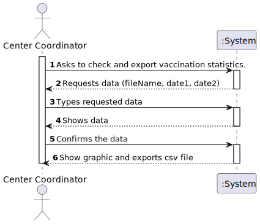
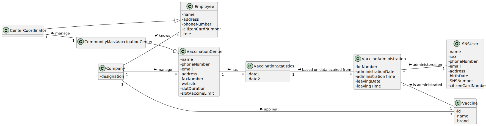
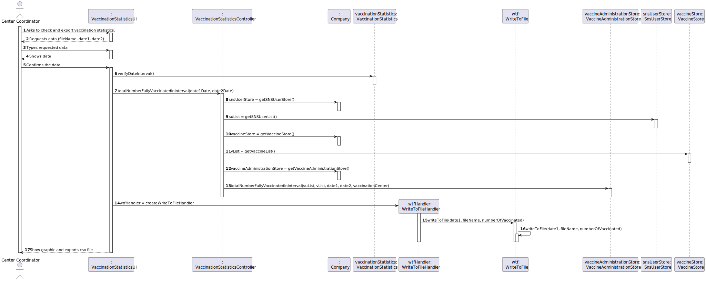
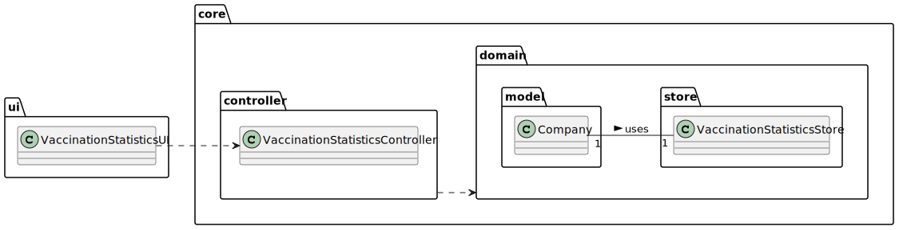

# US 15 - Check and export, to csv file, vaccination statistics.

## 1. Requirements Engineering
### 1.1. User Story Description

As a center coordinator, I intend to check and export vaccination statistics. I want to export, to a csv file, the total number of fully vaccinated users per day.

### 1.2. Customer Specifications and Clarifications

**From the specifications document:**

>   "The Center Coordinator wants to monitor the vaccination process, to see statistics and charts, to evaluate the performance of the vaccination process, generate reports and analyze data from other centers, including data from law systems."

**From the client clarifications:**

> **Question:** The user story says we should export the total number of fully vaccinated users per day. What constitutes fully vaccinated in the context of our program?
>
> **Answer:** 

> **Question:** When exporting vaccination statistics,do we export the data from all days available in the system or does the center coordinator chooses the time interval?
>
> **Answer:** The user should define a time interval (two dates).
 
> **Question:** Is there any kind of format our exported data should follow?
>
> **Answer:** Data format: date; number of fully vaccinated user.

> **Question:** Should the user introduce the name of the file  intended to export the vaccination statistics ?
>
> **Answer:** The user should introduce the name of the file.

> **Question:** Are the vaccination statistics refering only to the fully vaccinated users or refering to something more ?
>
> **Answer:** Only to fully vaccinated users.

> **Question:** In this US should the Center Coordinator check and export the Vaccination Statistics of the Center where he/she works at or should just check and export the Vaccination Statistics of all centers?
>
> **Answer:** The center coordinator can only export statistics from the vaccination center that he coordinates.

> **Question:** Is the exportation of the CSV file that contains the total number of fully vaccinated users per day, the only feature that needs to be implemented in code, for US15?
>
> **Answer:** Yes. 

### 1.3. Acceptance Criteria

* **AC1:** The user should define a time interval (two dates).
* **AC2:** Data format: date; number of fully vaccinated user.
* **AC3:** The user should introduce the name of the file.
* **AC4:** The center coordinator can only export statistics from the vaccination center that he coordinates.

### 1.4. Found out Dependencies

* There is a dependency to the specification of a new vaccine and its administration process(US13).
* There is a dependency to the creation of a center coordinator (US10).
* There is a dependency to the creation of a vaccination center(US09).
* There is a dependency to the record of the administration of a vaccine to an SNS user(US08).

### 1.5 Input and Output Data

**Input Data:**
    
* Typed data:
    * CSV file name
    * first date
  * second date

* Selected data: 
    (none)

**Output Data:**
* CSV vaccination statistics file
* (In)Success of the operation

### 1.6. System Sequence Diagram (SSD)

### 1.7 Other Relevant Remarks

* (none)

## 2. OO Analysis

### 2.1. Relevant Domain Model Excerpt

### 2.2. Other Remarks

* (None)

## 3. Design - User Story Realization

### 3.1. Rationale

**SSD adopted.**

| Interaction ID                                            | Question: Which class is responsible for...                                                             | Answer                                   | Justification (with patterns)                                                                                                                                                                                                                                                                                                              |
|:----------------------------------------------------------|:--------------------------------------------------------------------------------------------------------|:-----------------------------------------|:-------------------------------------------------------------------------------------------------------------------------------------------------------------------------------------------------------------------------------------------------------------------------------------------------------------------------------------------|
| Step 1 : Asks to check and export vaccination statistics. |                                                                                                         |                                          |                                                                                                                                                                                                                                                                                                                                            |
| Step 2 : Requests data (fileName, date1, date2)           | ...showing the dates and requesting the selection of a period (two dates), and requesting the file name | VaccinationStatisticsUI                  | **Pure Fabrication:** there is no reason to assign this responsibility to any existing class in the Domain Model. Using a Class for the interactions of the User with the System promotes the **HCLC** principle .                                                                                                                         |         
| Step 3 : Types requested data                             |                                                                                                         |                                          |                                                                                                                                                                                                                                                                                                                                            |
| Step 4 : Shows data                                       | ... showing the Center's Vaccination Statistics                                                         | VaccinationStatisticsUI                  | **Pure Fabrication:** there is no reason to assign this responsibility to any existing class in the Domain Model.                                                                                                                                                                                                                          |
| Step 5 : Confirms the data                                | ... exporting the Vaccination Statistics                                                                | WriteToFile                              | **Pure Fabrication:** there is no reason to assign this responsibility to any existing class in the Domain Model. By creating a Class to assign the responsibility of exporting a list we are adopting the **HCLC** principle as we are not assigning another responsibility to the Vaccination Center and we are promoting reusable code. |
| Step 6 : Show graphic and exports csv file                | ... informing the operation success                                                                     | VaccinationStatisticsUI                  | **Pure Fabrication:** there is no reason to assign this responsibility to any existing class in the Domain Model.                                                                                                                                                                                                                          |

### Systematization ##

According to the taken rationale, the conceptual classes promoted to software classes are:

* 

Other software classes (i.e. Pure Fabrication) identified:

* VaccinationStatisticsUI
* WriteToFile

## 3.2. Sequence Diagram (SD)

## 3.3. Class Diagram (CD)

# 4. Tests

**Test 1:** 

# 5. Construction (Implementation)

## Class [...]UI

## Class [...]Controller

## Class Company

# 6. Integration and Demo

* 

# 7. Observations

