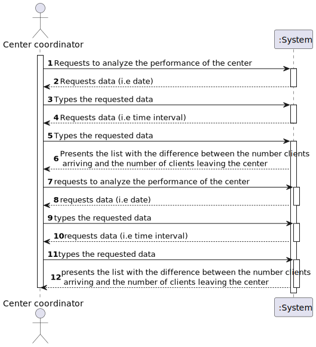
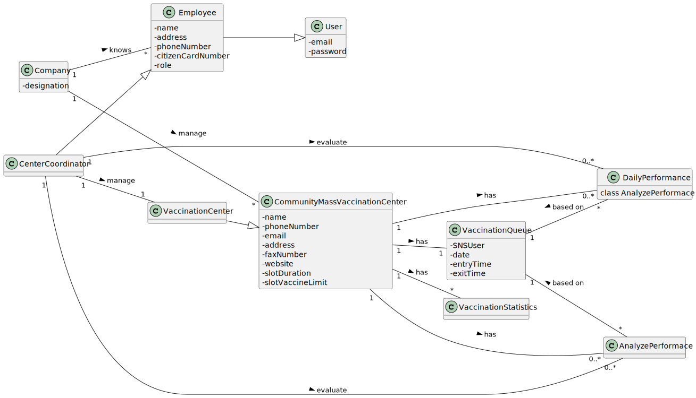
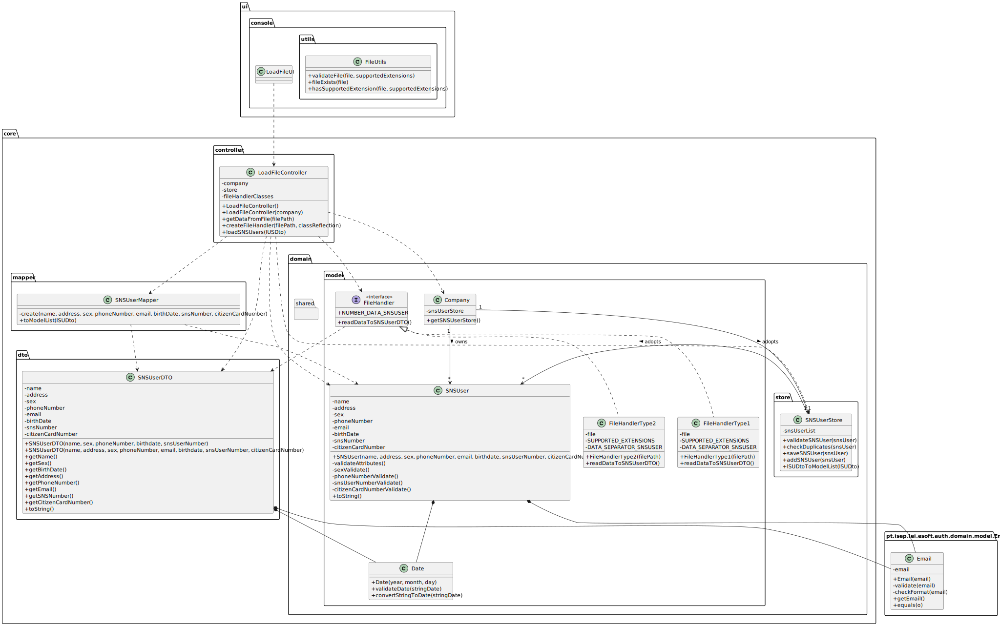

# US 16 - Analyze the performance of a center.

## 1. Requirements Engineering
### 1.1. User Story Description
As a center coordinator, I intend to analyze the performance of a center.

### 1.2. Customer Specifications and Clarifications

**From the specifications document:**

> "The goal of this US is to implement a procedure that, for a specific day, and time intervals of m minutes (for m = 30, 20, 10, 5, and 1, for example) chosen by the coordinator of the center, with a daily work from 8 a.m. to 8 p.m., the procedure creates a list of length 720/m (respectively, lists of length 24, 36, 72, 144, 720), where the i-th value of the list is the difference between the number of new clients arriving and the number of clients leaving the center in that i-th time interval."
> "Then, the application should implement a brute-force algorithm (an algorithm which examines all the contiguous sublists of the input one) to determine the contiguous sublist with maximum sum. The output should be the input list, the maximum sum contiguous sublist and its sum, and the time interval corresponding to this contiguous sublist (for example, for time intervals of 1 hour, a list of length 12 is created; if, for example, the maximum sum contiguous sublist starts at the 2nd and ends at the 5th entries of the input list, with a sum s, it means that the vaccination center was less effective in responding from 9 a.m. to 1 p.m, with s clients inside the center)."
> "The performance analysis should be documented in the application user manual (in the annexes) that must be delivered with the application. Also in the user manual, the implemented algorithm should be analyzed in terms of its worst-case time complexity. The complexity analysis must be accompanied by the observation of the execution time of the algorithms, and it should be compared to a benchmark algorithm provided, for inputs of variable size m, with m= 24, 36, 72, 144, 720, in order to observe the asymptotic behavior."

**From the client clarifications:**

> **Question:** 
>
> **Answer:**

### 1.3. Acceptance Criteria

* **AC1:** All the requested data must be provided 
* **AC2:** Only if the user logs in with a Center Coordinator account will these functionalities be available.
* **AC3:** The center coordinator can only export statistics from the vaccination center that he coordinates
* **AC4:** The time interval that the center coordinator inserts must be in minutes.

### 1.4. Found out Dependencies

Depends from the US4 and US8.

* US4 - As a receptionist at a vaccination center, I want to register the arrival of a SNS user to take the vaccine
* US8 - As a nurse, I want to record the administration of a vaccine to a SNS user

### 1.5 Input and Output Data

**Input Data:**

* Typed data:
    * Data
    * Time intervals (minutes)

* Selected data: 
	

**Output Data:**

* list with the difference between the number clients arriving and the number of clients leaving the center

### 1.6. System Sequence Diagram (SSD)

### 1.7 Other Relevant Remarks

* Frequency of Occurrence: Very often

## 2. OO Analysis

### 2.1. Relevant Domain Model Excerpt

### 2.2. Other Remarks

* There are currently no other remarks.

## 3. Design - User Story Realization

### 3.1. Rationale

**SSD adopted.**

| Interaction ID | Question: Which class is responsible for... | Answer  | Justification (with patterns)  |
|:-------------  |:--------------------- |:------------|:---------------------------- |
| Step 1: |	... interacting with the actor? | LoadFileUI | **Pure Fabrication:** there is no reason to assign this responsibility to any existing class in the Domain Model |
| 		  |	... coordinating the US? | LoadFileController | **Controller** |
| Step 2: |	 |  |  |
| Step 3: |	... instantiating a file handler object? | LoadFileController | **Creator (R1):** It's easier to work with the object itself |
|         | ... validating if the file exists and have the required extension? | FileUtils | **Pure Fabrication:** Since the application can have more functionalities to import a file in the future, it's better to assign this responsibility to a artificial class where it can be called from other contexts with similar purposes |
|         | ... reading the data present in the file? | FileHandler | **IE:** the object knows where is the file to get the information |
| Step 4: |	 |  |  |
| Step 5: | ... knows SNSUserStore? | Company |  **IE:** Company knows the SNSUserStore to which it is delegating some tasks |
|         |	... transfer the data read in the file to the domain? | SNSUserDTO | **DTO:** When there is so much data to transfer, it is better to opt by using a DTO in order to reduce coupling between the controller and domain |
| 		  |	... instantiating a new SNS User? | SNSUserMapper | **DTO** using **Mapper**, **Creator (R1)** and **HC+LC:** By the application of the Creator (R1) it would be the "Company". But, by applying HC + LC to the "Company", and since we are using the DTO pattern to transfer the data between the UI layer and the domain layer, this delegates that responsibility to the "SNSUserMapper" |
|         |	... saving the SNS User data? | SNSUser  | **IE:** a SNS User knows its own data |
|         |	... validating all data (local validation)? | SNSUser | **IE:** an object knows its own data |
| 		  |	... validating all data (global validation)? | SNSUserStore | **IE:** knows all the SNS Users|
| 		  |	... saving the SNSUser? | SNSUserStore | **IE:** Knows all SNS Users |
| Step 6: |	... informing operation success? | LoadFileUI | **IE:** is responsible for user interactions |

### Systematization ##

According to the taken rationale, the conceptual classes promoted to software classes are:

* Company
* SNSUser

Other software classes (i.e. Pure Fabrication) identified:

* LoadFileUI
* LoadFileController
* FileHandler
* FileUtils
* SNSUserStore
* SNSUserMapper
* SNSUserDto

## 3.2. Sequence Diagram (SD)

## 3.3. Class Diagram (CD)

# 4. Tests

# Class EmployeeRoleStore

**Test 1:** Check if the inserted role exists.

	@Test
    public void checkIfRoleExistsInTheList() {
		//...
    }

# 5. Construction (Implementation)

## Class ListEmployeeController

	private Company company;
    private EmployeeStore employeeStore;
    private EmployeeRoleStore employeeRoleStore;
    private Employee employee;
    private EmployeeRole employeeRole;

    public ListEmployeeController() {
        this(App.getInstance().getCompany());
    }

    public ListEmployeeController(Company company) {
        this.company = company;
        this.employeeStore = this.company.getEmployeeStore();
        this.employeeRoleStore = this.company.getEmployeeRolesStore();
        this.employee = null;
        this.employeeRole = null;
    }

    public List<EmployeeRole> getEmployeeRoles() {
        this.employeeRoleStore = this.company.getEmployeeRolesStore();
        return this.employeeRoleStore.getEmployeeRoles();
    }

    public List<Employee> getEmployeeListByRole(String roleId) {

        boolean valid = this.employeeRoleStore.checkIfRoleExists(roleId);

        if (valid) {
            EmployeeRole eRole = this.employeeRoleStore.getEmployeeRoleById(roleId);
            this.employeeStore = this.company.getEmployeeStore();
            return this.employeeStore.getEmployeesByRole(eRole);
        }

        return null;
    }

## Class EmployeeStore

	private List<Employee> employeesList = new ArrayList<Employee>();

    public List<Employee> getEmployeesByRole(EmployeeRole role) {
        List<Employee> employeeListByRole = new ArrayList<Employee>();

        return employeeListByRole;
    }

## Class Employee

	...

	private EmployeeRole role;
	
	public Employee(String name, String address, int phoneNumber, String email, int citizenCardNumber, EmployeeRole role) {
        this.name = name;
        this.address = address;
        this.phoneNumber = phoneNumber;
        this.email = email;
        this.citizenCardNumber = citizenCardNumber;
        this.role = role;
    }

	...

	public EmployeeRole getRole() {
        return role;
    }

	public void setRole(EmployeeRole role) {
        this.role = role;
    }

## Class EmployeeRoleStore

	private List<EmployeeRole> employeeRoleStoreList = new ArrayList<EmployeeRole>();

    // temporary construtor --> ignore it | TODO delete from here
    public EmployeeRoleStore() {
        this.employeeRoleStoreList.add(new EmployeeRole("1", "Nurse"));
        this.employeeRoleStoreList.add(new EmployeeRole("2", "Receptionist"));
        this.employeeRoleStoreList.add(new EmployeeRole("3", "Center Coordinator"));
    }
    // to here

    public List<EmployeeRole> getEmployeeRoles() {
        return this.employeeRoleStoreList;
    }

    public boolean checkIfRoleExists(String roleId) {
        boolean valid = false;
        //...
        return valid;
    }

    public EmployeeRole getEmployeeRoleById(String roleId) {
        EmployeeRole eRole = null;
        //...
        return eRole;
    }

## Class EmployeeRole

    private String id;

    private String designation;

    public EmployeeRole(String id, String designation) {
        this.id = id;
        this.designation = designation;
    }

    public String getId() {
        return id;
    }

    public String getDesignation() {
        return designation;
    }

## Class Company

	...
	private EmployeeStore employeeStore = new EmployeeStore();
    private EmployeeRoleStore employeeRoleStore = new EmployeeRoleStore();

	...

	public EmployeeStore getEmployeeStore() {
        return this.employeeStore;
    }

    public EmployeeRoleStore getEmployeeRolesStore() {
        return this.employeeRoleStore;
    }

# 6. Integration and Demo

* A new option on the Administrator menu options was added.

* When using this new option from the admin menu, employee roles are created automatically for demonstration purposes only.

# 7. Observations

In order to carry out this User Story, the Company responsibilities were delegated to other classes. In this way, the code is more structured and makes it easier to maintain.

