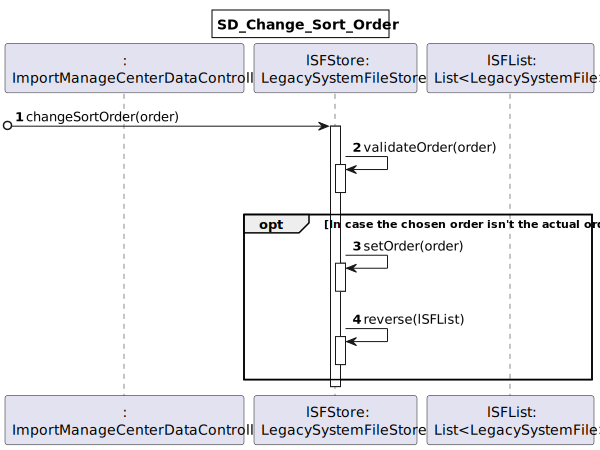
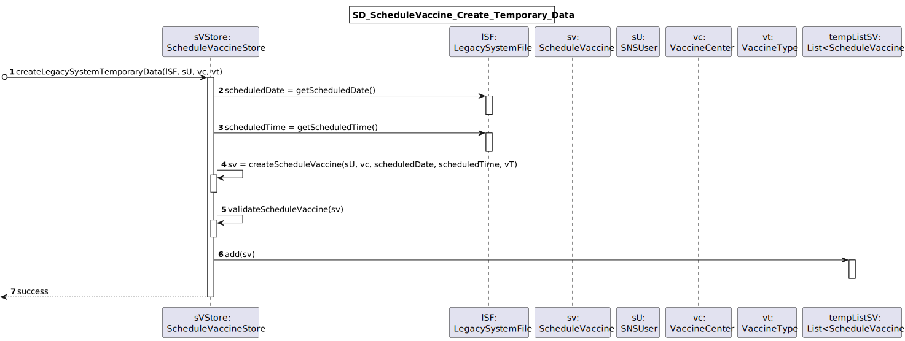
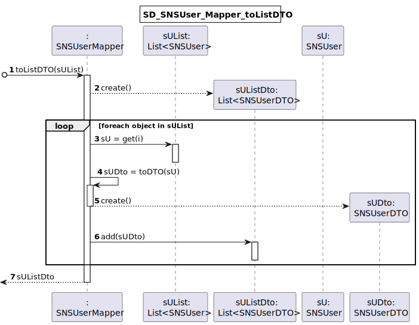

# US 17 - Import data from a legacy system that was used in the past to manage centers

## 1. Requirements Engineering
### 1.1. User Story Description
As a center coordinator, I want to import data from a legacy system that was used in the past to manage centers

### 1.2. Customer Specifications and Clarifications

**From the specifications document:**

>   "Each vaccination center has a Center Coordinator that has the responsibility to manage the Covid-19 vaccination process."
>	"The Center Coordinator wants to monitor the vaccination process, to see statistics and charts, to evaluate the performance of the vaccination process, generate reports and analyze data from other centers, including data from law systems."
>   "The imported data should be presented to the user sorted by arrival time or by the center leaving time."
>   "The name of the SNS user and the vaccine type Short Description attribute should also be presented to the user."
>   "Two sorting algorithms should be implemented (to be chosen manually by the coordinator), and worst-case time complexity of each algorithm should be documented in the application user manual (in the annexes) that must be delivered with the application."
>   "The center coordinator must be able to choose the file that is to be uploaded."

**From the client clarifications:**

> **Question:** "In the Sprint D requirements is stated that two sorting algorithms should be implemented and that the imported data should be sorted by arrival time or center leaving time. Should each algorithm be capable of both sortings or is one of the algorithms supposed to do one (e.g. arrival time) and the other the remaining sorting criteria (e.g. leaving time)?"
>
> **Answer:** "Each algorithm should be capable of doing both sortings. The application should be prepared to run both algorithms. The algorithm that will be used to sort data should be defined in a configuration file."

> **Question:** "It should be an option to choose to either sort by arrival time or by the center leaving time?"
>
> **Answer:** "The user can choose to sort by arrival time or by the center leaving time."

> **Question:** "I was analysing the csv file that should be imported for US17 (the one that is in moodle), I noticed that the date attributes are written like this 5/30/2022 I thought that the date format should be DD/MM/YYYY. I also noticed, that the time is written like this, 9:43, I also thought that the time format should be written like this HH:MM, (in this case it would be 09:43). Are the date and time formats different for US17?"
>
> **Answer:** "That file is from a legacy system, that uses a different date and time format. The date and time should be converted when loading the data into the application that we are developing."

> **Question:** "I noticed that some postal codes in the address does not follow the format of XXXX-YYY. For example some of them are XXXX-Y. Are we supposed to be able to load those users as well?"
>
> **Answer:** "Yes."

> **Question:** "In a meeting you already clarified that when uploading a file from a legacy system the application should check if the SNS Users are already registered and if not US 014 should be put to use. My question is now if only one or two SNS Users are not registered, should the whole legacy file be discarded?"
>
> **Answer:** "SNS users that are not registered should be loaded/registered. The other SNS users should not be registered again and should be ignored."

> **Question:** "You already have clarified that when uploading a file from a legacy system the application should check if the SNS Users are already registered and if not, we should register them using US 014. How exactly do you want this to proceed, in case there aren't registered users, should the application ask the center coordinator to select the file with the users data to be uploaded?"
>
> **Answer:** "US14 and US17 are two different features of the system. In US17, if the SNS user does not exist in the system, the vaccination of this SNS user should not be loaded. The system should continue processing the CSV file until all vaccinations are processed."

> **Question:** "Is there any correct format for the lot number? Should we simply assume that the lot number will always appear like this 21C16-05 ,like it's written in the file, and not validate it?"
>
> **Answer:** "The lot number has five alphanumeric characters an hyphen and two numerical characters (examples: 21C16-05 and A1C16-22)."

> **Question:** "Should the vaccine named Spikevax, (the one in the given CSV file for US17), be registered before loading the CSV file?"
>
> **Answer:** "Yes."

> **Question:** "When sorting data by arrival time or central leaving time, should we sort from greater to smallest or from smallest to greater?"
>
> **Answer:** "The user must be able to sort in ascending and descending order."

> **Question:** "Should we consider only time or date also? So, for example, if we sort from smaller to greater and consider a date also, 20/11/2020 11:00 would go before 20/12/2020 08:00. Without considering the date (only time) it would be 20/12/2020 08:00 before 20/11/2020 11:00."
>
> **Answer:** "Date and time should be used to sort the data. Sort the data by date and then by time."

> **Question:** "Regarding the validation of the data in the performance data csv, in case the dose is the not the first one, should we check if the user age and the date when the user took the other vaccine dose, are valid for the new dose to be administered?"
>
> **Answer:** "The data from the legacy system (CSV file) should be validated before being loaded. Even so, each team should create a Spikevax vaccine that allows loading all vaccinations from the example CSV file that is available in moodle. This is required for developing MDISC tasks and assessment."

> **Question:** "You answered to a previous question saying that the user should be able to sort by ascending or descending order. Should the user choose in the UI, the order in which the information should be presented? Or should this feature be defined in the configuration file?"
>
> **Answer:** "The center coordinator must use the GUI to select the sorting type (ascending or descending)."

> **Question:** "Should the configuration file be defined , manually, before strating the program? Or Should an administrator or another DGS entity be able to alter the file in a user interface? This question is also important for US06 and US16 since these US also use configuration files, will the same process be applied to them?"
>
> **Answer:** "The configuration file should be edited manually."

> **Question:** "We'd like to know if the second column in the US17 file really is the NAME of the Vaccine or if it's the short description of the VaccineType."
>
> **Answer:** "It is the name of the vaccine. The header of the CSV file includes the attribute name, which is called "VaccineName". Moreover, if you search the internet you will see what is Spikevax."

> **Question:** "Should the imported data be available only while the program is running or should it be mixed with the schedule, arrival, nurse administration and leaving times registered in the system?"
>
> **Answer:** "This US is used to load data from a legacy system. After loading, the data should be available in the application and can be used in other USs."

### 1.3. Acceptance Criteria

* **AC1:** The center coordinator must be able to choose the file that is to be uploaded.
* **AC2** The file should be a CSV.
* **AC3:** The data should be separated by semicolon.
* **AC4:** The data should be presented in the following order: "SNSUSerNumber;VaccineName;Dose;LotNumber;ScheduledDateTime;ArrivalDateTime;NurseAdministrationDateTime;LeavingDateTime;".
* **AC5:** The data from the legacy system (CSV file) should be validated before being loaded.
* **AC6:** Two sorting algorithms should be implemented (to be chosen manually by the coordinator), and worst-case time complexity of each algorithm should be documented in the application user manual (in the annexes) that must be delivered with the application.
* **AC7:** The algorithm that will be used to sort data should be defined in a configuration file.
* **AC8:** The center coordinator can choose to sort by arrival time or by the center leaving time. (The imported data should be presented to the user in the chosen condition)
* **AC9:** The center coordinator must be able to sort in ascending and descending order.
* **AC10:** The data should be sorted by date and then by time.
* **AC11:** The name of the SNS user and the vaccine type Short Description attribute should also be presented to the user.
* **AC12:** The lot number has five alphanumeric characters an hyphen and two numerical characters (examples: 21C16-05 and A1C16-22).
* **AC13:** Legacy system uses a different date and time format. The date and time present in the file should be converted when loading the data into this application.
* **AC14:** If the SNS user does not exist in the system, the vaccination of this SNS user should not be loaded. The system should continue processing the CSV file until all vaccinations are processed.
* **AC15:** The vaccine specified in the file should exist in the system.

### 1.4. Found out Dependencies

Were found the following dependencies:
* "US3 - As a receptionist, I want to register a SNS user", it's required to the SNS User to be registered in the system to make part of the vaccination process.
* "US9 - As an administrator, I want to register a vaccination center to respond to a certain pandemic", it's required to exist a vaccination center were the vaccination process can occur.
* "US10 - As an administrator, I want to register an Employee", since we need the center coordinator to be registered to access the functionality present in this US.
* "US12 - As an administrator, I intend to specify a new vaccine type", a vaccine type must exist making possible to create a vaccine that will be administered to the SNS User.
* "US13 - As an administrator, I intend to specify a new vaccine and its administration process", it's required to exist the vaccine to administer it to the SNS User.
* "US14 - As an administrator, I want to load a set of users from a CSV file", it's required to the SNS User to be registered in the system to make part of the vaccination process.

### 1.5 Input and Output Data

**Input Data:**

* Typed data:
    * The path to the file to be imported

* Selected data:
    * The sort criteria
    * The sort order (ascending or descending)

**Output Data:**

* A list with the data to be imported to the system
* (In)Success of the operation

### 1.6. System Sequence Diagram (SSD)

### 1.7 Other Relevant Remarks

* There are some similarities to other US's, since the data present in the file to be imported in this US as data that comes from the use of other US, such as the following ones:
  * US1 - As a SNS user, I intend to use the application to schedule a vaccine
  * US2 - As a receptionist at one vaccination center, I want to schedule a vaccination
  * US4 - As a receptionist at a vaccination center, I want to register the arrival of a SNS user to take the vaccine
  * US8 - As a nurse, I want to record the administration of a vaccine to a SNS user

## 2. OO Analysis

### 2.1. Relevant Domain Model Excerpt

### 2.2. Other Remarks

* The LegacySystemFile business class should be taken as an interface, so we can prevent and protect future variations on the file from the legacy system
* In the file we will get only a part of information for some classes, so it will be necessary to get the rest of the information for each part:
  * (1) The vaccination center that will hold the imported data it's the one where the center coordinator is operating (chosen when he makes the login)
  * (2) With the SNSUserNumber we can get all the information about that SNS User;
  * (3) With VaccineName we can get the information of the vaccine and the correspondent type;
  * (4) With the dose number and the birthdate of the SNS User (the last one is gotten like described in (2)) and the vaccine (3), we can get all information referent to the vaccine dose

## 3. Design - User Story Realization

### 3.1. Rationale

**SSD adopted.**

| Interaction ID | Question: Which class is responsible for... | Answer  | Justification (with patterns)  |
|:-------------  |:--------------------- |:------------|:---------------------------- |
| Step 1: |	... interacting with the actor? | ImportManageCenterDataUI | **Pure Fabrication:** there is no reason to assign this responsibility to any existing class in the Domain Model |
| 		  |	... coordinating the US? | ImportManageCenterDataController | **Controller** |
|         | ... knowing the vaccination center where the center coordinator is working? | ImportManageCenterDataUI | **Pure Fabrication:** there is no reason to assign this responsibility to any existing class in the Domain Model |
|         | ... knowing the list of vaccinations centers? | VaccinationCenterStore | **IE:** knows all the vaccination centers |
|         | ... knowing the VaccinationCenterStore? | Company |  **IE:** Company knows the VaccinationCenterStore to which it is delegating some tasks |
| Step 2: |	 |  |  |
| Step 3: |	... validating if the file exists and have the required extension? | FileUtils | **Pure Fabrication:** Since we already created this artificial class to make file properties validation, we can reuse it here and don't reply the same code |
|         | ... saving the data present in each line of the file? | LegacySystemFile | **IE:** a legacy system file knows its own data |
|         | ... reading the data existent in the file? | LegacySysFileReader | **Pure Fabrication:** there is no reason to assign this responsibility to any existing class in the Domain Model. This promotes the reuse of this functionality. |
|         | ... instantiating the data present in each line of the file? | LegacySystemFileStore | **Creator (R1)** and **HC+LC**: By the application of the Creator (R1) it would be the "Company". But, by applying HC + LC to the "Company", this delegates that responsibility to the "LegacySystemFileStore" |
|         | ... store the list with all the read data? | LegacySystemFileStore | **Pure Fabrication** and **HC + LC:** The "Company" has the responsibility to store all this data but by applying the High Cohesion and Low Coupling pattern, the company delegates that responsibility to the "LegacySystemFileStore". |
|         | ... saving the LegacySystemFile date? | LegacySystemFileStore | **IE:** Knows all the LegacySystemFile |
|         | ... knows VaccineAdministrationStore? | Company | **IE:** Company knows the VaccineAdministrationStore to which it is delegating some tasks |
|         | ... store the date information? | Date | **IE:** knows the day, month and year information |
|         | ... store the time information? | Time | **IE:** knows the hour and minutes information |
|         | ... knowing the SNSUsers registered in the system? | SNSUserStore | **IE:** knows all the SNS Users |
|         | ... knows SNSUserStore? | Company | **IE:** Company knows the SNSUserStore to which it is delegating some tasks |
|         | ... knowing the SNS User information? | SNSUser | **IE:** an object knows his own data |
|         | ... transfer the SNS Users information from the domain layer? | SNSUserDTO | **DTO:** When there is so much data to transfer, it is better to opt by using a DTO in order to reduce coupling between the controller and domain |
| 		  |	... transform the SNS User model into a SNS User DTO? | SNSUserMapper | **DTO** using **Mapper**, **Creator (R1)** and **HC+LC:** By the application of the Creator (R1) it would be the "Company". But, by applying HC + LC to the "Company", and since we are using the DTO pattern to transfer the data, this delegates that responsibility to the "SNSUserMapper" |
|         | ... knowing the vaccines registered in the system? | VaccineStore | **IE:** knows all the vaccines |
|         | ... knows VaccineStore? | Company | **IE:** Company knows the VaccineStore to which it is delegating some tasks |
|         | ... knowing the vaccine information? | Vaccine | **IE:** an object knows his own data |
|         | ... transfer the vaccines information from the domain layer? | VaccineDTO | **DTO:** When there is so much data to transfer, it is better to opt by using a DTO in order to reduce coupling between the controller and domain |
| 		  |	... transform the vaccine model into a vaccine DTO? | VaccineMapper | **DTO** using **Mapper**, **Creator (R1)** and **HC+LC:** By the application of the Creator (R1) it would be the "Company". But, by applying HC + LC to the "Company", and since we are using the DTO pattern to transfer the data, this delegates that responsibility to the "VaccineMapper" |
|         | ... transfer a vaccine type information from the domain layer? | VaccineTypeDTO | **DTO:** When there is so much data to transfer, it is better to opt by using a DTO in order to reduce coupling between the controller and domain |
| 		  |	... transform the vaccine type model into a vaccine type DTO? | VaccineTypeMapper | **DTO** using **Mapper**, **Creator (R1)** and **HC+LC:** By the application of the Creator (R1) it would be the "Company". But, by applying HC + LC to the "Company", and since we are using the DTO pattern to transfer the data, this delegates that responsibility to the "VaccineTypeMapper" |
| Step 4: |	 |  |  |
| Step 5: | ... sort the data present in the LegacySystemFileStore following a criteria? | SortDataAlgorithm | **Pure Fabrication**, **HC + LC** and **Protected Variation:** Since the chances that we will need to sort other data in the future are high, we just create a new class to assign this responsibility and promote high cohesion, low coupling, and reuse. |
|         | ... knowing which sort algorithm should be used? | Company | **IE:** The company knows the configured algorithm that should be used. |
|         | ... return the required data corresponding to the field criteria? | SortDataCriteria | **Pure fabrication** and **HC+LC:** By applying the HC+LC pattern, we delegate this functionality to another class so we promote the reuse |
| Step 6: | |  |  |
| Step 7: | ... knowing in which order the data is ordered? | LegacySystemFileStore | **IE:** Knows the order of her own data |
|         | ... change the data order? | LegacySystemFileStore | **IE:** Knows all the data and respective order |
| Step 8: |	| | |
| Step 9: | ... knowing the data to be imported? | LegacySystemFile | **IE:** an object knows its own data |
|         | ... knowing all the data to be imported? | LegacySystemFileStore | **IE:** knows all the LegacySystemFile |
|         | ... knowing the SNS User by it SNS User number? | SNSUserStore | **IE:** Knows all the SNS Users |
|         | ... knowing the vaccine by it id? | VaccineStore | **IE:** knows all the vaccines |
|         | ... knowing the vaccine type by the code? | VaccineTypeStore | **IE:** knows all the vaccine types |
|         | ... having the Dose information registered? | Dose | **IE:** an object knows its own data. |
|         | ... knows the Dose? | AgeGroup | **IE:** an object knows its belonging data. |
|         | ... knows the age group? | Vaccine | **IE:** the vaccine knows all the corresponding age groups |
|         | ... save vaccine administration information? | VaccineAdministration | **IE:** and object know its own data. |
|         | ... creating a vaccine administration? | VaccineAdministrationStore | **Creator (R1)** and **HC+LC**: By the application of the Creator (R1) it would be the "Company". But, by applying HC + LC to the "Company", this delegates that responsibility to the "VaccineAdministrationStore" |
|         | ... saving a vaccine administration? | VaccineAdministrationStore | **IE:** knows all the vaccine administrations |
|         | ... knows VaccineAdministrationStore? | Company | **IE:** Company knows the VaccineAdministrationStore to which it is delegating some tasks |
|         | ... validate the vaccine administration data (object validation)? | VaccineAdministration | **IE:** and object knows its own data |
|         | ... validate the vaccine administration data (global validation)? | VaccineAdministrationStore | **IE:** knows all the vaccine administrations |
|         | ... save a vaccine schedule information? | ScheduleVaccine | **IE:** and object know its own data. |
|         | ... creating a vaccine schedule? | ScheduleVaccineStore | **Creator (R1)** and **HC+LC**: By the application of the Creator (R1) it would be the "Company". But, by applying HC + LC to the "Company", this delegates that responsibility to the "ScheduleVaccineStore" |
|         | ... saving a vaccine schedule? | ScheduleVaccineStore | **IE:** knows all the vaccine schedules |
|         | ... knows ScheduleVaccineStore? | Company | **IE:** Company knows the ScheduleVaccineStore to which it is delegating some tasks |
|         | ... validate the vaccine schedule data (object validation)? | ScheduleVaccine | **IE:** and object knows its own data |
|         | ... validate the vaccine schedule data (global validation)? | ScheduleVaccineStore | **IE:** knows all the vaccine schedules |
|         | ... save a SNS User arrival information? | ArrivalSNSUser | **IE:** and object know its own data. |
|         | ... creating a SNS User arrival? | ArrivalSNSUserStore | **Creator (R1)** and **HC+LC**: By the application of the Creator (R1) it would be the "Company". But, by applying HC + LC to the "Company", this delegates that responsibility to the "ArrivalSNSUserStore" |
|         | ... saving a SNS User arrival? | ArrivalSNSUserStore | **IE:** knows all the SNS Users arrivals |
|         | ... knows ArrivalSNSUserStore? | Company | **IE:** Company knows the ArrivalSNSUserStore to which it is delegating some tasks |
|         | ... validate the SNS User arrival data (object validation)? | ArrivalSNSUser | **IE:** and object knows its own data |
|         | ... validate the SNS User arrival data (global validation)? | ArrivalSNSUserStore | **IE:** knows all the SNS User arrival |
|         | ... persist all the vaccine administration data? | VaccineAdministrationStore | **IE:** knows all the vaccine administrations |
|         | ... persist all the vaccine schedules data? | ScheduleVaccineStore | **IE:** knows all the vaccine schedules |
|         | ... persist all the SNS User arrivals data? | ArrivalSNSUserStore | **IE:** knows all the SNS User arrivals |
| Step 10: | ... informing operation success? | ImportManageCenterDataUI | **IE:** is responsible for user interactions |

### Systematization ##

According to the taken rationale, the conceptual classes promoted to software classes are:

* Company
* LegacySystemFile
* SNSUser
* VaccinationCenter
* Vaccine
* VaccineType
* AgeGroup
* Dose
* VaccineAdministration
* ScheduleVaccine
* ArrivalSNSUser
* Date
* Time

Other software classes (i.e. Pure Fabrication) identified:

* ImportManageCenterDataUI
* ImportManageCenterDataController
* SNSUserMapper
* VaccineMapper
* VaccineTypeMapper
* SNSUserDTO
* VaccineDTO
* VaccineTypeDTO
* SortDataAlgorithm
* SNSUserStore
* VaccineStore
* VaccineTypeStore
* VaccinationCenterStore
* VaccineAdministrationStore
* ScheduleVaccineStore
* ArrivalSNSUserStore
* LegacySystemFileStore
* LegacySysFileReader
* SortDataCriteria
* FileUtils

## 3.2. Sequence Diagram (SD)

**Main Sequence Diagram for this US**

**SD_ArrivalSNSUser_Create_Temporary_Data**

**SD_ArrivalSNSUser_Save_Temporary_Data**

**SD_Change_Sort_Order**

**SD_LegacySystemFileStore_storeData**

**SD_Read_Legacy_System_Data_File**

**SD_ScheduleVaccine_Create_Temporary_Data**

**SD_ScheduleVaccine_Save_Temporary_Data**

**SD_SNSUser_Mapper_toListDTO**

**SD_VACCINE_MAPPER_TOLISTDTO**

**SD_VaccineAdministration_Create_Temporary_Data**

**SD_VaccineAdministration_Save_Temporary_Data**

## 3.3. Class Diagram (CD)

# 4. Tests

# Class VaccineAdministrationTests

**Test 1:** Check that it is not possible to create an instance of the VaccineAdministration class with null values.

    @Test(expected = IllegalArgumentException.class)
    public void ensureNullIsNotAllowed() {
        new VaccineAdministration(null, null, null, null, null, null, null, null, null);
    }

**Test 2:** Check that it is not possible to create an instance of the VaccineAdministration class with invalid lot number.

    @Test(expected = IllegalArgumentException.class)
    public void testCheckLotNumber() {
        new VaccineAdministration(SNS_USER1, VACCINE1, DOSE1, ADMINISTRATION_DATE1, ADMINISTRATION_TIME2,
            LEAVING_DATE1, LEAVING_TIME2, VACCINATION_CENTER, "123-AA");
    }

**Test 3:** Check that it is not possible to create an instance of the VaccineAdministration class with administration time greater than exit time

    Time ADMINISTRATION_TIME1 = new Time(15, 10, 20);    
    Time LEAVING_TIME1 = new Time(15, 0, 20);

    @Test(expected = IllegalArgumentException.class)
    public void testCheckTime() {
        new VaccineAdministration(SNS_USER1, VACCINE1, DOSE1, ADMINISTRATION_DATE1, ADMINISTRATION_TIME1,
                LEAVING_DATE1, LEAVING_TIME1, VACCINATION_CENTER, "AA123-55");
    }

# 5. Construction (Implementation)

## Class ImportManageCenterDataController

    private Company company;
    private final String[] SUPPORTED_EXTENSIONS = {"csv"};
    private VaccinationCenterStore vcStore;
    private VaccinationCenter vc;

    public ImportManageCenterDataController(int vcId) {
        this(App.getInstance().getCompany());
        this.vcStore = company.getVaccinationCenterStore();
        this.vc = vcStore.getVaccinationCenter(vcId);
    }

    public ImportManageCenterDataController(Company company) {
        this.company = company;
    }

    public String validateFile(String filePath) {
        File file = new File(filePath);
        return FileUtils.validateFile(file, this.SUPPORTED_EXTENSIONS);
    }

    public List<LegacySystemFile> readFileData(String filePath) {
        List<List<String>> fileData = new LegacySysFileReaderType1().readDataToStringList(filePath);

        SNSUserStore sUStore = this.company.getSNSUserStore();
        List<SNSUser> sUList = sUStore.getSNSUserList();
        List<SNSUserDTO> suListDto = SNSUserMapper.toListDTO(sUList);

        VaccineStore vStore = this.company.getVaccineStore();
        List<Vaccine> listV = vStore.getListV();
        List<VaccineDTO> listVDto = VaccineMapper.toListDTO(listV);

        LegacySystemFileStore lSFStore = this.company.getLegacySystemFileStore();
        lSFStore.storeData(fileData, suListDto, listVDto);

        return lSFStore.getlSFList();

    }

    public List<LegacySystemFile> sortDataByCriteria(String sortingCriteria) {
        LegacySystemFileStore lSFStore = this.company.getLegacySystemFileStore();
        List<LegacySystemFile> lSF = lSFStore.getlSFList();
        boolean exception = false;
        SortDataAlgorithm sortDataAlgorithm = null;
        try {
            sortDataAlgorithm = this.company.getSortDataAlgorithm(sortingCriteria);
        } catch (Exception ex) {
            exception = true;
        }

        if (exception) {
            throw new IllegalArgumentException("Something went wrong. Please try again later.");
        }

        lSFStore.changeSortOrder(LegacySystemFileStore.ORDER_ASC);

        return sortDataAlgorithm.sortData(lSF);
    }

    public List<LegacySystemFile> changeSortOrder(String order) {
        LegacySystemFileStore lSFStore = this.company.getLegacySystemFileStore();
        lSFStore.changeSortOrder(order);
        return lSFStore.getlSFList();
    }

    public void importDataToTheSystem() {
        LegacySystemFileStore lSFStore = this.company.getLegacySystemFileStore();
        SNSUserStore snsUserStore = this.company.getSNSUserStore();
        VaccineStore vaccineStore = this.company.getVaccineStore();
        VaccineTypeStore vaccineTypeStore = this.company.getVaccineTypeStore();
        VaccineAdministrationStore vaStore = this.company.getVaccineAdministrationStore();
        ScheduleVaccineStore sVStore = this.company.getScheduleVaccineStore();
        ArrivalSNSUserStore aSUStore = this.company.getArrivalSNSUserStore();

        List<LegacySystemFile> lSFList = lSFStore.getlSFList();
        int line = 2;

        for (LegacySystemFile lSF : lSFList) {

            boolean success;

            SNSUser snsUser = snsUserStore.getSNSUser(lSF.getSnsUserDTO().getSnsUserNumber());
            Vaccine vaccine = vaccineStore.getVaccine(lSF.getVaccineDTO().getId());
            VaccineType vaccineType = vaccineTypeStore.getVaccineTypeByCode(lSF.getVaccineDTO().getVtDto().getCode());

            // Vaccine administration
            int age = Date.yearsBetweenTwoDates(snsUser.getBirthdate(), lSF.getScheduledDate());
            Dose dose = vaccineStore.getDose(vaccine, age, Dose.mapDoseValue(lSF.getDose()));
            try {
                success = vaStore.createLegacySystemTemporaryData(snsUser, vaccine, dose, lSF, vc);
                this.throwExceptionIfNotSuccess(success, line, "Invalid vaccine administration data.");

                // Schedule Vaccine
                success = sVStore.createLegacySystemTemporaryData(lSF, snsUser, this.vc, vaccineType);
                this.throwExceptionIfNotSuccess(success, line, "Invalid schedule vaccine data.");

                // Arrival SNS User
                success = aSUStore.createLegacySystemTemporaryData(snsUser, lSF, this.vc);
                this.throwExceptionIfNotSuccess(success, line, "Invalid arrival data.");
            } catch (IllegalArgumentException ex) {
                aSUStore.cleanTempList();
                vaStore.cleanTempList();
                sVStore.cleanTempList();
                throw new InvalidDataInLegacySystemFileException(line, ex.getMessage());
            }

            line++;
        }

        vaStore.saveLegacySystemTemporaryData();
        sVStore.saveLegacySystemTemporaryData();
        aSUStore.saveLegacySystemTemporaryData();

    }

    private void throwExceptionIfNotSuccess(boolean valid, int fileLine, String message) {
        if (!valid) {
            throw new InvalidDataInLegacySystemFileException(fileLine, message);
        }
    }

## Class SNSUserMapper

    public static List<SNSUserDTO> toListDTO(List<SNSUser> sUList) {

        List<SNSUserDTO> sUListDto = new ArrayList<>();

        for (int i = 0; i < sUList.size(); i++) {
            SNSUser sU = sUList.get(i);
            SNSUserDTO sUDto = toDto(sU);
            sUListDto.add(sUDto);
        }

        return sUListDto;

    }

    public static SNSUserDTO toDto(SNSUser su) {
        String name = su.getName();
        String address = su.getAddress();
        String sex = su.getSex();
        String phoneNumber = su.getPhoneNumber();
        Email email = su.getEmail();
        Date birthdate = su.getBirthdate();
        String snsUserNumber = su.getSnsUserNumber();
        String citizenCardNumber = su.getCitizenCardNumber();

        return new SNSUserDTO(name, address, sex, phoneNumber, email, birthdate, snsUserNumber, citizenCardNumber);
    }

## Class VaccineMapper

    public static List<VaccineDTO> toListDTO(List<Vaccine> listV) {
        List<VaccineDTO> listVDto = new ArrayList<>();

        for (int i = 0; i < listV.size(); i++) {
            Vaccine au = listV.get(i);

            VaccineDTO vDto = toDTO(au);
            listVDto.add(vDto);
        }

        return listVDto;
    }

    public static VaccineDTO toDTO(Vaccine v) {
        int id = v.getId();
        String name = v.getName();
        String brand = v.getBrand();
        VaccineTypeDTO vtDto = VaccineTypeMapper.toDTO(v.getVt());
        List<AgeGroup> agList = v.getAgList();

        return new VaccineDTO(id, name, brand, vtDto, agList);
    }

## Class VaccineTypeMapper

    public static VaccineTypeDTO toDTO(VaccineType vt) {
        String code = vt.getCode();
        String description = vt.getDescription();
        String technology = vt.getTechnology();

        return new VaccineTypeDTO(code, description, technology);
    }

## Class SNSUserDTO

    private String name;
    private String address;
    private String sex;
    private String phoneNumber;
    private Email email;
    private Date birthdate;
    private String snsUserNumber;
    private String citizenCardNumber;

    public SNSUserDTO(String name, String address, String sex, String phoneNumber, Email email, Date birthdate,
                      String snsUserNumber, String citizenCardNumber) {
        this.name = name;
        this.address = address;
        this.sex = sex;
        this.phoneNumber = phoneNumber;
        this.email = email;
        this.birthdate = birthdate;
        this.snsUserNumber = snsUserNumber;
        this.citizenCardNumber = citizenCardNumber;
    }

    public String getName() {
        return name;
    }

    public String getSex() {
        return sex;
    }

    public String getPhoneNumber() {
        return phoneNumber;
    }

    public Date getBirthdate() {
        return birthdate;
    }

    public String getSnsUserNumber() {
        return snsUserNumber;
    }

    public String getAddress() {
        return address;
    }

    public Email getEmail() {
        return email;
    }

    public String getCitizenCardNumber() {
        return citizenCardNumber;
    }

## Class VaccineDTO

    private int id;
    private String name;
    private String brand;
    private VaccineTypeDTO vt;
    private List<AgeGroup> agList;

    public VaccineDTO(int id, String name, String brand, VaccineTypeDTO vt, List<AgeGroup> agList) {
        this.id = id;
        this.name = name;
        this.brand = brand;
        this.vt = vt;
        this.agList = agList;
    }

    public int getId() {
        return id;
    }

    public String getName() {
        return name;
    }

    public String getBrand() {
        return brand;
    }

    public VaccineTypeDTO getVtDto() {
        return vt;
    }

    public List<AgeGroup> getAgList() {
        return agList;
    }

## Class VaccineTypeDTO
    
    private String code;
    private String description;
    private String technology;

    public VaccineTypeDTO(String code, String description, String technology) {
        this.code = code;
        this.description = description;
        this.technology = technology;
    }

    public String getCode() {
        return code;
    }

    public String getDescription() {
        return description;
    }

    public String getTechnology() {
        return technology;
    }

## Interface SortDataAlgorithm

    public interface SortDataAlgorithm {
        List<LegacySystemFile> sortData(List<LegacySystemFile> lSFList);
    }

## Class BubbleSortAlgorithm

    private SortDataCriteria sortDataCriteria;

    public BubbleSortAlgorithm(String sortCriteria) {
        ...
    }

    @Override
    public List<LegacySystemFile> sortData(List<LegacySystemFile> lSFList) {
        ...
    }

    private void bubbleSort(List<LegacySystemFile> lSFList) {
        ...
    }

    private void swap(List<LegacySystemFile> lSFList, int i, int j) {
        ...
    }

## Class QuickSortAlgorithm

    private SortDataCriteria sortDataCriteria;

    public QuickSortAlgorithm(String sortCriteria) {
        ...
    }

    @Override
    public List<LegacySystemFile> sortData(List<LegacySystemFile> lSFList) {
        ...
    }

    private void quicksort(List<LegacySystemFile> lSFList, int low, int high) {
        ...
    }

    private void swap(List<LegacySystemFile> lSFList, int i, int j) {
        ...
    }

    private int partition(List<LegacySystemFile> lSFList, int low, int high) {
        ...
    }

## Class SNSUserStore

    private List<SNSUser> snsUserList;
    
    public List<SNSUser> getSNSUserList() {
        this.snsUserList = this.loadSNSUsersListFromFile();
        return snsUserList;
    }

    public boolean validateSNSUser(SNSUser snsUser) {
        if (snsUser == null) {
            return false;
        } else {
            return !checkDuplicates(snsUser);
        }
    }

    public boolean checkDuplicates(SNSUser snsUser) {
        return this.snsUserList.contains(snsUser);
    }

    public boolean saveSNSUser(SNSUser snsUser) {
        if (!validateSNSUser(snsUser)) {
            return false;
        } else {
            return addSNSUser(snsUser);
        }
    }

    private boolean addSNSUser(SNSUser snsUser) {
        return this.snsUserList.add(snsUser);
    }

    public SNSUser getSNSUser(String snsUserNumber) {
        SNSUser su = null;

        for (SNSUser item : snsUserList) {
            if (item.getSnsUserNumber().equals(snsUserNumber)) {
                su = item;
            }
        }

        return su;
    }

## Class VaccineStore

    private List<Vaccine> listV;
    
    public List<Vaccine> getListV() {
        return this.listV;
    }

    public Vaccine getVaccine(int id) {

        Vaccine v = null;

        for (Vaccine list : this.listV) {
            if (list.getId() == id) {
                v = list;
            }
        }

        return v;
    }

    public Dose getDose(Vaccine v, int age, int doseNumber) {
        Dose d = null;

        for (AgeGroup listAgeGroup : v.getAgList()) {
            if (age >= listAgeGroup.getMinimumAge() && age <= listAgeGroup.getMaximumAge()) {

                for (Dose listDose : listAgeGroup.getDoseList()) {
                    if (listDose.getDoseNumber() == doseNumber) {
                        d = listDose;
                    }
                }
            }
        }

        return d;
    }

## Class VaccineTypeStore

    private List<VaccineType> vtList;

    public VaccineType getVaccineTypeByCode(String code) {

        VaccineType vT = null;
        int i = 0;
        boolean found = false;

        while (i < this.vtList.size() && !found) {

            if (this.vtList.get(i).getCode().equals(code)) {
                vT = this.vtList.get(i);
                found = true;
            }
            i++;

        }

        return vT;

    }

## Class VaccinationCenterStore

    private List<VaccinationCenter> listVC;

    public VaccinationCenter getVaccinationCenter(int vcId) {
        this.listVC = this.loadVaccinationCenterListFromFile();

        VaccinationCenter vc = null;

        for (VaccinationCenter list : listVC) {
            if (list.getId() == vcId) {
                vc = list;
            }
        }

        return vc;
    }

    public int getVaccinationCenterIdCenterCoordinator(int centerCoordinatorId) {
        int vcId = 0;
        this.listVC = this.loadVaccinationCenterListFromFile();

        for (VaccinationCenter list : this.listVC) {
            if (list.getCenterCoordinatorId() == centerCoordinatorId) {
                vcId = list.getId();
            }
        }

        return vcId;
    }

## Class VaccineAdministrationStore

    private List<VaccineAdministration> listVA = new ArrayList<>();
    private List<VaccineAdministration> tempListVA = new ArrayList<>();

    public VaccineAdministration instantiateVaccineAdministration(SNSUser snsUser, Vaccine vaccine, Dose dose,
                                                                  Date administrationDate, Time administrationTime,
                                                                  Date leavingDate, Time leavingTime,
                                                                  VaccinationCenter vCenter, String lotNumber) {
        return new VaccineAdministration(snsUser, vaccine, dose, administrationDate, administrationTime, leavingDate,
                leavingTime, vCenter, lotNumber);
    }

    public boolean validateVaccineAdministration(VaccineAdministration av) {
        if (av == null) {
            return false;
        } else {
            return !checkDuplicates(av);
        }
    }

    public boolean checkDuplicates(VaccineAdministration av) {
        return this.listVA.contains(av);
    }

    public boolean saveVaccineAdministration(VaccineAdministration av) {
        if (!validateVaccineAdministration(av)) {
            return false;
        } else {
            return addAdministrationVaccine(av);
        }
    }

    private boolean addAdministrationVaccine(VaccineAdministration av) {
        return this.listVA.add(av);
    }

    public boolean saveVaccineAdministrationListInFile() {
        return SerializeClasses.saveObjectIntoDisk(this.listVA, this.FILE_WITH_ALL_DATA);
    }

    public List<VaccineAdministration> loadVaccineAdministrationListFromFile() {
        return SerializeClasses.loadObjectIntoMemory(this.FILE_WITH_ALL_DATA);
    }

    public boolean createLegacySystemTemporaryData(SNSUser snsUser, Vaccine vaccine, Dose dose, LegacySystemFile lSF,
                                                   VaccinationCenter vCenter) {
        VaccineAdministration vaccineAdministration = this.instantiateVaccineAdministration(snsUser, vaccine, dose,
                lSF.getNurseAdministrationDate(), lSF.getNurseAdministrationTime(), lSF.getLeavingDate(),
                lSF.getLeavingTime(), vCenter, lSF.getLotNumber());

        if (!this.validateVaccineAdministration(vaccineAdministration)) {
            return false;
        }

        return this.tempListVA.add(vaccineAdministration);
    }

    public void saveLegacySystemTemporaryData() {

        if (this.tempListVA.size() > 0) {
            for (VaccineAdministration vaccineAdministration : this.tempListVA) {
                this.saveVaccineAdministration(vaccineAdministration);
            }

            this.saveVaccineAdministrationListInFile();

            this.cleanTempList();
        }

    }

    public void cleanTempList() {
        this.tempListVA = new ArrayList<>();
    }

## Class ScheduleVaccineStore

    private List<ScheduleVaccine> listSV;
    private List<ScheduleVaccine> tempListSV = new ArrayList<>();

    public boolean saveScheduleVaccine(ScheduleVaccine scheduleVaccine) {
        if (!validateScheduleVaccine(scheduleVaccine)) {
            return false;
        } else {
            return addScheduleVaccine(scheduleVaccine);
        }
    }

    public ScheduleVaccine createScheduleVaccine(SNSUser snsUser, VaccinationCenter vaccinationCenter, Date date, Time time,
                                                 VaccineType vaccineType) {
        return new ScheduleVaccine(snsUser, vaccinationCenter, date, time, vaccineType);
    }

    public boolean saveSVListInFile() {
        return SerializeClasses.saveObjectIntoDisk(this.listSV, this.FILE_WITH_ALL_DATA);
    }

    public List<ScheduleVaccine> loadSVFromFile() {
        return SerializeClasses.loadObjectIntoMemory(this.FILE_WITH_ALL_DATA);
    }

    public boolean validateScheduleVaccine(ScheduleVaccine scheduleVaccine) {
        if (scheduleVaccine == null) {
            return false;
        } else {
            return !this.listSV.contains(scheduleVaccine);
        }
    }

    public boolean addScheduleVaccine(ScheduleVaccine scheduleVaccine) {
        return this.listSV.add(scheduleVaccine);
    }

    public boolean createLegacySystemTemporaryData(LegacySystemFile lSF, SNSUser snsUser, VaccinationCenter vCenter,
                                                   VaccineType vType) {
        ScheduleVaccine scheduleVaccine = this.createScheduleVaccine(snsUser, vCenter, lSF.getScheduledDate(),
                lSF.getScheduledTime(), vType);

        if (!this.validateScheduleVaccine(scheduleVaccine)) {
            return false;
        }

        return this.tempListSV.add(scheduleVaccine);
    }

    public void saveLegacySystemTemporaryData() {

        if (this.tempListSV.size() > 0) {
            for (ScheduleVaccine scheduleVaccine : this.tempListSV) {
                this.saveScheduleVaccine(scheduleVaccine);
            }

            this.saveSVListInFile();

            this.cleanTempList();
        }

    }

    public void cleanTempList() {
        this.tempListSV = new ArrayList<>();
    }

## Class ArrivalSNSUserStore

    private List<ArrivalSNSUser> listAU;
    private List<ArrivalSNSUser> tempListASU = new ArrayList<>();

    public ArrivalSNSUser instantiateArrivalSNSUser(SNSUser snsUser, Date arrivalDate, Time arrivalTime,
                                                    VaccinationCenter vaccinationCenter) {
        return new ArrivalSNSUser(snsUser, arrivalDate, arrivalTime, vaccinationCenter);
    }

    public boolean validateArrivalSNSUser(ArrivalSNSUser au) {
        if (au == null) {
            return false;
        } else {
            return !checkDuplicates(au);
        }
    }

    public boolean checkDuplicates(ArrivalSNSUser au) {
        return this.listAU.contains(au);
    }

    public boolean saveArrivalSNSUser(ArrivalSNSUser au) {
        if (!validateArrivalSNSUser(au)) {
            return false;
        } else {
            return this.addArrivalSNSUser(au);
        }
    }

    public boolean saveArrivalSNSUserListInFile() {
        return SerializeClasses.saveObjectIntoDisk(this.listAU, this.FILE_WITH_ALL_DATA);
    }

    public List<ArrivalSNSUser> loadSNSUsersArrivalsListFromFile() {
        return SerializeClasses.loadObjectIntoMemory(this.FILE_WITH_ALL_DATA);
    }

    private boolean addArrivalSNSUser(ArrivalSNSUser arrivalSNSUser) {
        return this.listAU.add(arrivalSNSUser);
    }

    public boolean createLegacySystemTemporaryData(SNSUser snsUser, LegacySystemFile lSF, VaccinationCenter vCenter) {
        ArrivalSNSUser arrivalSNSUser = this.instantiateArrivalSNSUser(snsUser, lSF.getArrivalDate(),
                lSF.getArrivalTime(), vCenter);

        if (!this.validateArrivalSNSUser(arrivalSNSUser)) {
            return false;
        }

        return this.tempListASU.add(arrivalSNSUser);
    }

    public void saveLegacySystemTemporaryData() {
        for (ArrivalSNSUser arrivalSNSUser : this.tempListASU) {
            this.saveArrivalSNSUser(arrivalSNSUser);
        }

        this.saveArrivalSNSUserListInFile();

        this.cleanTempList();

    }

    public void cleanTempList() {
        this.tempListASU = new ArrayList<>();
    }

## Class LegacySystemFileStore

    private List<LegacySystemFile> lSFList = new ArrayList<>();
    public static final String ORDER_ASC = "asc";
    public static final String ORDER_DESC = "desc";
    public static String order = LegacySystemFileStore.ORDER_ASC;

    public void storeData(List<List<String>> fileData, List<SNSUserDTO> sUListDto, List<VaccineDTO> listVDto) {
        ...
    }

    public Date transformDate(String dateString) {
        Date date = null;

        String[] d = dateString.split("/");

        try {
            date = new Date(Integer.parseInt(d[2]), Integer.parseInt(d[0]), Integer.parseInt(d[1]));
        } catch (ArrayIndexOutOfBoundsException | NumberFormatException ex) {
            throw new InvalidDateException(dateString);
        }

        return date;
    }

    public Time transformTime(String timeString) {
        Time time = null;

        String[] t = timeString.split(":");
        try {
            time = new Time(Integer.parseInt(t[0]), Integer.parseInt(t[1]));
        } catch (ArrayIndexOutOfBoundsException | NumberFormatException ex) {
            throw new InvalidTimeException(timeString);
        }

        return time;
    }

    public List<LegacySystemFile> getlSFList() {
        return lSFList;
    }

    private SNSUserDTO findSUBySUNumber(String snsUserNumber, List<SNSUserDTO> sUListDto) {

        SNSUserDTO sUDto = null;
        int i = 0;
        boolean found = false;

        while (i < sUListDto.size() && !found) {
            sUDto = sUListDto.get(i);
            if (sUDto.getSnsUserNumber().equals(snsUserNumber)) {
                found = true;
            }
            i++;
        }

        return sUDto;

    }

    private VaccineDTO findVaccineByName(String vName, List<VaccineDTO> listVDto) {

        VaccineDTO vDto = null;
        int i = 0;
        boolean found = false;

        while (i < listVDto.size() && !found) {
            vDto = listVDto.get(i);
            if (vDto.getName().equals(vName)) {
                found = true;
            }
            i++;
        }

        return vDto;

    }

    public LegacySystemFile createLegacySystemFile(SNSUserDTO sUDto, VaccineDTO vDto, String dose, String lotNumber,
                                                   Date scheduledDate, Time scheduledTime, Date arrivalDate,
                                                   Time arrivalTime, Date nurseAdministrationDate,
                                                   Time nurseAdministrationTime, Date leavingDate,
                                                   Time leavingTime) {
        return new LegacySystemFile(sUDto, vDto, dose, lotNumber, scheduledDate, scheduledTime, arrivalDate,
                arrivalTime, nurseAdministrationDate, nurseAdministrationTime, leavingDate, leavingTime);
    }

    public boolean saveLegacySystemFile(LegacySystemFile lSF) {
        return this.lSFList.add(lSF);
    }

    public void changeSortOrder(String order) {
        this.validateOrder(order);
        if (!order.equalsIgnoreCase(LegacySystemFileStore.order)) {
            setOrder(order);
            Collections.reverse(this.lSFList);
        }
    }

    private void validateOrder(String order) {
        if (!order.equalsIgnoreCase(ORDER_ASC) && !order.equalsIgnoreCase(ORDER_DESC)) {
            throw new IllegalArgumentException("Invalid order");
        }
    }

    public static void setOrder(String order) {
        LegacySystemFileStore.order = order.toLowerCase();
    }

## Class Company

    private VaccinationCenterStore vaccinationCenterStore = new VaccinationCenterStore();
    private VaccineTypeStore vaccineTypeStore = new VaccineTypeStore();
    private VaccineStore vaccineStore = new VaccineStore();
    private SNSUserStore snsUserStore = new SNSUserStore();
    private ScheduleVaccineStore scheduleVaccineStore = new ScheduleVaccineStore();
    private ArrivalSNSUserStore arrivalSNSUserStore = new ArrivalSNSUserStore();
    private VaccineAdministrationStore vaccineAdministrationStore = new VaccineAdministrationStore();
    private LegacySystemFileStore legacySystemFileStore = new LegacySystemFileStore();
    private SortDataAlgorithm sortDataAlgorithm;

    public VaccinationCenterStore getVaccinationCenterStore() {
        return vaccinationCenterStore;
    }

    public VaccineTypeStore getVaccineTypeStore() {
        return vaccineTypeStore;
    }

    public VaccineStore getVaccineStore() {
        return vaccineStore;
    }

    public SNSUserStore getSNSUserStore() {
        return snsUserStore;
    }

    public ScheduleVaccineStore getScheduleVaccineStore() {
        return scheduleVaccineStore;
    }

    public ArrivalSNSUserStore getArrivalSNSUserStore() {
        return arrivalSNSUserStore;
    }

    public VaccineAdministrationStore getVaccineAdministrationStore() {
        return vaccineAdministrationStore;
    }

    public LegacySystemFileStore getLegacySystemFileStore() {
        return legacySystemFileStore;
    }

    public SortDataAlgorithm getSortDataAlgorithm(String sortCriteria) throws ClassNotFoundException,
            NoSuchMethodException, InvocationTargetException, InstantiationException, IllegalAccessException {
        App app = App.getInstance();
        String sortingClass = app.getPropertySortingAlgorithm();
        // Getting class name to instantiate
        Class<?> oClass = Class.forName(sortingClass);
        Constructor<?> cons = oClass.getConstructor(String.class);
        return (SortDataAlgorithm) cons.newInstance(sortCriteria);
    }

## Class LegacySystemFile

    private SNSUserDTO snsUserDTO;
    private VaccineDTO vaccineDTO;
    private String dose;
    private String lotNumber;
    private Date scheduledDate;
    private Time scheduledTime;
    private Date arrivalDate;
    private Time arrivalTime;
    private Date nurseAdministrationDate;
    private Time nurseAdministrationTime;
    private Date leavingDate;
    private Time leavingTime;

    public LegacySystemFile(SNSUserDTO snsUserDTO, VaccineDTO vaccineDTO, String dose, String lotNumber,
                            Date scheduledDate, Time scheduledTime, Date arrivalDate, Time arrivalTime,
                            Date nurseAdministrationDate, Time nurseAdministrationTime, Date leavingDate,
                            Time leavingTime) {
        this.snsUserDTO = snsUserDTO;
        this.vaccineDTO = vaccineDTO;
        this.dose = dose;
        this.lotNumber = lotNumber;
        this.scheduledDate = scheduledDate;
        this.scheduledTime = scheduledTime;
        this.arrivalDate = arrivalDate;
        this.arrivalTime = arrivalTime;
        this.nurseAdministrationDate = nurseAdministrationDate;
        this.nurseAdministrationTime = nurseAdministrationTime;
        this.leavingDate = leavingDate;
        this.leavingTime = leavingTime;
    }

    public SNSUserDTO getSnsUserDTO() {
        return snsUserDTO;
    }

    public VaccineDTO getVaccineDTO() {
        return vaccineDTO;
    }

    public String getDose() {
        return dose;
    }

    public String getLotNumber() {
        return lotNumber;
    }

    public Date getScheduledDate() {
        return scheduledDate;
    }

    public Time getScheduledTime() {
        return scheduledTime;
    }

    public Date getArrivalDate() {
        return arrivalDate;
    }

    public Time getArrivalTime() {
        return arrivalTime;
    }

    public Date getNurseAdministrationDate() {
        return nurseAdministrationDate;
    }

    public Time getNurseAdministrationTime() {
        return nurseAdministrationTime;
    }

    public Date getLeavingDate() {
        return leavingDate;
    }

    public Time getLeavingTime() {
        return leavingTime;
    }

## Class SNSUser

    private String name;
    private String address;
    private String sex;
    private String phoneNumber;
    transient private Email email;
    private Date birthdate;
    private String snsUserNumber;
    private String citizenCardNumber;

    public String getName() {
        return name;
    }

    public String getAddress() {
        return address;
    }

    public String getSex() {
        return sex;
    }

    public String getPhoneNumber() {
        return phoneNumber;
    }

    public Email getEmail() {
        return email;
    }

    public Date getBirthdate() {
        return birthdate;
    }

    public String getSnsUserNumber() {
        return snsUserNumber;
    }

    public String getCitizenCardNumber() {
        return citizenCardNumber;
    }

## Class VaccinationCenter

    private int id;
    private int centerCoordinatorId;

    public int getCenterCoordinatorId() {
        return centerCoordinatorId;
    }

    public int getId() {
        return id;
    }

## Class Vaccine

    private int id;
    private String name;
    private String brand;
    private VaccineType vt;
    private List<AgeGroup> agList;

    public void addAgeGroup(AgeGroup ag) {
        this.agList.add(ag);
    }

    public int getId() {
        return id;
    }

    public String getName() {
        return name;
    }

    public String getBrand() {
        return brand;
    }

    public List<AgeGroup> getAgList() {
        return agList;
    }

    public VaccineType getVt() {
        return vt;
    }

## Class VaccineType

    private String code;
    private String description;
    private String technology;

    public VaccineType(String code, String description, String technology) {
        checkCodeRules(code);
        checkDescriptionRules(description);
        this.code = code;
        this.description = description;
        this.technology = technology;
    }

    public String getCode() {
        return code;
    }

    public String getDescription() {
        return description;
    }

    public String getTechnology() {
        return technology;
    }

## Class AgeGroup

    private int minimumAge;
    private int maximumAge;
    private List<Dose> dList;

## Class Dose

    private int doseNumber;
    private int dosage;
    private int timeIntervalBetweenLastDose;
    public static final String FIRST_DOSE_STRING = "primeira";
    public static final String SECOND_DOSE_STRING = "segunda";
    public static final String THIRD_DOSE_STRING = "terceira";
    public static final String FOURTH_DOSE_STRING = "quarta";
    public static final String FIFTH_DOSE_STRING = "quinta";

    public static int mapDoseValue(String dose) {
        int doseNumber = -1;
        switch (dose.toLowerCase()) {
            case FIRST_DOSE_STRING:
                doseNumber = 1;
                break;
            case SECOND_DOSE_STRING:
                doseNumber = 2;
                break;
            case THIRD_DOSE_STRING:
                doseNumber = 3;
                break;
            case FOURTH_DOSE_STRING:
                doseNumber = 4;
                break;
            case FIFTH_DOSE_STRING:
                doseNumber = 5;
                break;
        }

        return doseNumber;

    }

## Class VaccineAdministration

    private SNSUser snsUser;
    private Vaccine vaccine;
    private Dose dose;
    private Date administrationDate;
    private Time administrationTime;
    private Date leavingDate;
    private Time leavingTime;
    private VaccinationCenter vaccinationCenter;
    private String lotNumber;

    public VaccineAdministration(SNSUser snsUser, Vaccine vaccine, Dose dose, Date administrationDate, Time administrationTime,
                                 Date leavingDate, Time leavingTime, VaccinationCenter vaccinationCenter, String lotNumber) {
        checkAllNull(snsUser, vaccine, dose, administrationDate, administrationTime, leavingDate, leavingTime, vaccinationCenter);
        checkTime(administrationTime, leavingTime);
        checkLotNumber(lotNumber);

        this.snsUser = snsUser;
        this.vaccine = vaccine;
        this.dose = dose;
        this.administrationDate = administrationDate;
        this.administrationTime = administrationTime;
        this.leavingDate = leavingDate;
        this.leavingTime = leavingTime;
        this.vaccinationCenter = vaccinationCenter;
        this.lotNumber = lotNumber;
    }

    private void checkAllNull(SNSUser snsUser, Vaccine vaccine, Dose dose, Date administrationDate, Time administrationTime,
                              Date leavingDate, Time leavingTime, VaccinationCenter vaccinationCenter) {
        if (snsUser == null || vaccine == null || dose == null || administrationDate == null || administrationTime == null
                || leavingDate == null || leavingTime == null || vaccinationCenter == null)
            throw new InvalidVaccineAdministration();
    }

    private void checkTime(Time administrationTime, Time leavingTime) {
        if (administrationTime.isBigger(leavingTime))
            throw new InvalidVaccineAdministration("The leaving time cannot be greater than the administration time");
    }

    private void checkLotNumber(String lotNumber) {
        if (StringUtils.isBlank(lotNumber))
            throw new InvalidVaccineAdministration("Lot number cannot be blank.");
        if (!correctFormatLotNumber(lotNumber))
            throw new InvalidVaccineAdministration("The lot number has five alphanumeric characters an Hyphen and two numerical characters (example: 21C16-05).");
    }

    /**
     * Method to check if the lot number format is correct.
     *
     * @param lotNumber the vaccine administration lot number.
     * @return true if the format is correct. Otherwise, returns false.
     */
    public static boolean correctFormatLotNumber(String lotNumber) {
        String regex = "^[a-zA-Z0-9]{5}-[0-9]{2}$*";
        return lotNumber.matches(regex);
    }

    @Override
    public int compareTo(VaccineAdministration otherVaccineAdministration) {
        if (!this.administrationDate.equals(otherVaccineAdministration.administrationDate)) {
            return this.administrationDate.compareTo(otherVaccineAdministration.administrationDate);
        } else {
            return this.administrationTime.compareTo(otherVaccineAdministration.administrationTime);
        }
    }

## Class ScheduleVaccine

    private SNSUser snsUser;
    private VaccinationCenter vaccinationCenter;
    private Date date;
    private Time time;
    private VaccineType vaccineType;

    public ScheduleVaccine(SNSUser snsUser, VaccinationCenter vaccinationCenter, Date date, Time time, VaccineType vaccineType) {
        checkFields(snsUser, vaccinationCenter, date, time, vaccineType);

        this.snsUser = snsUser;
        this.vaccinationCenter = vaccinationCenter;
        this.date = date;
        this.time = time;
        this.vaccineType = vaccineType;
    }

    public void checkFields(SNSUser snsUser, VaccinationCenter vaccinationCenter, Date date, Time time, VaccineType vaccineType) {
        if (snsUser == null || vaccinationCenter == null || date == null || time == null || vaccineType == null) {
            throw new IllegalArgumentException("The SNS User name cannot be blank!");
        }
    }

    @Override
    public int compareTo(ScheduleVaccine otherScheduleVaccine) {
        if (!this.date.equals(otherScheduleVaccine.date)) {
            return this.date.compareTo(otherScheduleVaccine.date);
        } else {
            return this.time.compareTo(otherScheduleVaccine.time);
        }
    }

## Class ArrivalSNSUser

    private SNSUser snsUser;
    private Date arrivalDate;
    private Time arrivalTime;
    private VaccinationCenter vaccinationCenter;
    private boolean waitingRoom;

    public ArrivalSNSUser(SNSUser snsUser, Date arrivalDate, Time arrivalTime, VaccinationCenter vaccinationCenter) {
        checkSNSUser(snsUser);
        checkArrivalDate(arrivalDate);
        checkArrivalTime(arrivalTime);
        checkVaccinationCenter(vaccinationCenter);

        this.snsUser = snsUser;
        this.arrivalDate = arrivalDate;
        this.arrivalTime = arrivalTime;
        this.vaccinationCenter = vaccinationCenter;
        this.waitingRoom = true;
    }

    private void checkSNSUser(SNSUser snsUser) {
        if (snsUser == null) {
            throw new IllegalArgumentException("SNS user cannot be null.");
        }
    }

    private void checkArrivalDate(Date arrivalDate) {
        if (arrivalDate == null) {
            throw new IllegalArgumentException("Arrival date cannot be null.");
        }
    }

    private void checkArrivalTime(Time arrivalTime) {
        if (arrivalTime == null) {
            throw new IllegalArgumentException("Arrival time be null.");
        }
    }

    private void checkVaccinationCenter(VaccinationCenter vaccinationCenter) {
        if (vaccinationCenter == null) {
            throw new IllegalArgumentException("Vaccination center cannot be null.");
        }
    }

    @Override
    public int compareTo(ArrivalSNSUser otherArrivalSNSUser) {
        if (!this.arrivalDate.equals(otherArrivalSNSUser.arrivalDate)) {
            return this.arrivalDate.compareTo(otherArrivalSNSUser.arrivalDate);
        } else {
            return this.arrivalTime.compareTo(otherArrivalSNSUser.arrivalTime);
        }
    }

## Class Date

    public Date(int year, int month, int day) {
        this.year = year;
        this.month = Months.getMonths(month);
        this.day = day;
    }

    @Override
    public int compareTo(Date otherDate) {
        return (otherDate.isMajor(this)) ? -1 : (isMajor(otherDate)) ? 1 : 0;
    }

    public static boolean validateDateFormat(String stringDate) {
        boolean state = false;

        String[] stringArrayDate = stringDate.split("/");

        try {
            if (stringArrayDate.length == 3) {
                state = true;
            }
        } catch (RuntimeException ex) {
            System.out.println("Invalid date!");
        }
        return state;
    }

    public static boolean validateDateMeaning(String stringDate) {
        boolean state = false;

        String[] stringArrayDate = stringDate.split("/");
        int[] integerArrayDate = {0, 0, 0};

        try {
            if (validateDateFormat(stringDate)) {
                for (int i = 0; i < stringArrayDate.length; i++) {
                    integerArrayDate[i] = Integer.parseInt(stringArrayDate[i]);
                }

                int day = integerArrayDate[0];
                int month = integerArrayDate[1];
                int year = integerArrayDate[2];

                if (1 <= month && month <= 12) {
                    if (1 <= day && day <= Months.getMonths(month).numberOfDays(year)) {
                        if (year >= 1) {
                            state = true;
                        }
                    }
                }
            }

        } catch (RuntimeException ex) {
            System.out.println("Invalid date!");
        }

        return state;
    }

    public static Date convertStringToDate(String stringDate) {
        String[] stringArrayDate = stringDate.split("/");
        int[] integerArrayDate = {0, 0, 0};

        Date date = null;

        if (validateDateFormat(stringDate)) {
            for (int i = 0; i < stringArrayDate.length; i++) {
                integerArrayDate[i] = Integer.parseInt(stringArrayDate[i]);
            }

            if (validateDateMeaning(stringDate)) {
                date = new Date(integerArrayDate[2], integerArrayDate[1], integerArrayDate[0]);
            }
        }
        return date;
    }

    public static int yearsBetweenTwoDates(Date dateOne, Date dateTwo) {

        if (dateOne.compareTo(dateTwo) > 0) {
            return -1;
        }

        LocalDate currentDate = LocalDate.now();

        int year = dateOne.year;
        int month = dateOne.month.ordinal() + 1;
        int day = dateOne.day;
        LocalDate firstDate = LocalDate.of(year, month, day);

        year = dateTwo.year;
        month = dateTwo.month.ordinal() + 1;
        day = dateTwo.day;
        LocalDate secondDate = LocalDate.of(year, month, day);

        return Period.between(firstDate, secondDate).getYears();
    }

## Class Time

    private int hours;
    private int minutes;
    private int seconds;
    private final int SECONDS_DEFAULT = 0;

    public Time(int hours, int minutes, int seconds) {
        checkHours(hours);
        checkMinutes(minutes);
        checkSeconds(seconds);

        this.hours = hours;
        this.minutes = minutes;
        this.seconds = seconds;
    }

    private void checkHours(int hours) {
        if (hours < 0 || hours > 24) {

            throw new IllegalArgumentException("Value is only accepted if it is between 0 and 24.");
        }
    }
    
    private void checkMinutes(int minutes) {
        if (minutes < 0 || minutes > 60) {

            throw new IllegalArgumentException("Value is only accepted if it is between 0 and 60.");
        }
    }

    public String toStringHHMMSS() {
        return String.format("%02d:%02d:%02d", hours, minutes, seconds);
    }

    @Override
    public int compareTo(Time otherTime) {
        return (otherTime.isBigger(this)) ? -1 : (isBigger(otherTime)) ? 1 : 0;
    }

## Interface LegacySysFileReader
    
    List<List<String>> readDataToStringList(String filePath);

## Class LegacySysFileReaderType1

    @Override
    public List<List<String>> readDataToStringList(String filePath) {

        List<List<String>> fileData = new ArrayList<>();

        File file = new File(filePath);

        Scanner scannerFile;
        try {
            scannerFile = new Scanner(file);
        } catch (FileNotFoundException ex) {
            throw new IllegalArgumentException("File not found.");
        }

        String header = "";

        try {
            // Read header
            header = scannerFile.nextLine();
        } catch (IllegalStateException ex) {
            scannerFile.close();
            throw new IllegalStateException(ex.getMessage());
        }

        if (!this.validHeader(header)) {
            scannerFile.close();
            throw new IllegalArgumentException("The file is invalid!");
        }

        int line = 2;

        while (scannerFile.hasNextLine()) {

            String[] lineValues = scannerFile.nextLine().split(DATA_SEPARATOR);

            if (lineValues.length == NUMBER_OF_DATA) {

                List<String> data = new ArrayList<>();
                for (int i = 0; i < NUMBER_OF_DATA; i++) {
                    data.add(lineValues[i]);
                }

                fileData.add(data);
                line++;

            } else {
                scannerFile.close();
                throw new IllegalArgumentException("The file is invalid!");
            }

        }

        scannerFile.close();

        return fileData;
    }

    private boolean validHeader(String header) {
        return header.split(DATA_SEPARATOR).length == NUMBER_OF_DATA;
    }

## Class SortDataCriteria

    public static final String ARRIVAL_CRITERIA = "arrival";
    public static final String LEAVING_CRITERIA = "leaving";
    private String sortCriteria;

    public SortDataCriteria(String sortCriteria) {
        this.validateSortCriteria(sortCriteria);
        this.sortCriteria = sortCriteria;
    }

    private void validateSortCriteria(String sortCriteria) {
        if (!sortCriteria.equals(ARRIVAL_CRITERIA) && !sortCriteria.equals(LEAVING_CRITERIA)) {
            throw new IllegalArgumentException("Sort criteria is invalid!");
        }
    }

    public Date getDateValue(LegacySystemFile lSF) {

        Date date = null;

        switch (sortCriteria) {
            case ARRIVAL_CRITERIA:
                date = lSF.getArrivalDate();
                break;
            case LEAVING_CRITERIA:
                date = lSF.getLeavingDate();
                break;
        }

        return date;

    }

    public Time getTimeValue(LegacySystemFile lSF) {

        Time time = null;

        switch (sortCriteria) {
            case ARRIVAL_CRITERIA:
                time = lSF.getArrivalTime();
                break;
            case LEAVING_CRITERIA:
                time = lSF.getLeavingTime();
                break;
        }

        return time;

    }

## Class FileUtils

    public static String validateFile(File file, String[] supportedExtensions) {
        String message = "";

        if (!FileUtils.fileExists(file)) {
            message = "The file doesn't exists!";
        } else if (!FileUtils.hasSupportedExtension(file, supportedExtensions)) {
            message = "The extension of the file isn't supported!";
        }

        return message;
    }

    public static boolean fileExists(File file) {
        return file.exists();
    }

    public static boolean hasSupportedExtension(File file, String[] supportedExtensions) {
        boolean validExtension = false;
        String filePath = file.getPath();
        int extensionIndex = 0;

        while (extensionIndex < supportedExtensions.length && !validExtension) {
            String extension = supportedExtensions[extensionIndex];
            if (filePath.length() > extension.length()) {
                String fileExtension = filePath.substring(filePath.length() - extension.length());
                if (extension.equalsIgnoreCase(fileExtension)) {
                    validExtension = true;
                }
            }
            extensionIndex++;
        }

        return validExtension;

    }

# 6. Integration and Demo

* A new option in the Center Coordinator menu options was added.

# 7. Observations

In order to carry out this User Story, the Company responsibilities were delegated to other classes. In this way, the code is more structured and makes it easier to maintain.

